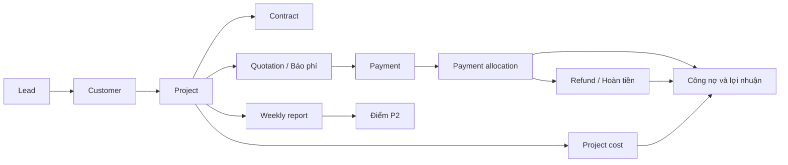
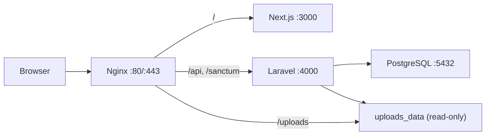

# X3 CRM

Tài liệu tổng duy nhất của dự án X3Sales CRM. File này là nguồn chuẩn cho cách cài đặt, lệnh chạy,
kiến trúc, luồng nghiệp vụ, API, quy ước frontend/backend và vận hành VPS.

> Cập nhật gần nhất: 29/07/2026. Khi thay đổi luồng, API, cấu trúc hoặc cách triển khai, cập nhật
> trực tiếp file này; không tạo thêm README hoặc thư mục `docs` rời.

## Quy tắc xử lý yêu cầu

### Tra cứu trước khi sửa

- Khi yêu cầu chưa đủ rõ về phạm vi, nghiệp vụ hoặc cấu trúc, phải quét README theo tiêu đề và từ khóa
  liên quan trước khi sửa; sau đó đối chiếu với code thực tế của module.
- Thay đổi cục bộ chỉ cần đọc các phần README liên quan. Thay đổi xuyên module, luồng nghiệp vụ, API,
  dữ liệu hoặc deployment phải kiểm tra toàn bộ các phần bị tác động.
- Không tự suy đoán khi README và code chưa đủ kết luận. Nếu README mâu thuẫn với hành vi thực tế, code
  đang chạy là bằng chứng để xác minh và README phải được cập nhật trong cùng change set.
- Chỉ mở rộng phạm vi sang module khác khi có phụ thuộc thực tế. Không build hoặc deploy nếu yêu cầu
  không cần đến các bước đó.

### Đồng bộ giao diện toàn site

- Trước khi tạo hoặc sửa một màn hình, phải đối chiếu shell, layout và các trang cùng loại đang có.
  Không thiết kế riêng từng page theo một format độc lập.
- Giữ thống nhất cách bố trí tiêu đề, breadcrumb, action, card, filter, table, form, khoảng cách,
  typography, màu sắc, responsive và các trạng thái loading/empty/error.
- Ưu tiên component, hook, helper và design token dùng chung. Nếu một pattern mới có khả năng tái sử
  dụng, đặt nó ở lớp shared phù hợp thay vì nhúng riêng vào page.
- Route page phải giữ mỏng; UI và logic nghiệp vụ lớn nằm trong `src/features/<domain>`. Không thay
  toàn bộ style của màn hình khi yêu cầu chỉ sửa content hoặc một hành vi cục bộ.
- Sau thay đổi giao diện, kiểm tra logic theo code, TypeScript và format trong phạm vi bị tác động.
  Không tự mở rộng sang kiểm thử giao diện chi tiết, mở trình duyệt, chụp ảnh hoặc rà mọi tương tác
  khi người dùng chưa yêu cầu; người dùng sẽ mô tả sai lệch hiển thị để sửa đúng trọng tâm.
- Chỉ chạy build hoặc kiểm thử sâu khi thay đổi có rủi ro tương ứng, cần xác nhận release hoặc được
  yêu cầu rõ. Không kéo dài công việc bằng các bước xác minh ngoài phạm vi cần thiết.

### Đồng bộ API toàn hệ thống

- Trước khi sửa API, phải lần theo đầy đủ luồng `Route → Controller → Form Request → Service →
Repository/Model → API Resource` và kiểm tra các frontend consumer liên quan.
- Endpoint mới hoặc đã sửa phải thống nhất với API hiện có về naming, HTTP method/status, validation,
  response resource, pagination, error format, authentication, permission và soft delete.
- Business rule và tính toán đặt ở Service/backend, không đẩy sang Controller hoặc frontend để xử lý
  riêng cho một màn hình.
- Khi request hoặc response thay đổi, phải cập nhật đồng bộ frontend service, type, form/helper,
  Swagger/OpenAPI và các màn hình đang sử dụng; đồng thời xem xét tương thích với dữ liệu hoặc client cũ.
- Thay đổi migration/model phải kiểm tra ảnh hưởng đến seed, resource, nghiệp vụ liên quan và dữ liệu
  production. Thay đổi luồng hoặc contract API phải cập nhật README trong cùng change set.

## Lệnh chạy nhanh

Danh sách lệnh rút gọn để tra cứu khi thao tác nằm tại
[`tooling/COMMANDS.md`](tooling/COMMANDS.md). README này vẫn là nguồn giải thích đầy đủ và chuẩn cuối cùng.

### Cài đặt lần đầu trên Windows PowerShell

Yêu cầu: Node.js 20+, npm, Docker Desktop; nếu chạy backend ngoài Docker cần PHP 8.2+, Composer và
extension `pdo_pgsql`.

```powershell
# Từ thư mục gốc repository
npm install
Copy-Item apps/backend/.env.example apps/backend/.env

Set-Location apps/backend
composer install
php artisan key:generate
Set-Location ../..
```

Nếu PHP/Composer không nằm trong `PATH`, script backend mặc định dùng Laragon tại
`D:\laragon\bin\php\php-8.4.4\php.exe` và
`D:\laragon\bin\composer\composer.phar`. Có thể ghi đè bằng `PHP_PATH` và `COMPOSER_PHAR`.

### Chạy môi trường phát triển khuyến nghị

Backend chạy trên máy host, PostgreSQL chạy trong Docker. `npm run dev` chạy đồng thời frontend và
backend; backend tự migrate/seed database local và mặc định mở thêm ngrok cho webhook SePay.

```powershell
npm run dev:db
npm run dev
```

Các địa chỉ hỗ trợ:

| Thành phần       | Địa chỉ                                 |
| ---------------- | --------------------------------------- |
| Frontend         | http://localhost:3000                   |
| Backend API      | http://localhost:4000/api               |
| Swagger UI       | http://localhost:4000/api/documentation |
| PostgreSQL local | `127.0.0.1:5433`                        |
| Ngrok inspector  | http://127.0.0.1:4040                   |
| Production       | https://crm.x3sales.com                 |

### Chạy từng phần

```powershell
npm run dev:frontend
npm run dev:backend

# Backend dùng domain ngrok dev cố định
npm run dev:backend:x3sales

# Không mở ngrok
$env:START_NGROK = '0'
npm run dev:backend
Remove-Item Env:START_NGROK
```

Webhook local:

```text
https://<ngrok-domain>/api/payments/webhook
```

Domain ngrok cố định hiện được cấu hình trong script:

```text
https://despitefully-ahungered-anh.ngrok-free.dev/api/payments/webhook
```

### Chạy toàn bộ bằng Docker

Đảm bảo `apps/backend/.env` đã có `APP_KEY`, sau đó:

```powershell
npm run dev:docker
docker compose -f tooling/development/compose.full.yml ps
docker compose -f tooling/development/compose.full.yml logs -f --tail=200
```

`tooling/development/compose.full.yml` cung cấp frontend `3000`, backend `4000` và PostgreSQL host
port `5433`. Backend container tự chạy migration và seed khi khởi động.

### Database, cache và Swagger

```powershell
npm run db:migrate
npm run db:seed

# CẢNH BÁO: xóa và tạo lại toàn bộ dữ liệu local
npm run db:fresh

Set-Location apps/backend
php artisan config:clear
php artisan route:list
php artisan migrate:status
php artisan l5-swagger:generate
Set-Location ../..
```

### Kiểm tra code

Project hiện chưa có test suite tự động. Kiểm tra tối thiểu trước khi bàn giao:

```powershell
Set-Location apps/frontend
npm exec tsc -- --noEmit
npm run format:check
Set-Location ../backend
php artisan route:list
php artisan migrate:status
Set-Location ../..
```

Trong công việc thường ngày, ưu tiên kiểm tra logic theo luồng code, TypeScript và format. Không cần
tự kiểm tra chi tiết trên trình duyệt nếu người dùng chưa yêu cầu. Chỉ chạy build toàn dự án khi cần
xác nhận release, thay đổi có rủi ro cao hoặc có yêu cầu rõ ràng.

```powershell
npm run build:frontend
npm run build:backend
```

### Chuyển database local/server

Chọn profile trong `apps/backend/.env`:

```dotenv
DB_PROFILE=local
```

Local dùng các biến `DB_LOCAL_*` và PostgreSQL tại `127.0.0.1:5433`.

```powershell
npm run dev:db
Set-Location apps/backend
php artisan config:clear
php artisan serve --host=0.0.0.0 --port=4000
```

Muốn truy cập database VPS từ backend local:

```powershell
# Terminal 1: giữ cửa sổ này mở
npm run db:tunnel

# apps/backend/.env
# DB_PROFILE=server

# Terminal 2
Set-Location apps/backend
php artisan config:clear
php artisan serve --host=0.0.0.0 --port=4000
```

Profile `server` dùng các biến `DB_SERVER_*` qua tunnel `127.0.0.1:5434`. Script
`dev-backend.cmd` không tự migrate/seed khi profile là `server`. `DB_PROFILE=default` dùng trực tiếp
`DB_HOST`, `DB_PORT`, `DB_DATABASE`, `DB_USERNAME`, `DB_PASSWORD`.

### Deploy production

Lệnh chuẩn từ máy phát triển:

```powershell
npm run deploy:production
```

Hoặc dùng SSH key và tham số rõ ràng:

```powershell
.\tooling\deployment\deploy-production.ps1 `
  -Server 45.252.251.120 `
  -SshUser root `
  -SshKey C:\path\to\id_ed25519 `
  -PublicUrl https://crm.x3sales.com
```

Script build image `linux/amd64`, backup database VPS, tải image/cấu hình, chạy migration, khởi động
lại container và kiểm tra HTTP. Chi tiết và lệnh vận hành máy chủ nằm ở phần
[Triển khai và vận hành VPS](#triển-khai-và-vận-hành-vps).

## Tổng quan sản phẩm

X3 CRM là hệ thống nội bộ cho agency X3Sales, quản lý từ đầu mối bán hàng đến khách hàng, dự án,
báo phí, hợp đồng, tiền vào/tiền hoàn, chi phí thực hiện, báo cáo tuần, điểm P2 và KPI tài chính theo
dịch vụ/phòng ban.

Luồng nghiệp vụ chính:



Nguyên tắc cốt lõi:

- Luồng giao diện đi tuần tự `Lead → Customer → Project → Báo phí`; không tạo Báo phí khi chưa có
  Project.
- Customer là hồ sơ dùng chung của khách hàng/pháp nhân; một Customer có nhiều Project.
- Project là hồ sơ trung tâm, tồn tại qua nhiều tháng và có nhiều Báo phí, Payment, chi phí, hợp
  đồng và báo cáo tuần.
- Quotation là số tiền báo khách phải thanh toán cho một kỳ/lần; Payment là giao dịch ngân hàng đã
  thực nhận. Hai khái niệm không được dùng thay nhau.
- Giao dịch ngân hàng gốc không bị tách thành giao dịch giả. Phân bổ tiền vào Báo phí được lưu trong
  sổ riêng để luôn truy vết được.
- Backend là nguồn tính toán và kiểm tra cuối cùng cho mã nghiệp vụ, tổng tiền, công nợ, hạn mức và
  trạng thái khóa.

## Kiến trúc hệ thống

### Công nghệ

- Monorepo dùng npm workspaces.
- Frontend: Next.js 14 App Router, React 18, TypeScript, Tailwind CSS, MUI, Emotion, TanStack Query,
  Zustand, Axios, React Hook Form, Zod, Day.js, Recharts và dnd-kit.
- Backend: Laravel 11, PHP 8.2+ ở local, PHP 8.4 trong image production, Laravel Sanctum, L5
  Swagger.
- Database: PostgreSQL 17 ở `tooling/development/compose.local.yml` và production; full-Docker
  Compose local vẫn dùng PostgreSQL 16.
- Production: Docker Compose, Nginx reverse proxy, HTTPS Let's Encrypt.

### Luồng request production



- `/api/vietqr/banks` là ngoại lệ: Nginx chuyển route này sang frontend để Next.js proxy danh mục
  ngân hàng VietQR.
- PostgreSQL production chỉ bind loopback của VPS; máy ngoài phải đi qua SSH tunnel.
- Upload được lưu bằng đường dẫn tương đối `/uploads/YYYY/MM/...` và dùng volume
  `x3crm_uploads_data`.

### Cấu trúc repository

```text
.
├── apps/
│   ├── backend/
│   │   ├── app/                  # Controllers, Requests, Resources, Services, Repositories, Models
│   │   ├── database/             # Migrations và seeders
│   │   └── routes/api.php        # Toàn bộ route API
│   └── frontend/
│       ├── src/app/              # Next.js routes, layouts, loading/error
│       ├── src/features/         # UI và logic theo domain
│       ├── src/components/       # Component dùng chung
│       ├── src/services/         # API client
│       ├── src/stores/           # Client state, auth store
│       ├── src/lib/              # Helper dùng chung
│       ├── src/types/            # TypeScript types
│       ├── src/assets/           # Ảnh, icon, logo import qua source
│       ├── src/styles/           # Global/shared CSS
│       └── public/uploads/       # Upload public ở local
├── packages/shared/              # Kiểu dữ liệu dùng chung
└── tooling/
    ├── COMMANDS.md               # Bảng tra cứu nhanh các lệnh có thể chạy
    ├── development/              # Compose local, dev backend, ngrok, DB tunnel/migrate
    ├── deployment/               # Deploy script và cấu hình production
    ├── binaries/                 # Binary local như ngrok; bị Git ignore
    └── backups/                  # Database dump local; bị Git ignore
```

Backend đi theo luồng:

```text
Route → Controller → Form Request → Service → Repository/Model → API Resource
```

Frontend route page giữ mỏng; phần giao diện/nghiệp vụ lớn đặt trong
`src/features/<domain>/components`.

`tooling/` nằm cùng cấp với `README.md` để tách toàn bộ công cụ phát triển/triển khai khỏi source
runtime trong `apps/`. Production image chỉ nhận build context sạch được deployment script tạo tạm
trong `tooling/deployment/.work`; `binaries`, `backups` và `.work` không được commit hoặc đưa vào
image.

## Xác thực, Role và phân quyền

### Xác thực và thứ tự kiểm tra request

- Auth dùng Laravel Sanctum session cookie `x3_crm_session` dạng HttpOnly; không lưu access token
  hoặc user auth trong `localStorage`.
- Login gọi `/sanctum/csrf-cookie`, sau đó `POST /api/auth/login`. Login sai thông tin hoặc tài khoản
  bị khóa trả `401`.
- `POST /api/auth/login` nhận thêm `remember` dạng boolean. Phiên thường hết hạn sau 120 phút không
  hoạt động; khi chọn `Ghi nhớ đăng nhập trong 30 ngày`, Laravel phát hành remember cookie trong
  `43200` phút theo `AUTH_REMEMBER_DURATION`. Cookie vẫn là HttpOnly/Secure ở production và bị thu
  hồi khi người dùng đăng xuất.
- Lịch sử đăng nhập phục vụ audit chưa được lưu riêng. Khi triển khai, thời hạn mặc định đề xuất là
  180 ngày; đây là dữ liệu khác với session và remember cookie.
- Frontend lưu current user trong Zustand memory. Khi refresh, đổi route hoặc cửa sổ lấy lại focus,
  frontend gọi `GET /api/auth/me` để xác minh session và lấy lại permission mới nhất.
- Axios client tại `apps/frontend/src/services/api/client.ts` luôn gửi cookie bằng
  `withCredentials`; request thay đổi dữ liệu gửi XSRF token.
- Mọi route nghiệp vụ, trừ `POST /api/auth/login`, health endpoint và webhook thanh toán, đều đi qua
  `auth:sanctum` và middleware `active`.
- `active` cho request đi tiếp khi `users.is_active=true`; nếu user còn tồn tại nhưng bị khóa,
  middleware logout session, invalidate session/CSRF token và trả `401` với thông báo
  `Tài khoản không tồn tại hoặc đã bị khóa`.
- User đã bị soft-delete hoặc session không còn resolve được user sẽ bị `auth:sanctum` từ chối trước
  middleware `active`.

Thứ tự kiểm tra backend:

```text
Request
  → auth:sanctum
  → active
  → permission:<code> ở route, nếu route có khai báo
  → Controller / Form Request
  → Service
  → Policy hoặc kiểm tra quyền theo nghiệp vụ, nếu thao tác có khai báo
  → Repository / Model
```

- Middleware `permission` đọc các code từ role của user. Nếu truyền nhiều code thì dùng điều kiện OR:
  có ít nhất một code là được phép. Route hiện tại chủ yếu truyền một code.
- Thiếu permission trả `403` với thông báo `Bạn không có quyền thực hiện thao tác này`.
- Policy bị từ chối cũng trả `403`. Validation trả `422`; resource không tồn tại trả `404`.
- Alias middleware `role` có tồn tại và kiểm tra trực tiếp `users.role`, nhưng chưa được route nào
  sử dụng. Luồng chính phải kiểm tra bằng permission, không branch theo tên role.
- Production dùng `SESSION_SECURE_COOKIE=true`, domain thật trong `SANCTUM_STATEFUL_DOMAINS` và
  CORS frontend tương ứng.

### Mô hình dữ liệu Role/Permission

| Thành phần         | Ý nghĩa                                                                              |
| ------------------ | ------------------------------------------------------------------------------------ |
| `users.role_id`    | Khóa ngoại đến một Role; đây là nguồn dùng để tính permission                        |
| `users.role`       | Chuỗi tên role được giữ song song cho tương thích cũ, thống kê và một số logic media |
| `roles`            | `id` số nguyên, `name` duy nhất, `description`, audit fields và soft delete          |
| `permissions`      | `id` số nguyên, `code`, `name`, `module`, `description`, audit fields và soft delete |
| `role_permissions` | Bảng nhiều-nhiều giữa Role và Permission, unique theo `(role_id, permission_id)`     |

Nguyên tắc hiện tại:

- Mỗi user chỉ có một Role; một Role có nhiều Permission.
- Quyền hiệu lực được lấy từ `users.role_id → roles → role_permissions → permissions`.
- `User::hasPermission($code)` cache danh sách code trên instance user trong phạm vi một request.
- Không có cơ chế mặc định kiểu `ADMIN` tự động bỏ qua mọi kiểm tra. Admin có toàn quyền vì seeder và
  migration gán tất cả permission hiện có cho Role `ADMIN`.
- Tạo/cập nhật user nhận trường `role` là tên Role đang hoạt động. Backend tự resolve `role_id` và ghi
  đồng thời `users.role`; frontend không gửi trực tiếp `role_id`.
- Auth profile trả object `{ user, role, permissions }`; `permissions` là mảng code của Role hiện tại.

### Quy ước mã permission

- Mẫu thông thường: `<module>.<action>`, ví dụ `lead.create`, `user.update`.
- Hậu tố `_all` bỏ qua giới hạn sở hữu bản ghi, ví dụ `lead.update_all`.
- `manage` là quyền thao tác quản trị rộng của module, ví dụ `option.manage`, `payment.manage`.
- Quyền nhiều cấp dùng thêm segment, ví dụ `role.permission.update`.
- Permission phải được khai báo trong migration/seeder, gán cho Role và được kiểm tra ở route hoặc
  Policy. Chỉ tồn tại trong bảng `permissions` không tự bảo vệ endpoint.

### Role mặc định và quyền seed

Seeder tạo năm Role:

| Role         | Mô tả             | Số quyền seed | Phạm vi mặc định                                                   |
| ------------ | ----------------- | ------------: | ------------------------------------------------------------------ |
| `ADMIN`      | Quản trị hệ thống |            53 | Tất cả permission hiện có                                          |
| `LEADER`     | Trưởng nhóm       |            34 | Bộ quyền cơ sở, quản lý mọi Lead/Customer/Quotation và xem nhân sự |
| `EMPLOYEE`   | Nhân sự           |            27 | Bộ quyền cơ sở, thao tác dữ liệu trong phạm vi sở hữu              |
| `SALES`      | Sales             |            27 | Hiện giống hoàn toàn `EMPLOYEE`                                    |
| `ACCOUNTANT` | Kế toán           |            28 | Bộ quyền cơ sở và `payment.manage`                                 |

Bộ quyền cơ sở gồm:

- `lead.view/create/update/delete`;
- `customer.view/create/update/delete`;
- `project.view/create/update/delete`;
- `quotation.view/create/update/delete`;
- `weeklyreport.view/create/approve`;
- `meeting.view/create/update/delete`;
- `p2point.view/create/approve`;
- `kpi.view`.

`LEADER` được cộng thêm:

- `lead.update_all`, `lead.delete_all`;
- `customer.update_all`, `customer.delete_all`;
- `quotation.update_all`, `quotation.delete_all`;
- `user.view`.

`LEADER` không được seed `project.update_all`, `project.delete_all`,
`weeklyreport.approve_all` hoặc các quyền P2 `_all`; các thao tác này vẫn bị giới hạn theo Project.

### Danh mục 53 permission hiện tại

Ký hiệu Role: `A` = ADMIN, `L` = LEADER, `E` = EMPLOYEE, `S` = SALES,
`K` = ACCOUNTANT. Cột “Kiểm tra backend” mô tả code đang chạy, không phải thiết kế mong muốn.

| Code                       | Ý nghĩa                                     | Role seed     | Kiểm tra backend hiện tại                                               |
| -------------------------- | ------------------------------------------- | ------------- | ----------------------------------------------------------------------- |
| `user.view`                | Xem nhân sự                                 | A, L          | Stats và Department GET; chưa chặn list/detail User                     |
| `user.create`              | Tạo nhân sự/Department                      | A             | Route middleware                                                        |
| `user.update`              | Cập nhật nhân sự/Department                 | A             | Route middleware                                                        |
| `user.delete`              | Xóa nhân sự/Department                      | A             | Route middleware                                                        |
| `role.view`                | Xem Role                                    | A             | Bao toàn bộ nhóm route Role và Permission                               |
| `role.create`              | Tạo Role                                    | A             | Cần đồng thời `role.view`                                               |
| `role.update`              | Đổi tên/mô tả Role                          | A             | Cần đồng thời `role.view`                                               |
| `role.delete`              | Soft-delete Role                            | A             | Cần đồng thời `role.view`                                               |
| `role.permission.update`   | Thay toàn bộ permission của Role            | A             | Cần đồng thời `role.view`                                               |
| `permission.view`          | Xem danh sách Permission                    | A             | Chưa được backend/frontend dùng để chặn route                           |
| `lead.view`                | Xem Lead                                    | A, L, E, S, K | Route middleware cho list/detail và route guard/menu frontend           |
| `lead.create`              | Tạo Lead                                    | A, L, E, S, K | `LeadPolicy::create`                                                    |
| `lead.update`              | Sửa Lead được giao                          | A, L, E, S, K | `LeadPolicy::update` + `assigned_user_id`                               |
| `lead.update_all`          | Sửa mọi Lead                                | A, L          | `LeadPolicy::update`, bỏ qua ownership                                  |
| `lead.delete`              | Xóa Lead được giao                          | A, L, E, S, K | `LeadPolicy::delete` + `assigned_user_id`                               |
| `lead.delete_all`          | Xóa mọi Lead                                | A, L          | `LeadPolicy::delete`, bỏ qua ownership                                  |
| `customer.view`            | Xem Customer                                | A, L, E, S, K | Chỉ route guard/menu frontend; backend GET chưa kiểm tra                |
| `customer.create`          | Tạo Customer                                | A, L, E, S, K | `CustomerPolicy::create` khi không đi từ Lead                           |
| `customer.update`          | Sửa Customer mình phụ trách                 | A, L, E, S, K | `CustomerPolicy::update` + `sales_user_id`                              |
| `customer.update_all`      | Sửa mọi Customer                            | A, L          | Bỏ qua ownership; cho tạo Project dưới mọi Customer                     |
| `customer.delete`          | Xóa Customer mình phụ trách                 | A, L, E, S, K | `CustomerPolicy::delete` + `sales_user_id`                              |
| `customer.delete_all`      | Xóa mọi Customer                            | A, L          | `CustomerPolicy::delete`, bỏ qua ownership                              |
| `project.view`             | Xem Project và một số màn con               | A, L, E, S, K | Chỉ route guard/menu frontend; backend GET chưa kiểm tra                |
| `project.create`           | Tạo Project                                 | A, L, E, S, K | Cần sở hữu Customer hoặc có `customer.update_all`                       |
| `project.update`           | Sửa Project mình quản lý/phụ trách sales    | A, L, E, S, K | `manager_user_id` hoặc `sales_user_id`                                  |
| `project.update_all`       | Sửa mọi Project                             | A             | Bỏ qua ownership                                                        |
| `project.delete`           | Xóa Project mình quản lý/phụ trách sales    | A, L, E, S, K | `manager_user_id` hoặc `sales_user_id`                                  |
| `project.delete_all`       | Xóa mọi Project                             | A             | Bỏ qua ownership                                                        |
| `quotation.view`           | Xem Báo phí                                 | A, L, E, S, K | Chỉ route guard/menu frontend; backend GET chưa kiểm tra                |
| `quotation.create`         | Tạo Báo phí                                 | A, L, E, S, K | `QuotationPolicy::create`; chưa kiểm tra ownership trong Policy         |
| `quotation.update`         | Sửa Báo phí thuộc dữ liệu mình phụ trách    | A, L, E, S, K | Theo Project, Customer hoặc Lead cha                                    |
| `quotation.update_all`     | Sửa mọi Báo phí                             | A, L          | Bỏ qua ownership                                                        |
| `quotation.delete`         | Xóa Báo phí thuộc dữ liệu mình phụ trách    | A, L, E, S, K | Theo Project, Customer hoặc Lead cha                                    |
| `quotation.delete_all`     | Xóa mọi Báo phí                             | A, L          | Bỏ qua ownership                                                        |
| `weeklyreport.view`        | Xem báo cáo tuần                            | A, L, E, S, K | Chỉ route guard/menu frontend; backend GET chưa kiểm tra                |
| `weeklyreport.create`      | Tạo báo cáo tuần                            | A, L, E, S, K | `WeeklyReportPolicy::create`                                            |
| `weeklyreport.approve`     | Duyệt Project mình quản lý                  | A, L, E, S, K | Manager Project và không được tự duyệt báo cáo của mình                 |
| `weeklyreport.approve_all` | Duyệt mọi báo cáo tuần                      | A             | Bỏ qua Project ownership                                                |
| `meeting.view`             | Xem lịch hẹn trong phạm vi                  | A, L, E, S, K | Route middleware, repository scope, Policy và route guard/menu frontend |
| `meeting.create`           | Tạo lịch hẹn                                | A, L, E, S, K | Route middleware và `MeetingPolicy::create`                             |
| `meeting.update`           | Sửa/chuyển trạng thái lịch thuộc phạm vi    | A, L, E, S, K | `MeetingPolicy::update`                                                 |
| `meeting.update_all`       | Sửa mọi lịch hẹn                            | A             | Bỏ qua ownership                                                        |
| `meeting.delete`           | Xóa lịch hẹn thuộc phạm vi                  | A, L, E, S, K | `MeetingPolicy::delete`                                                 |
| `meeting.delete_all`       | Xóa mọi lịch hẹn                            | A             | Bỏ qua ownership                                                        |
| `p2point.view`             | Xem điểm P2                                 | A, L, E, S, K | Route middleware cho list/detail và route guard/menu frontend           |
| `p2point.create`           | Ghi P2 cho Project mình quản lý             | A, L, E, S, K | `P2PointPolicy::create`, Project bắt buộc thuộc manager                 |
| `p2point.create_all`       | Ghi P2 không cần Project/ownership          | A             | Bỏ qua giới hạn Project                                                 |
| `p2point.approve`          | Duyệt P2 của Project mình quản lý           | A, L, E, S, K | `P2PointPolicy::approve`                                                |
| `p2point.approve_all`      | Duyệt mọi điểm P2                           | A             | Bỏ qua giới hạn Project                                                 |
| `kpi.view`                 | Xem báo cáo KPI                             | A, L, E, S, K | Route middleware cho API báo cáo và route guard/menu frontend           |
| `kpi.manage`               | Nhập kế hoạch tháng theo dịch vụ/phòng ban  | A             | Route middleware cho API cập nhật kế hoạch                              |
| `payment.manage`           | Phân bổ, hoàn, phân loại, hóa đơn, đối soát | A, K          | Policy/helper kế toán ở các action nhạy cảm                             |
| `option.manage`            | Quản lý Options và Services                 | A             | Route middleware cho create/update/delete/reorder                       |

### Phạm vi sở hữu bản ghi

- Lead thuộc user khi `leads.assigned_user_id` bằng user hiện tại.
- Customer thuộc user khi `customers.sales_user_id` bằng user hiện tại.
- Project thuộc user khi user là `manager_user_id` hoặc `sales_user_id`.
- Báo phí ưu tiên kiểm tra Project cha; nếu chưa có Project thì kiểm tra Customer, sau đó Lead.
- Hợp đồng, chi phí Project và cấu hình báo cáo tuần dùng quyền cập nhật của Project cha qua
  `authorizeProjectOwnership()`.
- Đối soát chi phí và xác nhận CID dùng `payment.manage`; báo/hủy CID dùng quyền cập nhật Project.
- Tạo Customer từ Lead không dùng `customer.create`; backend yêu cầu quyền sửa chính Lead đó để bảo
  toàn luồng chuyển đổi.
- `weeklyreport.approve` yêu cầu user là manager của Project và người báo cáo không phải chính manager.
- Lịch hẹn thuộc phạm vi khi user là người tạo, người phụ trách, người tham gia nội bộ, người sở hữu
  Lead/Customer/Project liên quan, hoặc là trưởng phòng của người phụ trách. Quyền
  `meeting.update_all`/`meeting.delete_all` bỏ qua giới hạn này.
- `p2point.create/approve` yêu cầu user là manager của Project; quyền `_all` bỏ qua điều kiện này.

### API quản lý Role và Permission

Tất cả endpoint dưới đây còn yêu cầu `auth:sanctum` và `active`.

| Method      | Route                               | Permission thực tế                     | Hành vi                                             |
| ----------- | ----------------------------------- | -------------------------------------- | --------------------------------------------------- |
| `GET`       | `/api/roles?keyword=`               | `role.view`                            | Danh sách Role, kèm permissions, tìm theo tên/mô tả |
| `POST`      | `/api/roles`                        | `role.view` + `role.create`            | Tạo Role chưa có permission, trả `201`              |
| `GET`       | `/api/roles/{id}`                   | `role.view`                            | Chi tiết Role kèm permissions                       |
| `PUT/PATCH` | `/api/roles/{id}`                   | `role.view` + `role.update`            | Sửa tên/mô tả                                       |
| `DELETE`    | `/api/roles/{id}`                   | `role.view` + `role.delete`            | Soft-delete Role                                    |
| `GET`       | `/api/roles/{id}/permissions`       | `role.view`                            | Danh sách quyền của Role                            |
| `POST`      | `/api/roles/{id}/permissions`       | `role.view` + `role.permission.update` | Thay toàn bộ quyền của Role                         |
| `GET`       | `/api/permissions?module=&keyword=` | `role.view`                            | Danh sách quyền, lọc module/từ khóa                 |

Payload Role:

```json
{
  "name": "SALES_MANAGER",
  "description": "Quản lý đội Sales"
}
```

- `name` bắt buộc khi tạo, là chuỗi tối đa 100 ký tự và duy nhất trong Role chưa bị soft-delete.
- `description` cho phép null.
- Role API dùng ID số nguyên theo database, dù Controller nhận route parameter dưới dạng string.
- `RoleResource` trả `id`, `name`, `description`, mảng `permissions`, `createdAt`, `updatedAt`.
- `PermissionResource` trả `id`, `code`, `name`, `module`, `description`, `createdAt`, `updatedAt`.

Payload đồng bộ quyền:

```json
{
  "permission_ids": [1, 2, 3]
}
```

- `permission_ids` bắt buộc là array; mỗi ID phải là integer, không trùng và tồn tại.
- Mảng rỗng hợp lệ và sẽ gỡ toàn bộ quyền của Role.
- Backend chạy transaction: xóa tất cả liên kết hiện tại rồi insert đúng danh sách mới.
- Permission hiện là danh mục chỉ đọc qua API; không có show/create/update/delete endpoint.

### Luồng tạo, sửa, gán và áp dụng Role

Tạo Role từ giao diện hiện dùng hai request:

1. `POST /api/roles` tạo tên/mô tả;
2. nếu có quyền được chọn, `POST /api/roles/{id}/permissions` gán quyền.

Sửa Role cũng dùng hai request:

1. `PUT /api/roles/{id}` sửa tên/mô tả;
2. `POST /api/roles/{id}/permissions` thay toàn bộ permission.

Hai request frontend không nằm trong cùng một transaction backend. Request thứ nhất có thể thành công
nhưng request thứ hai thất bại; khi đó Role đã được tạo/sửa nhưng permission chưa đồng bộ.

Gán Role cho user:

1. frontend gửi tên Role trong trường `role` của `POST/PUT/PATCH /api/users`;
2. `UsersService` tìm Role đang hoạt động theo `roles.name`;
3. backend ghi cả `users.role_id` và `users.role`;
4. request đăng nhập/profile tiếp theo tải permission từ `role_id`.

Thay permission của Role có hiệu lực ở request backend kế tiếp và lần frontend verify profile kế tiếp.
Không cần logout/login lại, nhưng UI đang mở có thể chưa đổi cho đến khi auth được verify.

### Frontend sử dụng permission

- `apps/frontend/src/lib/route-permissions.ts` chặn truy cập route theo prefix; danh sách permission
  trong một route là điều kiện OR.
- Sidebar dùng cùng permission để ẩn/hiện menu.
- `apps/frontend/src/lib/ownership.ts` mirror các Policy backend để ẩn/disable action theo ownership.
- Trang `/users/permissions` hiện dùng `role.view`, không dùng `permission.view`.
- Frontend chỉ là lớp UX. Ẩn menu, chặn route hoặc disable nút không thay thế kiểm tra backend.

Route guard frontend hiện tại:

| Route                                                   | Permission                                         |
| ------------------------------------------------------- | -------------------------------------------------- |
| `/leads`                                                | `lead.view`                                        |
| `/customers`                                            | `customer.view`                                    |
| `/projects`, `/projects/services`, `/projects/partners` | `project.view`                                     |
| `/meetings`                                             | `meeting.view`; nút tạo cần thêm `meeting.create`  |
| `/quotations`                                           | `quotation.view`                                   |
| `/costs`                                                | `project.view`                                     |
| `/weekly-reports`                                       | `weeklyreport.view`                                |
| `/p2-points`                                            | `p2point.view`                                     |
| `/kpi`                                                  | `kpi.view`; nút sửa kế hoạch cần thêm `kpi.manage` |
| `/users`                                                | `user.view`                                        |
| `/users/roles`, `/users/permissions`                    | `role.view`                                        |
| `/settings`                                             | `option.manage`                                    |

### Khoảng trống phân quyền đang tồn tại

Các điểm dưới đây là kết quả đối chiếu code ngày 28/07/2026; cần xem là technical debt, không được hiểu
thành quy tắc bảo mật mong muốn:

1. Backend chưa kiểm tra các quyền `customer.view`, `project.view`, `quotation.view` và
   `weeklyreport.view`. User đăng nhập và còn active có thể gọi trực tiếp các API GET này dù frontend
   đã chặn route/menu. `lead.view` và `p2point.view` đã được áp dụng cho list/detail tương ứng.
2. `GET /api/users` và `GET /api/users/{id}` chưa yêu cầu `user.view`; chỉ stats và Department GET
   đang yêu cầu quyền này.
3. `permission.view` được seed nhưng không được dùng. `GET /api/permissions` đang nằm trong group
   `role.view`, và frontend cũng kiểm tra `role.view`.
4. Update/delete/submit báo cáo tuần chưa kiểm tra ownership hoặc permission; chỉ create và
   approve/return-to-draft có Policy. Update/delete điểm P2 cũng chưa kiểm tra permission.
5. CRUD Payment cơ bản chưa yêu cầu `payment.manage`; quyền này mới bảo vệ phân bổ, gỡ phân bổ, hoàn
   tiền, cập nhật/xóa khoản hoàn, phân loại và cập nhật hóa đơn. Webhook có secret riêng.
6. Xóa Role chưa kiểm tra Role hệ thống hoặc user đang sử dụng. Vì là soft delete, foreign key không
   chặn; user trỏ đến Role đã xóa sẽ không còn lấy được permission ở request sau.
7. Đổi tên Role không đồng bộ `users.role` của user hiện có. `role_id` và permission vẫn hoạt động,
   nhưng chuỗi role cũ có thể làm sai thống kê hoặc logic cũ.
8. Logic Media vẫn kiểm tra trực tiếp chuỗi `users.role === ADMIN` cho scope toàn bộ/xóa file của
   người khác. Custom Role dù có tất cả permission vẫn không có đặc quyền Media giống `ADMIN`.
9. Role hệ thống `ADMIN`, `LEADER`, `EMPLOYEE`, `SALES`, `ACCOUNTANT` chưa được khóa đổi tên/xóa.
10. Form Role frontend gọi API metadata và API sync quyền tách rời, nên không atomic.
11. OpenAPI hiện mô tả Role ID là UUID trong khi migration dùng bigint. README lấy bigint làm dữ liệu
    đúng theo schema hiện tại.
12. Form Request chỉ kiểm tra trùng tên với Role chưa bị xóa, nhưng unique index database áp dụng cả
    bản ghi soft-delete. Vì vậy chưa thể tạo lại sạch một tên Role đã từng bị xóa.

### Quy trình thêm hoặc sửa permission

Khi bổ sung một quyền mới, phải làm đủ:

1. thêm permission bằng migration để database đang chạy được cập nhật;
2. thêm cùng code/name/module vào `DatabaseSeeder` cho môi trường mới;
3. quyết định Role mặc định nào nhận quyền và cấp cho Admin trong migration;
4. gắn middleware route hoặc Policy/Service thực sự kiểm tra code đó;
5. cập nhật auth/profile consumer, route guard, sidebar và helper ownership frontend nếu liên quan;
6. cập nhật Swagger/OpenAPI và mục phân quyền trong README;
7. kiểm tra ít nhất các trường hợp chưa đăng nhập `401`, thiếu quyền `403`, quyền theo ownership,
   quyền `_all` và tài khoản bị khóa.

## Luồng nghiệp vụ chi tiết

### 1. Lead → Customer → Project

#### Lead

- Lead có mã `lead_code`, thông tin liên hệ, nguồn, ngành, dịch vụ quan tâm, người phụ trách, trạng
  thái và timeline chăm sóc.
- Status/source/industry lấy từ option groups `lead_status`, `lead_source`, `industry`.
- Trường nguồn cho phép chọn option có sẵn hoặc nhập mới; frontend tạo option trước rồi lưu Lead.
- Quick view Lead tải `GET /leads/{id}` để có timeline đầy đủ và giữ nguyên filter/list state.
- Lead chưa chuyển đổi có CTA `Chuyển thành khách hàng`; Lead đã chuyển đổi hiển thị `Mở khách
hàng`.

#### Chuyển thành Customer

- Frontend mở `/customers/new?leadId=<id>` và gọi `POST /customers` với `leadId`.
- Backend khóa Lead trong transaction, kiểm tra `converted_customer_id` và Customer cùng `lead_id`
  để chặn tạo trùng.
- Trong cùng transaction, backend:
  1. tạo Customer;
  2. cập nhật Lead đã chuyển đổi và `closed_date`;
  3. ghi timeline;
  4. bổ sung `customer_id` cho Báo phí/Payment cũ của Lead nếu còn thiếu.
- Tạo Customer thành công mở hồ sơ Customer. Hệ thống không tự nhảy sang form tạo Project.
- Customer chỉ được tạo từ Lead hợp lệ. Mở lại URL của Lead đã chuyển đổi sẽ chuyển đến Customer
  hiện có.
- `customer_code` độc lập với `lead_code`, được backend cấp dạng `001`, `002`, `003`, ... bằng khóa
  transaction và `MAX(customer_code) + 1`. Frontend không gửi hoặc sửa mã này; transaction rollback
  không làm nhảy số.
- API cũ `POST /leads/{id}/convert` vẫn tồn tại cho tương thích, nhưng giao diện hiện tại dùng
  `POST /customers`.

#### Project

- Từ hồ sơ Customer, CTA `Tạo dự án` mở `/projects/new?customerId=<id>`.
- Project bắt buộc có Customer, service, tên, type, ngày bắt đầu, trạng thái, manager, sales phụ
  trách và thứ báo cáo theo yêu cầu giao diện hiện tại.
- Project type chỉ có `K` hoặc `M`.
- Backend luôn tự tạo lại mã:

```text
<customer_code>.<root_service_code>.<project_type>.<project_name>
```

Ví dụ:

```text
001.DV1.M.X3SALES
```

- Service con dùng mã của root service trong project code.
- Form Project không tạo Hợp đồng hoặc Báo phí ngầm. Hai nghiệp vụ này chỉ bắt đầu sau khi Project
  tồn tại.
- Hồ sơ `/projects/[id]` có bốn tab: `Thông tin dự án`, `Hợp đồng`, `Tài chính`, `Khách hàng`.
- Thanh luồng `Lead → Customer → Dự án` xuất hiện trên các hồ sơ liên quan.

### 2. Nhóm doanh thu 2.1 và 2.2

Không phân nhóm cứng theo mã DV1/DV2/DV3/DV4. Nhóm được quyết định từ option
`service_quote_config` của root service:

- Config tự động bật → nhóm `2.1`, `pricingMode=management_fee`.
- Không có config bật → nhóm `2.2`, `pricingMode=quantity_price`.
- Service con kế thừa config của root service.
- Khi tạo Báo phí, lưu snapshot `revenueGroup`, `pricingMode`, `serviceRootId`,
  `serviceRootCode` vào metadata. Thay đổi config sau này không được sửa lịch sử Báo phí cũ.

Nhóm 2.1 áp dụng ngân sách quảng cáo, bảng tỷ lệ phí quản lý và gói setup. Nhóm 2.2 dùng hạng mục,
số lượng, đơn giá và chi phí đối tác/thực hiện.

### 3. Báo phí

- Luồng bắt buộc: `Lead → Customer → Project → Báo phí`.
- Form chỉ chọn một Project. Customer, Lead nguồn, service, mã nền và phân nhóm được backend suy ra
  từ Project.
- Mỗi Project có nhiều Báo phí theo kỳ/lần.
- Mã Báo phí do backend tạo:

```text
<project-code-base>.Q001
<project-code-base>.Q002
```

- Mã này là nội dung chuyển khoản VietQR và không được đổi sau khi phát hành.
- Form có các dòng động: nội dung, đơn vị tính, số lượng/số lần, đơn giá, thành tiền. Nếu root
  service có auto pricing, frontend thêm các dòng ngân sách, phí quản lý và setup theo config.
- Tổng trước thuế, VAT và tổng thanh toán được tính nhất quán ở frontend và được backend kiểm tra.
- Trạng thái nghiệp vụ:
  - `draft` → `Báo phí`;
  - `won` → `Đã thanh toán`;
  - vòng đời hoàn tiền có thể hiển thị `Đã hoàn tiền`, `Đã hoàn toàn bộ`, hoặc
    `Đã hoàn + bù thêm`.
- Form không cho người dùng tự chọn trạng thái. Backend tính lại trạng thái theo sổ phân bổ và hoàn
  tiền.
- Khi tổng phân bổ gốc đạt tổng phải thu với sai số tối đa `0,01`, dữ liệu nghiệp vụ của Báo phí bị
  khóa; chỉ `Ghi chú` còn được sửa. Hủy phân bổ có thể mở khóa nếu tổng nhận xuống dưới mức phải
  thu. Hoàn tiền không xóa chứng từ thu gốc và không tự mở khóa lịch sử.
- Báo phí đã có phân bổ không được đổi tổng tiền hoặc xóa.

### 4. Hợp đồng

- Một Project có nhiều Hợp đồng; quản lý tại tab `Hợp đồng`.
- CRUD dùng `/contracts`, lọc theo `project_id`.
- Chủ thể nhận hóa đơn được snapshot trên từng Hợp đồng:
  - `customer`: lấy pháp lý hiện tại của Customer tại thời điểm lưu;
  - `other`: nhập chủ thể/pháp nhân độc lập.
- Snapshot gồm tên, đại diện, mã số thuế, địa chỉ, email hóa đơn và điện thoại. Sửa Customer sau
  này không viết lại lịch sử Hợp đồng.
- Khi Hợp đồng gắn Báo phí, backend đồng bộ `contract_id` sang Báo phí và Payment liên quan.

### 5. Payment, phân bổ và hoàn tiền

#### Giao dịch gốc

- `payments` là sổ giao dịch ngân hàng gốc: số tiền, nội dung, thời gian, tài khoản nhận, mã tham
  chiếu và raw webhook payload.
- Một giao dịch có thể trả nhiều Báo phí, và một Báo phí có thể nhận nhiều giao dịch qua
  `payment_allocations`.
- Không sửa/tách giao dịch webhook thành nhiều giao dịch giả.
- Webhook SePay chỉ auto-match khi nội dung chứa đúng `quotation_code`; không fuzzy match theo
  số tiền, tên hoặc chuỗi gần giống.
- Khi match, hệ thống tự phân bổ tối đa bằng số còn phải thu. Phần vượt vẫn là số dư chưa xử lý.
- Webhook không có mã hợp lệ tạo Payment `unmatched` và vẫn trả body gốc
  `{"success": true}` nếu payload hợp lệ.
- Webhook yêu cầu `PAYMENT_WEBHOOK_SECRET` qua `Authorization: Apikey ...` hoặc Bearer theo
  middleware. Secret rỗng khiến mọi webhook bị từ chối.

#### Phân bổ

```text
Tiền chưa phân bổ = Tiền nhận
                    - Tổng phân bổ
                    - Hoàn tiền thừa đang chờ/đã chuyển
```

- Không phân bổ vượt tiền chưa phân bổ hoặc công nợ Báo phí.
- Dự án và Customer luôn suy ra từ Báo phí được chọn; không còn thao tác gắn Project trực tiếp vào
  giao dịch.
- Hủy phân bổ là soft delete và trả tiền về số dư chưa xử lý. Không được hủy nếu dòng phân bổ đã có
  khoản trả khách `pending` hoặc `completed`.
- Danh sách `/payments` có thể group theo Báo phí để không cắt một nhóm giao dịch qua hai trang.
- `Chênh lệch = Tổng phân bổ ròng của nhóm - Tổng Báo phí`: âm là thiếu, dương là thừa, 0 là khớp.
- Số hóa đơn đầu ra lưu riêng tại `payments.output_invoice_number`, chỉnh qua
  `PATCH /payments/{id}/invoice`.

#### Hoàn tiền

`payment_refunds` quản lý nghiệp vụ trả khách, không tự phát lệnh chuyển tiền ngân hàng.

Các loại:

- `deposit`: hoàn cọc;
- `payment`: hoàn khoản đã phân bổ;
- `overpayment`: hoàn tiền chuyển thừa;
- `compensation`: bù thêm ngoài tiền khách đã nộp.

Trạng thái:

- `pending`: giữ chỗ hạn mức để chống hoàn trùng, chưa giảm công nợ;
- `completed`: đã trả thực tế và được tính vào số thu ròng;
- `cancelled`: hủy và giải phóng hạn mức.

Các chỉ số chính:

```text
Đã thu ròng = Tổng payment_allocations
               - Tổng refund completed (không gồm compensation)

Cần thu hiện tại = Tổng Báo phí - Cọc đã hoàn

Tiền ra = Tiền hoàn cọc/thanh toán + Tiền bù thêm

Lợi nhuận thực nhận của Project = Đã nhận
                                  - Đã hoàn
                                  - Bù thêm
                                  - Cọc còn giữ
                                  - Chi phí đã chi
```

- `Đã nhận` luôn là tổng phân bổ gốc trước hoàn để không mất dấu tiền khách từng chuyển.
- Hoàn cọc giảm nghĩa vụ cần thu tương ứng và không biến một Báo phí đã thanh toán thành thiếu.
- Hoàn toàn bộ giữ lại tổng Báo phí và tổng tiền nhận ban đầu để truy vết, nhưng các chỉ số cần thu,
  thực thu, còn phải thu và chênh lệch về 0.
- `compensation` hiển thị riêng, không tạo công nợ âm và không thay đổi số phải thu.

### 6. Chi phí Project và CID

- `project_costs` là dòng tiền công ty chi ra.
- `entryType=ad_spend` cho nhóm 2.1; `entryType=partner_cost` cho nhóm 2.2.
- Backend tính tổng, không tin tổng do frontend gửi:
  - 2.1: tiền trước VAT + VAT;
  - 2.2: tiền trước VAT + VAT - discount, tối thiểu 0.
- Chỉ `completed` được tính vào chi phí/lợi nhuận; `pending` chưa tính; `cancelled` bị loại.
- Một khoản chi có thể gắn Báo phí để đối chiếu theo kỳ nhưng không bắt buộc.
- `/costs` là sổ đối soát tập trung, group theo Project và hỗ trợ keyword, loại, trạng thái, đã
  khớp/chưa khớp và khoảng ngày.
- `POST /project-costs/{id}/reconcile` khóa khoản chi sau khi xác nhận; khoản đã khớp không được sửa
  hoặc xóa.

Với chi phí nạp quảng cáo:

- `cashOutAmount`: dòng tiền đã chi, không thay đổi sau đối soát;
- `actualCostAmount`: chi phí thực tế;
- `originalBalanceAmount`: số dư gốc khi CID dừng;
- `releasedBalanceAmount`: hạn mức đã trả lại Project.

Nếu CID dừng trước khi đối soát, kết quả reconcile tính phần thực chạy và trả toàn bộ số dư hợp lệ
vào hạn mức nạp. Nếu CID dừng sau khi khoản chi đã khóa:

1. nhân sự tạo `project_cost_cid_incidents` ở trạng thái `pending`;
2. nhập ngày dừng, số thực chạy, phần không thu hồi và ghi chú;
3. kế toán xác nhận tại `/costs`;
4. backend tính:

```text
releasedAmount = totalAmount - spentAmount - unrecoverableAmount
actualCostAmount = spentAmount + unrecoverableAmount
```

Sự kiện đã xác nhận bị khóa; sự kiện pending có thể sửa/hủy. Các endpoint:

- `PUT /project-costs/{id}/cid-incident`;
- `POST /project-costs/{id}/cid-incident/confirm`;
- `DELETE /project-costs/{id}/cid-incident`.

### 7. Lịch hẹn

Module lịch hẹn nằm tại `/meetings`, dùng để quản lý cuộc hẹn trong toàn bộ luồng
`Lead → Customer → Project`. Mỗi lịch bắt buộc gắn ít nhất một đối tượng liên quan:

- chọn Project: backend tự suy ra Customer và Lead của Project;
- chọn Customer: backend tự suy ra Lead của Customer;
- chọn Lead: lưu trực tiếp với Lead;
- khi đối tượng cha bị soft-delete, khóa ngoại lịch vẫn được giữ; khi bản ghi bị xóa vật lý, khóa
  ngoại được đưa về `null`.

Giao diện theo đúng format chung của CRM:

1. bốn thẻ tổng quan dạng compact `Lịch hôm nay`, `7 ngày tới`, `Chờ xác nhận`, `Quá giờ`; bấm thẻ
   chuyển sang tab danh sách và lọc đúng nhóm;
2. tab `Lịch tháng` và `Danh sách`;
3. bộ lọc từ khóa, người phụ trách, phòng ban, hình thức và trạng thái; mỗi filter chọn rộng
   `176px` trên tablet/desktop;
4. lịch tháng bắt đầu từ Thứ 2, hiển thị đủ 42 ngày bằng các ô compact cao cố định `84px`; mỗi
   lịch hiển thị trực tiếp bằng giờ và tiêu đề, tối đa ba lịch trong một ô; bấm ngày để tạo lịch,
   bấm lịch để xem chi tiết;
5. nếu một ngày có hơn ba lịch, nút `+n lịch khác` chuyển sang tab `Danh sách`, tự chọn đúng ngày
   vừa bấm trong filter `Ngày hẹn` và chỉ tải các lịch giao với ngày đó;
6. danh sách hỗ trợ phân trang, xem, sửa và menu chuyển trạng thái.

Mỗi lịch có:

- người phụ trách nội bộ `organizer_user_id`;
- người tham gia nội bộ nhiều-nhiều trong `meeting_participants`;
- hình thức `online`, `onsite` hoặc `phone`;
- giờ bắt đầu/kết thúc dạng timezone-aware, timezone mặc định `Asia/Ho_Chi_Minh`;
- nội dung cần trao đổi, địa điểm/link Meet, kết quả, hành động tiếp theo và ngày thực hiện tiếp.

Form dùng hai `DateTimePicker` riêng cho `Bắt đầu` và `Kết thúc`, vì vậy cuộc hẹn có thể kéo dài qua
nhiều ngày. Ô người tham gia nội bộ là multi-select tự tăng chiều cao khi chip xuống dòng. Form
không nhập thêm khách ngoài hệ thống: Lead/Customer/Project đã là ngữ cảnh khách hàng của lịch hẹn.
Table `meeting_guests` và dữ liệu guest cũ vẫn được giữ để tương thích; sửa lịch cũ không tự xóa
guest đã lưu.

Vòng đời:

```text
scheduled → confirmed → completed
    │            ├────→ cancelled
    │            └────→ no_show
    ├─────────────────→ cancelled
    └─────────────────→ no_show
```

- `scheduled`: Chờ xác nhận;
- `confirmed`: Đã xác nhận;
- `completed`: Hoàn thành, bắt buộc nhập kết quả; có thể nhập hành động/ngày tiếp theo;
- `cancelled`: Đã hủy, bắt buộc nhập lý do;
- `no_show`: Khách không tham gia;
- `Quá giờ` là trạng thái hiển thị được tính từ lịch `scheduled/confirmed` có `ends_at` nhỏ hơn thời
  điểm hiện tại, không phải một giá trị riêng lưu trong database.

Chỉ lịch `scheduled/confirmed` được sửa hoặc chuyển trạng thái. Khi đổi giờ, lịch tự quay lại
`scheduled` để xác nhận lại. Backend kiểm tra trùng thời gian của người phụ trách và người tham gia
nội bộ; nếu trùng trả HTTP `422` kèm danh sách lịch xung đột. UI hiển thị xác nhận và chỉ gửi
`allowConflict=true` khi người dùng chủ động chọn `Vẫn lưu lịch`.

Dữ liệu được tách thành:

- `meetings`: thông tin chính, liên kết CRM, audit fields và soft delete;
- `meeting_participants`: nhân sự tham gia và trạng thái tham dự;
- `meeting_guests`: khách ngoài hệ thống;
- `meeting_histories`: snapshot/action của mọi lần tạo, sửa, đổi lịch và chuyển trạng thái.

Mọi thao tác tạo/sửa/đổi trạng thái/xóa còn ghi một snapshot `type=meeting` vào
`customer_timelines`, vì vậy cuộc hẹn xuất hiện trong lịch sử Lead/Customer/Project mà không dùng
timeline làm nơi lưu dữ liệu lịch chính.

Phạm vi đọc và thao tác được tính đồng nhất ở repository và `MeetingPolicy`:

- user tạo lịch, là người phụ trách hoặc người tham gia nội bộ;
- user phụ trách Lead/Customer/Project liên quan;
- trưởng phòng của người phụ trách lịch;
- quyền `meeting.update_all` hoặc `meeting.delete_all` nhìn và thao tác toàn bộ.

Các endpoint đều nằm dưới `permission:meeting.view`; tạo thêm `meeting.create`, còn
sửa/xóa/chuyển trạng thái kiểm tra `MeetingPolicy`. API chính:

- `GET /api/meetings`: danh sách; nếu có `page`/`per_page` thì trả phân trang, nếu không thì trả mảng
  cho lịch tháng; hỗ trợ filter và khoảng ngày;
- `GET /api/meetings/summary`: bốn chỉ số tổng quan;
- `POST /api/meetings`, `GET/PUT/PATCH/DELETE /api/meetings/{id}`;
- `POST /api/meetings/{id}/confirm`;
- `POST /api/meetings/{id}/complete`;
- `POST /api/meetings/{id}/cancel`;
- `POST /api/meetings/{id}/no-show`.

Giai đoạn hiện tại chưa tạo notification, email, lời mời Google Calendar/Outlook, lịch lặp hoặc kéo
thả đổi giờ. Các phần này phải được triển khai thành phase riêng; không thêm bản ghi notification
rỗng hoặc giả lập gửi thông báo trong module meeting.

### 8. Báo cáo tuần

- Cấu hình nằm tại `project_weekly_settings`, được đồng bộ cùng transaction tạo/sửa Project.
- `report_weekday` dùng ISO weekday: Thứ 2 = 1, Chủ nhật = 7.
- Sales phụ trách đồng thời là `report_owner_user_id`.
- API assignment summary giúp form Project cảnh báo một Sales có bao nhiêu Project cùng ngày báo
  cáo.
- `/weekly-reports` có:
  - `Theo dõi tuần`: bảng điều phối từ cấu hình Project;
  - `Lịch sử báo cáo`: các báo cáo đã tạo.
- Backend tính kỳ báo cáo từ ngày bắt đầu Project và thứ báo cáo. Không cho chọn khoảng ngày tùy ý
  hoặc tạo báo cáo cho tuần tương lai.
- Hạn đúng ngày là `Đến hạn hôm nay`; từ ngày kế tiếp mới là `Quá hạn`.
- Báo cáo được nộp sau hạn mang tag `Nộp muộn` màu đỏ; `Quá hạn` cũng dùng màu đỏ, còn
  `Đến hạn hôm nay` dùng màu vàng để phân biệt mức độ.
- Trong bảng theo dõi và lịch sử, action tạo/mở báo cáo dùng nút chỉ có icon theo chuẩn các trang
  danh sách khác; tooltip và `aria-label` giữ đầy đủ ý nghĩa. Các tác vụ phụ vẫn nằm trong menu ba
  chấm. Với báo cáo đã tồn tại, icon mắt mở `Bản gửi khách` và luôn đứng đầu; icon chỉnh sửa đứng
  kế tiếp để đi vào trang báo cáo.
- Tiêu đề màn tạo/chỉnh sửa lấy trực tiếp từ tên Project, không có ô nhập tiêu đề riêng. Form dùng
  đúng bố cục của Báo phí: lưới `5/7`, cột trái là thông tin báo cáo và chỉ tiêu, cột phải là tổng
  quan bằng hình ảnh cùng đánh giá/phương án triển khai.
- Bốn chỉ tiêu tiền do người lập báo cáo nhập bằng `MoneyInput`:
  - `weeklySpendAmount` / `weekly_spend_amount`: Chi phí;
  - `averageWeeklyBudget` / `average_weekly_budget`: Ngân sách trung bình/tuần;
  - `remainingAccountBudget` / `remaining_account_budget`: Ngân sách tài khoản còn lại;
  - `totalBudget` / `total_budget`: Tổng ngân sách, khi tạo mới mặc định theo ngân sách tháng trong
    cấu hình báo cáo của Project.
- Nút `Bản gửi khách` trên danh sách mở preview cùng kích thước `lg` và cùng header cố định với Báo
  phí: logo, tên công ty, MST, điện thoại/website, địa chỉ và văn phòng. Tên Project cùng khoảng ngày
  báo cáo nằm bên dưới header; nhãn `Báo cáo tuần` và tên Project căn giữa, còn khoảng ngày căn phải
  trong khung rộng theo nội dung, có icon lịch và border giống DatePicker. Nút `Lấy ảnh` kết xuất
  toàn bộ preview thành PNG vào clipboard để người dùng tự dán gửi khách; không tạo public link và
  không gửi trực tiếp từ backend.
- Mỗi Project chỉ có một báo cáo cho một kỳ.
- Vòng đời:

```text
draft → submitted → approved
          └──────→ return-to-draft
```

- `draft` được sửa/xóa/gắn ảnh và submit; `submitted` khóa nội dung, chờ approve hoặc trả về draft;
  `approved` chỉ xem.
- Báo cáo chỉ dùng ảnh từ media library. Ảnh thư viện được liên kết metadata/URL, không nhân đôi file.
- Migration `2026_07_28_000300_add_customer_metrics_to_weekly_reports.php` phải được chạy trước khi
  tạo/chỉnh sửa báo cáo có bốn chỉ tiêu mới; nếu chưa chạy, PostgreSQL sẽ trả lỗi thiếu cột và API
  thành HTTP 500.

### 9. Điểm P2

- Điểm P2 là chức năng ghi nhận điểm cộng/trừ hiện tại; không được gọi là KPI.
- API chuẩn dùng `/p2-points`, có CRUD, phân trang, tổng hợp theo nhân viên và action approve.
- Màn hình chuẩn là `/p2-points`; nghiệp vụ KPI thật dùng riêng `/kpi`.
- Danh mục P2 được cấu hình tại `/settings/p2-categories`, option group `p2_category`.
- Route và menu được kiểm soát bằng permission `p2point.view`; create/approve dùng
  `P2PointPolicy` và các quyền `p2point.*`.
- Table dữ liệu là `p2_points`; model/service/resource dùng tên `P2Point`.
- Migration `2026_07_28_000100_rename_kpi_points_to_p2_points.php` đổi tên table, option group và
  permission tại chỗ nên giữ nguyên dữ liệu cùng các liên kết Role đã có.
- API `/kpi-points` cũ không còn được đăng ký.

### 10. KPI theo tháng

KPI là module tài chính riêng, không liên quan đến điểm P2. Trang `/kpi` có hai phạm vi:

- `Theo dịch vụ`: mỗi dòng là một dịch vụ gốc của cây dịch vụ;
- `Theo phòng ban`: mỗi dòng là một phòng ban và cộng hai nhánh đóng góp độc lập.

Ba chỉ số dùng chung:

- `Kế hoạch`: Admin nhập tay lợi nhuận trước VAT cho từng tháng, từng dịch vụ gốc hoặc từng phòng ban;
- `Lợi nhuận trước VAT`: lợi nhuận thực nhận đã loại VAT của đúng tháng đang xem;
- `Hoàn thành`: `Lợi nhuận / Kế hoạch × 100%`; nếu Kế hoạch bằng 0 thì để trống thay vì chia cho 0.

Kế hoạch lưu tại `kpi_targets` với khóa duy nhất `(scope_type, scope_id, period_month)`.
`scope_type` chỉ nhận `service` hoặc `department`; kế hoạch không được âm. `kpi.view` cho phép xem
báo cáo, còn `kpi.manage` cho phép cập nhật kế hoạch và mặc định chỉ cấp cho Admin.

Màn hình mặc định mở tháng hiện tại. Bộ lọc hỗ trợ `Theo tháng`, `Theo quý`, `Theo năm` và
`Khoảng tháng`; tháng/năm dùng MUI DatePicker giống các form khác trong CRM. Khi khoảng lọc có từ
hai tháng trở lên:

- mỗi tháng được hiển thị thành một table riêng;
- phía trên có table so sánh Kế hoạch, Lợi nhuận, Hoàn thành và chênh lệch lợi nhuận so với tháng
  liền trước;
- các thẻ tổng quan cộng Kế hoạch/Lợi nhuận của toàn khoảng và tính Hoàn thành trên tổng.

Bố cục theo chuẩn `/weekly-reports`: tổng quan → tab phạm vi → bộ lọc → bảng. Mỗi ô lọc rộng
`176px` trên tablet/desktop và tự giãn toàn chiều rộng trên màn hình nhỏ.

Trang KPI tách rõ số nguồn để đối soát và số dùng để tính lợi nhuận:

| Trường hiển thị       | Cơ sở số tiền                                               | Mục đích                |
| --------------------- | ----------------------------------------------------------- | ----------------------- |
| `Đã thu`              | Số tiền phân bổ gốc, gồm VAT và cọc                         | Khớp dữ liệu thanh toán |
| `Chi phí thực tế`     | Chi phí thực tế gốc, gồm VAT và adjustment chi phí hoàn tất | Khớp dữ liệu chi phí    |
| `Hoàn tiền`           | Số tiền hoàn gốc đã hoàn tất, gồm VAT và mọi loại hoàn      | Khớp dữ liệu hoàn tiền  |
| `Lợi nhuận trước VAT` | Số nội bộ đã chuẩn hóa về trước VAT theo quy tắc từng nhánh | Đánh giá KPI            |

Vì ba cột nguồn có VAT còn Lợi nhuận không có VAT, không được lấy trực tiếp
`Đã thu - Chi phí thực tế - Hoàn tiền` trên giao diện để kiểm tra Lợi nhuận. Backend phải giữ riêng
các accumulator số nguồn và số trước VAT; không được sửa một trường để dùng chung cho cả hiển thị
và công thức. Giao diện chỉ ghi rõ `trước VAT` tại Kế hoạch/Lợi nhuận, không thêm thanh hoặc note
diễn giải lặp lại.

Chỉ Project chưa bị soft-delete mới được tính. Báo phí không gắn Project, hoặc dữ liệu thuộc Project
đã xóa, không được tính vào số nguồn lẫn bất kỳ nhánh lợi nhuận KPI nào dù Payment/chi phí/hoàn tiền
vẫn còn lưu trong database.

#### KPI theo dịch vụ

Project được quy về dịch vụ gốc bằng cách đi ngược `services.parent_id`. Công thức cho từng dịch vụ:

```text
Lợi nhuận trước VAT tháng M = Tiền dịch vụ đã thu trước VAT trong M
                              - Chi phí thực tế trước VAT trong M
                              - Hoàn/bù thêm tác động lợi nhuận trong M
```

- Ngày ghi nhận tiền thu ưu tiên `payments.transaction_at`, sau đó `transaction_date`,
  `payment_allocations.allocated_at`.
- Chỉ tiền đã nằm trong `payment_allocations` của Báo phí thuộc Project đang tồn tại mới được tính;
  giao dịch chưa phân bổ không tính.
- `Đã thu` hiển thị nguyên `payment_allocations.amount`, gồm VAT và cọc. Khi tính Lợi nhuận, cọc
  được xem là phần tiền đến trước của Báo phí và bị loại; phần chịu thuế còn lại được quy đổi về
  trước VAT theo tỷ lệ
  `quotation.subtotal_amount / (subtotal_amount + vat_amount)`.
- Chi phí chỉ lấy `project_costs.status=completed`, theo `transaction_date`, dùng chi phí thực tế
  sau đối soát/CID. `Chi phí thực tế` hiển thị số thực tế gồm VAT; khi tính Lợi nhuận, số này được
  quy về trước VAT theo tỷ lệ
  `amount_before_vat / (amount_before_vat + vat_amount)`. Nhờ vậy giảm trừ được phân bổ cùng tỷ lệ,
  không bị tính ngược trở lại thành chi phí. Adjustment chi phí completed thuộc khoản chi không có
  VAT nên được cộng nguyên số vào cả số nguồn và chi phí trước VAT.
- `Hoàn tiền` hiển thị nguyên `payment_refunds.amount` của mọi khoản `completed`. Trong công thức
  Lợi nhuận, hoàn `payment` được quy về trước VAT; `compensation` bị trừ toàn bộ; `overpayment`
  không tác động vì tiền chuyển thừa chưa từng là doanh thu; hoàn `deposit` không tác động nhánh này
  vì cọc chưa từng được cộng.

#### KPI phòng ban: nhánh triển khai

Phòng ban triển khai lấy theo `projects.manager_user_id → users.department_id`. Công thức và mốc
tháng giống KPI dịch vụ:

```text
Lợi nhuận triển khai trước VAT = Tiền dịch vụ đã thu trước VAT
                                 - Chi phí thực tế trước VAT
                                 - Hoàn/bù thêm tác động lợi nhuận
```

Các số `Đã thu`, `Chi phí thực tế`, `Hoàn tiền` trong phần đối soát của nhánh triển khai vẫn là số
nguồn gồm VAT theo cùng quy tắc của bảng dịch vụ.

Nếu Project không có nhân sự triển khai hoặc nhân sự chưa thuộc phòng ban thì Project vẫn được tính
cho KPI dịch vụ nhưng không có phần đóng góp triển khai cho phòng ban.

#### KPI phòng ban: nhánh phụ trách khách hàng

Người mang KPI là người phụ trách Customer, không phải người tạo:
`projects.customer_id → customers.sales_user_id → users.department_id`.

Với từng Project, hệ thống:

1. duyệt mọi Báo phí và toàn bộ phân bổ theo thời gian giao dịch;
2. tìm thời điểm lũy kế phân bổ của từng Báo phí lần đầu đạt `total_amount`;
3. chọn Báo phí đạt điều kiện sớm nhất; vì vậy nếu Q001 chưa thu đủ nhưng Q002 thu đủ trước thì Q002
   là Báo phí thành công đầu tiên;
4. chỉ tại tháng đạt đủ tiền, cộng một lần:

```text
Lợi nhuận phụ trách khách hàng trước VAT
    = quotation.subtotal_amount + quotation.deposit_amount
```

`subtotal_amount` là giá trị trước VAT; cọc là khoản không chịu VAT và chỉ riêng nhánh này được cộng
theo quy tắc đã chốt. Các Báo phí thành công sau của cùng Project không tạo thêm khoản ghi nhận
nhánh phụ trách khách hàng. Số `Ghi nhận` hiển thị để đối soát là `quotation.total_amount` có VAT;
đây không phải số dùng trực tiếp trong công thức lợi nhuận.

Để tab phòng ban dễ đối soát mà không tạo quá nhiều cột ngang, mỗi dòng tách thành hai ô
`Nhánh triển khai` và `Nhánh phụ trách khách hàng`. Mỗi ô hiển thị Lợi nhuận trước VAT trước, sau đó
mới liệt kê nhóm `Số đối soát có VAT`; cột `Tổng lợi nhuận trước VAT` là tổng của đúng hai nhánh.

#### Hoàn tiền sang tháng sau

Khoản hoàn chỉ tác động KPI khi `payment_refunds.status=completed` và được ghi giảm vào tháng của
`completed_at`, không viết ngược lại tháng thu tiền:

```text
Tháng thu tiền:   cộng lợi nhuận theo quy tắc của nhánh
Tháng hoàn tiền: trừ khoản hoàn khỏi lợi nhuận của chính nhánh đó
```

Vì vậy Lợi nhuận và Hoàn thành của một tháng có thể âm. Cột/số phụ `Hoàn` luôn hiển thị nguyên số
đã hoàn gồm VAT để đối soát. Khi tính lợi nhuận, hoàn `payment` dùng giá trị trước VAT; hoàn
`deposit` chỉ giảm nhánh phụ trách khách hàng nếu khoản cọc thuộc Báo phí thành công đầu tiên;
`compensation` giảm nhánh dịch vụ/triển khai và cả nhánh phụ trách khách hàng khi gắn đúng Báo phí
đầu tiên; `overpayment` không tác động lợi nhuận. Nếu phòng ban triển khai cũng là phòng ban phụ
trách khách hàng, hai nhánh vẫn cộng độc lập, kể cả khoản ghi giảm tương ứng.

API:

- `GET /api/kpi?period_from=YYYY-MM&period_to=YYYY-MM`: trả `periodFrom`, `periodTo` và mảng
  `periods`; mỗi phần tử tháng có `services`, `departments` và `summary`; `calculationBasis` xác nhận
  `sourceAmountBasis=gross_including_vat`, `profitAmountBasis=before_vat`,
  `projectScope=existing_projects`, quy tắc cọc của số nguồn/hai nhánh lợi nhuận và đơn vị VND;
- `period=YYYY-MM` vẫn được chấp nhận để lấy một tháng; nếu không truyền kỳ thì mặc định tháng hiện
  tại; khoảng tối đa 36 tháng;
- `PUT /api/kpi/targets`: upsert kế hoạch bằng payload
  `{"period":"2026-07","scopeType":"service","scopeId":1,"targetAmount":100000000}`.

### 11. Media library

- API: `GET /media`, `POST /media/upload`, `PATCH /media/{id}`, `DELETE /media/{id}`.
- File vật lý nằm dưới frontend `public/uploads/YYYY/MM` ở local hoặc shared volume ở production.
- Database chỉ lưu đường dẫn tương đối `/uploads/...`; không lưu domain đầy đủ.
- `ImageUpload` dùng chung cho avatar, CCCD, ảnh đối soát và báo cáo.
- Hỗ trợ chọn file hoặc dán `Ctrl+V`; ảnh clipboard phải qua bước preview rồi mới upload.
- Định dạng: JPG, PNG, GIF, WEBP; tối đa 3 MB theo validation hiện tại.
- Danh sách media hỗ trợ phân trang, keyword, debounce và hủy request cũ.

## Màn hình frontend

Các route authenticated nằm trong `apps/frontend/src/app/(app)`.

| Nhóm           | Route chính                                                      | Vai trò                                                                                 |
| -------------- | ---------------------------------------------------------------- | --------------------------------------------------------------------------------------- |
| Auth           | `/login`, `/forgot-password`                                     | Đăng nhập và khôi phục truy cập                                                         |
| Dashboard      | `/dashboard`                                                     | Biểu đồ tổng quan độc lập; chưa lấy dữ liệu từ API KPI                                  |
| Lead           | `/leads`, `/leads/new`, `/leads/[id]`                            | CRUD, quick view, timeline, chuyển Customer                                             |
| Customer       | `/customers`, `/customers/new`, `/customers/[id]`                | Hồ sơ khách hàng từ Lead, mở Project                                                    |
| Project        | `/projects`, `/projects/new`, `/projects/[id]`                   | Hồ sơ trung tâm và bốn tab nghiệp vụ                                                    |
| Lịch hẹn       | `/meetings`                                                      | Lịch tháng, danh sách, người tham gia, kết quả và hành động tiếp                        |
| Báo phí        | `/quotations`, `/quotations/new`, `/quotations/[id]`             | Báo phí, VietQR, công nợ                                                                |
| Redirect cũ    | `/projects/quotes`                                               | Chuyển sang `/quotations`                                                               |
| Thanh toán     | `/payments`                                                      | Tiền nhận, phân bổ, hoàn tiền, hóa đơn đầu ra                                           |
| Chi phí        | `/costs`                                                         | Đối soát chi phí và sự kiện CID                                                         |
| Báo cáo tuần   | `/weekly-reports`, `/weekly-reports/new`, `/weekly-reports/[id]` | Điều phối và vòng đời báo cáo                                                           |
| KPI            | `/kpi`                                                           | Kế hoạch, Lợi nhuận, Hoàn thành theo dịch vụ và phòng ban                               |
| Điểm P2        | `/p2-points`                                                     | Điểm cộng/trừ P2 và duyệt                                                               |
| Thư viện       | `/media-library`                                                 | Media dùng chung                                                                        |
| User           | `/users`, `/users/new`, `/users/[id]`                            | Tài khoản nhân viên                                                                     |
| Phòng ban      | `/users/departments`                                             | CRUD phòng ban                                                                          |
| Vai trò        | `/users/roles`, `/users/roles/new`, `/users/roles/[id]`          | Role và gán permission                                                                  |
| Permission     | `/users/permissions`                                             | Danh sách permission; chưa có UI CRUD                                                   |
| Cài đặt        | `/settings`                                                      | Hồ sơ công ty/website                                                                   |
| Dịch vụ        | `/projects/services`                                             | Cây dịch vụ và cấu hình Báo phí root service                                            |
| Đối tác        | `/projects/partners`                                             | Option đối tác                                                                          |
| Ngân hàng      | `/settings/bank-accounts`                                        | Tài khoản nhận tiền công ty                                                             |
| Thẻ nạp QC     | `/settings/ad-topup-cards`                                       | Nguồn chi/nạp quảng cáo                                                                 |
| Hạng mục P2    | `/settings/p2-categories`                                        | Danh mục điểm P2                                                                        |
| Danh mục chung | `/settings/options`                                              | Option theo group, kéo thả thứ tự                                                       |
| Hồ sơ cá nhân  | `/profile`                                                       | Chỉ hiển thị current user, avatar và thông tin tài khoản; không có tab Dự án/Khách hàng |

## Tổng quan API

API prefix là `/api`. Frontend đã cấu hình base URL nên thường gọi `/leads`, `/projects`, ... trong
client code.

### Public

| Method | Route                   | Mục đích                         |
| ------ | ----------------------- | -------------------------------- |
| `GET`  | `/api/`                 | Health/info API                  |
| `POST` | `/api/auth/login`       | Tạo Sanctum session              |
| `POST` | `/api/payments/webhook` | Nhận webhook ngân hàng có secret |
| `GET`  | `/sanctum/csrf-cookie`  | Khởi tạo CSRF cookie             |

### Authenticated CRUD

| Resource                     | Route gốc                                             |
| ---------------------------- | ----------------------------------------------------- |
| Auth profile/logout/password | `/api/auth/*`                                         |
| Media                        | `/api/media`                                          |
| Options                      | `/api/options`                                        |
| Services                     | `/api/services`                                       |
| Users / departments          | `/api/users`, `/api/departments`                      |
| Roles / permissions          | `/api/roles`, `/api/permissions`                      |
| Leads / customers            | `/api/leads`, `/api/customers`                        |
| Projects / contracts         | `/api/projects`, `/api/contracts`                     |
| Meetings                     | `/api/meetings`                                       |
| Quotations                   | `/api/quotations`                                     |
| Payments / refunds           | `/api/payments`, `/api/payment-refunds`               |
| Project costs                | `/api/project-costs`                                  |
| Weekly settings/reports      | `/api/project-weekly-settings`, `/api/weekly-reports` |
| Điểm P2                      | `/api/p2-points`                                      |
| KPI                          | `/api/kpi`, `/api/kpi/targets`                        |

Hầu hết resource hỗ trợ `GET list/show`, `POST create`, `PUT/PATCH update`, `DELETE soft delete` theo
route hiện có.

### Action endpoints quan trọng

| Method   | Route                                              | Mục đích                                                   |
| -------- | -------------------------------------------------- | ---------------------------------------------------------- |
| `POST`   | `/leads/{id}/convert`                              | Luồng chuyển đổi cũ, giữ để tương thích                    |
| `PATCH`  | `/options/reorder`                                 | Sắp xếp option trong group                                 |
| `PATCH`  | `/services/reorder`                                | Sắp xếp cây dịch vụ                                        |
| `POST`   | `/roles/{id}/permissions`                          | Đồng bộ permission cho role                                |
| `POST`   | `/payments/{id}/allocations`                       | Phân bổ giao dịch vào Báo phí                              |
| `DELETE` | `/payments/{paymentId}/allocations/{allocationId}` | Hủy phân bổ                                                |
| `POST`   | `/payments/{id}/refunds`                           | Tạo khoản trả khách                                        |
| `PATCH`  | `/payment-refunds/{id}`                            | Cập nhật khoản trả                                         |
| `POST`   | `/payments/{id}/classification`                    | Phân loại customer/internal/other                          |
| `PATCH`  | `/payments/{id}/invoice`                           | Số hóa đơn đầu ra của giao dịch                            |
| `POST`   | `/project-costs/{id}/reconcile`                    | Khóa/đối soát chi phí                                      |
| `PUT`    | `/project-costs/{id}/cid-incident`                 | Báo CID dừng sau đối soát                                  |
| `POST`   | `/project-costs/{id}/cid-incident/confirm`         | Kế toán xác nhận CID                                       |
| `GET`    | `/project-weekly-settings/assignment-summary`      | Kiểm tra tải lịch Sales                                    |
| `GET`    | `/weekly-reports/board`                            | Bảng điều phối tuần từ backend                             |
| `POST`   | `/weekly-reports/{id}/submit`                      | Gửi duyệt                                                  |
| `POST`   | `/weekly-reports/{id}/approve`                     | Duyệt                                                      |
| `POST`   | `/weekly-reports/{id}/return-to-draft`             | Trả về nháp                                                |
| `POST`   | `/weekly-reports/{id}/attachments`                 | Gắn ảnh báo cáo                                            |
| `GET`    | `/meetings/summary`                                | Tổng hợp lịch hôm nay, 7 ngày tới, chờ xác nhận và quá giờ |
| `POST`   | `/meetings/{id}/confirm`                           | Xác nhận lịch                                              |
| `POST`   | `/meetings/{id}/complete`                          | Hoàn thành và lưu kết quả/hành động tiếp                   |
| `POST`   | `/meetings/{id}/cancel`                            | Hủy lịch kèm lý do                                         |
| `POST`   | `/meetings/{id}/no-show`                           | Đánh dấu khách không tham gia                              |
| `POST`   | `/p2-points/{id}/approve`                          | Duyệt điểm P2                                              |
| `GET`    | `/kpi?period_from=YYYY-MM&period_to=YYYY-MM`       | Báo cáo KPI theo một tháng hoặc khoảng tháng               |
| `PUT`    | `/kpi/targets`                                     | Admin cập nhật kế hoạch tháng                              |

Swagger được cấu hình tại `/api/documentation`; source OpenAPI chính ở
`apps/backend/app/OpenApi.php` và annotations liên quan.

## Mô hình dữ liệu chính

```text
Lead
 └─ Customer
     └─ Project
         ├─ Contract
         ├─ Quotation ─┬─ QuotationItem
         │             └─ PaymentAllocation ─ Payment ─ PaymentRefund
         ├─ ProjectCost ─ ProjectCostCidIncident
         ├─ ProjectWeeklySetting
         └─ WeeklyReport ─┬─ WeeklyReportItem
                         └─ WeeklyReportAttachment

Lead / Customer / Project
 └─ Meeting ─┬─ MeetingParticipant ─ User
             ├─ MeetingGuest
             └─ MeetingHistory

User ─ Role ─ RolePermission ─ Permission
Service ─ Service child/package
Option ─ các group cấu hình nghiệp vụ
Attachment ─ media library
P2Point ─ User/Project theo ngữ cảnh
KpiTarget ─ Service hoặc Department theo tháng
```

Các model dùng soft delete ở những nơi cần giữ lịch sử. Khi chỉnh sửa luồng tài chính, luôn kiểm tra
cả migration, Service, Resource và frontend type/helper; không chỉ sửa giao diện.

## Quy ước frontend

### Phân lớp thư mục

- `src/app`: chỉ route segment, layout, page, loading/error và composition theo route.
- `src/features/<domain>/components`: màn hình/logic lớn theo nghiệp vụ.
- `src/components`: component dùng chung như shell, form, table, feedback, upload.
- `src/services/api/client.ts`: Axios base URL, cookie, CSRF và xử lý 401.
- `src/stores/auth-store.ts`: current user/session state trong memory.
- `src/lib`: helper chung; không đặt component hoặc logic route lớn tại đây.
- `src/types`: type dùng qua nhiều component.

### UI và interaction

- Tailwind CSS là hệ thống chính cho layout/visual. MUI dùng cho input, select, table, checkbox,
  dialog, date picker, menu, icon và behavior.
- Tránh `sx`/inline style nếu Tailwind xử lý được.
- Font toàn app là Public Sans Variable.
- Màu chính `#2563eb`; xanh hỗ trợ `#16a34a`; cam nhấn `#f97316`.
- UI theo hướng CRM vận hành: dày thông tin, dễ quét, ít trang trí. Minimal UI là tham chiếu cho
  login, shell, list và form.
- Vùng cuộn sidebar dùng `sidebar-scrollbar`: thanh cuộn rộng 6px, bo tròn, mặc định trong suốt và
  chỉ hiện màu xám nhạt khi hover hoặc focus bên trong; vẫn giữ khả năng cuộn bằng chuột, touchpad
  và bàn phím.
- Summary của `/meetings`, `/weekly-reports`, `/kpi` và `/p2-points` dùng cùng
  `SummaryMetricCard`: card rời `rounded-xl`, khoảng cách `gap-3`, icon trạng thái 36px bên trái,
  nhãn/mô tả ở giữa và số liệu 22px bên phải. Summary có chức năng lọc phải dùng button, giữ
  `aria-pressed`, focus ring và viền active; summary chỉ hiển thị số liệu dùng card không tương tác.
- Form CRUD lớn mặc định là full page; chỉ dùng popup khi nghiệp vụ yêu cầu rõ.
- Route page giữ mỏng, không nhét cả table/form manager vào `page.tsx`.
- Money input dùng `src/components/form/money-input.tsx`, hiển thị ngăn cách hàng nghìn kiểu Việt
  Nam nhưng giữ raw digits cho payload/tính toán.
- Date picker hiển thị `DD/MM/YYYY`, API nhận `YYYY-MM-DD`.
- Không dùng native `alert`/`confirm`. Dùng `useAppNotification()` và shared confirm dialog.
- First load có thể dùng content loading; filter/refetch giữ dữ liệu cũ bằng TanStack Query
  `keepPreviousData` và chỉ loading vùng bảng.
- User mutation của current user phải cập nhật auth store để header/avatar đổi ngay.

### Assets và style

- Ảnh import qua source đặt trong `src/assets/images`, dùng alias `@assets/images/...` và
  `next/image` khi phù hợp.
- Logo/brand đặt trong `src/assets/logos`; logo chính:
  `src/assets/logos/x3sales-logo.svg`.
- Icon tùy biến đặt trong `src/assets/icons`; ưu tiên `@mui/icons-material` cho icon UI phổ biến.
- Global CSS entry là `src/styles/globals.css`, được root layout import bằng `@/styles/globals.css`.
- CSS Module riêng đặt cạnh component dưới dạng `*.module.css`.
- Shared CSS đặt trong `src/styles` và import qua `@styles/...`.

### Component dùng chung cần ưu tiên

- Toast: `src/components/feedback/notification-provider.tsx`.
- API error: `src/lib/api-error.ts`.
- Confirm: `src/components/feedback/confirm-dialog.tsx`.
- Full-page splash: `src/components/shell/app-splash-screen.tsx`.
- In-shell loading: `src/components/shell/content-loading.tsx`.
- Image picker: `src/components/upload/image-upload.tsx`.
- Money input: `src/components/form/money-input.tsx`.
- Summary metric: `src/components/data-display/summary-metric-card.tsx`.
- Server paginated autocomplete:
  `src/components/form/server-paginated-autocomplete.tsx`.

## Danh mục cấu hình

`options` lưu các danh mục linh hoạt. Một số group quan trọng:

| Group                  | Mục đích                         |
| ---------------------- | -------------------------------- |
| `lead_status`          | Trạng thái Lead                  |
| `lead_source`          | Nguồn Lead                       |
| `industry`             | Ngành                            |
| `customer_type`        | Loại Customer                    |
| `project_status`       | Trạng thái Project               |
| `contract_status`      | Trạng thái Hợp đồng              |
| `service_quote_config` | Auto pricing theo root service   |
| `project_partner`      | Hồ sơ đối tác dạng option        |
| `site_profile`         | Thông tin công ty/website        |
| `company_bank_account` | Tài khoản nhận tiền              |
| `ad_topup_card`        | Tài khoản/thẻ dùng nạp quảng cáo |
| `p2_category`          | Hạng mục điểm P2                 |

Trang `/settings/options` chỉ hiển thị tên, màu và trạng thái cho option thông thường. Thứ tự được
kéo thả trong từng group; mutation chỉ cập nhật/refetch group bị ảnh hưởng.

Mapping đặc biệt:

- `project_partner`: `key` mã đối tác, `label` tên, `value` dịch vụ,
  `meta.accountNo`/`meta.bankName` là ngân hàng.
- `company_bank_account`: `key` mã VietQR, `label` chủ tài khoản, `value` số tài khoản,
  `meta.bankName`, `branch`, `isDefault`.
- `service_quote_config`: `key` root service code, `value` root service id, metadata chứa trạng
  thái bật, bảng tỷ lệ và gói setup.

## Biến môi trường

### Backend local

Các key chính trong `apps/backend/.env`:

```dotenv
APP_URL=http://localhost:4000
FRONTEND_URL=http://localhost:3000
FRONTEND_URLS=http://localhost:3000,http://127.0.0.1:3000

SANCTUM_STATEFUL_DOMAINS=localhost:3000,127.0.0.1:3000
SESSION_DRIVER=database
SESSION_COOKIE=x3_crm_session
SESSION_SECURE_COOKIE=false

DB_PROFILE=local
DB_LOCAL_HOST=127.0.0.1
DB_LOCAL_PORT=5433
DB_LOCAL_DATABASE=x3crm
DB_LOCAL_USERNAME=x3crm

PAYMENT_WEBHOOK_SECRET=<secret>
```

### Frontend

```dotenv
NEXT_PUBLIC_API_URL=http://localhost:4000/api
NEXT_PUBLIC_MEDIA_URL=http://localhost:3000
```

Fallback API trong code là `http://localhost:4000/api`. Media URL đã lưu trong database phải là
relative path, nên `NEXT_PUBLIC_MEDIA_URL` chỉ dùng khi render.

Không commit `.env`, `APP_KEY`, database password, webhook secret, SSH password hoặc ngrok token.

## Dữ liệu seed local

Chỉ dùng cho môi trường phát triển. Đổi/xóa các credential mặc định ở môi trường thật.

| Vai trò         | Email              | Mật khẩu     |
| --------------- | ------------------ | ------------ |
| Admin           | `admin@x3crm.com`  | `Admin@123`  |
| Leader          | `leader@x3crm.com` | `Leader@123` |
| Nhân viên NV002 | `nv002@x3crm.com`  | `Nv002@123`  |
| Nhân viên NV003 | `nv003@x3crm.com`  | `Nv003@123`  |
| Kế toán         | `ketoan@x3crm.com` | `Ketoan@123` |

Seeder cũng tạo role, permission và cây dịch vụ mẫu.

## Triển khai và vận hành VPS

### Trạng thái production

- Public URL: https://crm.x3sales.com.
- VPS hiện được cấu hình tại `45.252.251.120`, thư mục `/opt/x3crm`.
- Compose project: `x3crm`.
- Bốn service: `nginx`, `frontend`, `backend`, `db`.
- Nginx public `80/443`; HTTP redirect HTTPS.
- Backend và frontend chỉ giao tiếp qua network Compose.
- PostgreSQL bind `127.0.0.1:5432` trên VPS, không mở ra Internet.
- Database volume do Compose quản lý; uploads dùng external volume `x3crm_uploads_data`.
- `.env` thật chỉ nằm trên VPS, nên đặt permission `600`.

Các file triển khai nguồn:

| File                                                             | Vai trò                                        |
| ---------------------------------------------------------------- | ---------------------------------------------- |
| `tooling/deployment/production/compose.yml`                      | Bốn service, volume, healthcheck, log rotation |
| `tooling/deployment/production/backend.Dockerfile`               | Laravel/PHP 8.4, pdo_pgsql, OPcache            |
| `tooling/deployment/production/frontend.Dockerfile`              | Next.js standalone/Node 20                     |
| `tooling/deployment/production/nginx.conf`                       | HTTPS, frontend, API, Sanctum, VietQR, uploads |
| `tooling/deployment/production/env.template`                     | Mẫu production, không chứa secret thật         |
| `tooling/deployment/production/opcache.ini`                      | OPcache backend                                |
| `tooling/deployment/production/next.config.production.js`        | Standalone và public env khi build             |
| `tooling/deployment/production/reset-keep-accounts-services.sql` | Reset nghiệp vụ có kiểm soát                   |
| `tooling/deployment/production/certbot-renew-*.sh`               | Dừng/chạy Nginx khi renew chứng chỉ            |

### Deploy tự động làm gì

`tooling/deployment/deploy-production.ps1`:

1. kiểm tra Docker và SSH;
2. tạo frontend build context sạch;
3. build backend/frontend `linux/amd64`;
4. đóng `NEXT_PUBLIC_API_URL` và `NEXT_PUBLIC_MEDIA_URL` vào frontend image;
5. tạo tar image;
6. kiểm tra `PAYMENT_WEBHOOK_SECRET` trên server;
7. backup database `pre-deploy-<release>.dump` và kiểm tra bằng `pg_restore -l`;
8. upload image, Compose và Nginx config;
9. tag image hiện tại thành `rollback-<release>`;
10. load image mới, chạy migration và recreate backend/frontend/nginx;
11. kiểm tra frontend, API, container và migration status;
12. xóa artifact tạm local/remote sau khi thành công.

`NEXT_PUBLIC_*` được đóng vào bundle lúc build. Đổi domain/API URL bắt buộc build lại frontend;
chỉ sửa `.env` VPS là chưa đủ.

### Lệnh vận hành thường ngày trên VPS

```bash
cd /opt/x3crm
docker compose ps
docker compose logs -f --tail=200
docker compose logs -f --tail=200 backend
docker compose up -d
docker compose restart backend
docker compose exec -T backend php artisan migrate --force
docker stats --no-stream
df -h
free -h
```

Không chạy `docker compose down -v` trong vận hành bình thường vì có thể xóa database volume. Không
xóa `/opt/x3crm/.env` nếu chưa có bản sao secret.

### Kiểm tra sau deploy

```bash
cd /opt/x3crm
docker compose ps
docker compose logs --since=10m --tail=200
curl -I https://crm.x3sales.com/
curl -H 'Accept: application/json' -i https://crm.x3sales.com/api/
```

Xác nhận:

- bốn container ở trạng thái Up, database Healthy;
- frontend và `/api/` trả HTTP 200;
- login thành công;
- API nghiệp vụ chính hoạt động;
- upload trả URL `/uploads/...` HTTP 200;
- không có `production.ERROR` mới hoặc vòng restart.

### Backup database

```bash
cd /opt/x3crm
ts=$(date +%Y%m%d-%H%M%S)
mkdir -p backups
docker compose exec -T db pg_dump \
  -U x3crm -d x3crm -Fc --no-owner --no-privileges \
  > "backups/x3crm-db-${ts}.dump"
chmod 600 "backups/x3crm-db-${ts}.dump"
docker compose exec -T db pg_restore -l < "backups/x3crm-db-${ts}.dump" > /dev/null
sha256sum "backups/x3crm-db-${ts}.dump"
```

### Backup uploads

```bash
cd /opt/x3crm
ts=$(date +%Y%m%d-%H%M%S)
mkdir -p backups
docker run --rm \
  -v x3crm_uploads_data:/source:ro \
  -v /opt/x3crm/backups:/backup alpine:3.22 \
  sh -c "tar -czf /backup/x3crm-uploads-${ts}.tar.gz -C /source ."
chmod 600 "backups/x3crm-uploads-${ts}.tar.gz"
sha256sum "backups/x3crm-uploads-${ts}.tar.gz"
```

Backup phải được tải sang máy khác hoặc object storage. Backup trên cùng ổ VPS không bảo vệ được
khi VPS/ổ đĩa hỏng.

### Restore database đầy đủ

Có downtime. Xác minh file và checksum trước khi chạy.

```bash
cd /opt/x3crm
backup_file="backups/<ten-file>.dump"

docker compose stop backend
docker compose exec -T db dropdb -U x3crm --if-exists --force x3crm
docker compose exec -T db createdb -U x3crm x3crm
docker compose exec -T db pg_restore \
  -U x3crm -d x3crm --no-owner --no-privileges \
  < "$backup_file"
docker compose start backend
docker compose logs --since=5m --tail=200 backend
```

### Restore uploads

```bash
cd /opt/x3crm
upload_backup="<ten-file>.tar.gz"

docker run --rm \
  -v x3crm_uploads_data:/target \
  -v /opt/x3crm/backups:/backup alpine:3.22 \
  sh -c "find /target -mindepth 1 -delete && tar -xzf /backup/$upload_backup -C /target"
```

Sau restore, kiểm tra login, danh sách, URL ảnh, log, migration và trạng thái container.

### Reset dữ liệu nghiệp vụ, giữ tài khoản/dịch vụ

> CẢNH BÁO: Đây là thao tác phá hủy dữ liệu thật, không thể undo nếu không có backup đọc được.
> Chỉ chạy sau khi xác nhận đúng VPS/database và đã kiểm tra backup.

Script giữ:

- `migrations`;
- `users`, `roles`, `permissions`, `role_permissions`, `departments`;
- `services`, `service_packages`.

Mọi bảng public khác bị `TRUNCATE ... RESTART IDENTITY CASCADE`.

Trước khi chạy, bảo đảm file nguồn
`tooling/deployment/production/reset-keep-accounts-services.sql` đã được copy thành
`/opt/x3crm/reset-keep-accounts-services.sql`.

```bash
cd /opt/x3crm

# Bắt buộc backup database và uploads trước.
docker compose exec -T db psql \
  -U x3crm -d x3crm \
  < reset-keep-accounts-services.sql

docker run --rm -v x3crm_uploads_data:/target alpine:3.22 \
  sh -c 'find /target -mindepth 1 -delete'

docker compose exec -T backend php artisan config:clear
docker compose exec -T backend php artisan route:clear
docker compose exec -T backend php artisan view:clear
docker compose restart backend
```

Không dùng `php artisan optimize:clear` nếu production đang dùng database cache mà chưa có bảng
`cache`; dùng ba lệnh clear riêng như trên.

### Rollback image

Deploy script gắn image cũ bằng tag `rollback-<release>`. Chọn đúng release trước khi tag lại:

```bash
cd /opt/x3crm
docker image ls --filter 'reference=x3crm-*'

docker tag x3crm-backend:rollback-<release> x3crm-backend:deploy
docker tag x3crm-frontend:rollback-<release> x3crm-frontend:deploy
docker compose up -d --force-recreate backend frontend nginx
docker compose ps
docker compose logs --since=5m --tail=200
```

Rollback image không tự rollback migration/database. Nếu migration không tương thích ngược, restore
đúng database backup `pre-deploy-<release>.dump`.

### Xử lý sự cố nhanh

| Triệu chứng                          | Kiểm tra                                                                  |
| ------------------------------------ | ------------------------------------------------------------------------- |
| Trang không mở                       | `docker compose ps`, Nginx log, DNS, firewall 80/443                      |
| API 502                              | Backend đang restart/migrate; xem backend logs                            |
| API 500 khi chưa đăng nhập           | Gửi `Accept: application/json`, kiểm tra middleware                       |
| Login lỗi                            | DB healthy, user/role, Sanctum domains, secure cookie, thời gian hệ thống |
| Ảnh 404                              | File trong upload volume, relative path DB, Nginx `/uploads/` alias       |
| DB refused                           | Service `db`, healthcheck, backend `DB_HOST=db`                           |
| Restart liên tục                     | Log service, RAM/swap, disk, `.env`, migration                            |
| Đĩa đầy                              | `df -h`, `docker system df`, backup/log/image cũ                          |
| Đổi domain nhưng frontend gọi URL cũ | Build lại frontend với `NEXT_PUBLIC_*` mới                                |
| Webhook bị từ chối                   | `PAYMENT_WEBHOOK_SECRET` và header Authorization                          |

### Lịch sử vận hành cần biết

Ngày 18/07/2026 đã có một lần backup/reset môi trường chạy thử:

- giữ account/role/permission/service;
- xóa sessions, dữ liệu nghiệp vụ và uploads;
- backup được ghi nhận trên VPS dưới tên
  `pre-reset-db-20260718-120112.dump` và
  `pre-reset-uploads-20260718-120112.tar.gz`.

Snapshot hạ tầng được ghi nhận tại thời điểm đó: Ubuntu 24.04.3 LTS, hostname
`crm.x3sales.vn`, 1 vCPU, khoảng 709 MiB RAM, 1 GiB swap, Docker Engine 29.1.3 và Docker Compose
2.37.1. Sau reset có 5 users, 5 roles, 10 permissions, 54 services, 64 migration records và không
còn dữ liệu nghiệp vụ/uploads. Các số này chỉ là mốc lịch sử; code hiện tại đã có thêm migration và
tính năng.

| Backup lịch sử                             | SHA-256 đã ghi nhận                                                |
| ------------------------------------------ | ------------------------------------------------------------------ |
| `pre-reset-db-20260718-120112.dump`        | `784f4a59eed078e735eefecfac2bf25238b310134efe775489cc6f855917e6d7` |
| `pre-reset-uploads-20260718-120112.tar.gz` | `899f651de2e0004cfe2824e96cffb9b3fca1644d66848ed7842db0051b1a19ea` |

Thông tin trên là nhật ký lịch sử, không phải cam kết các file vẫn tồn tại. Luôn kiểm tra trực tiếp
VPS và tạo backup mới trước thao tác.

## Giới hạn và việc cần duyệt

- Hồ sơ đối tác hiện vẫn là option; chưa có pháp nhân, mã số thuế, người liên hệ, hợp đồng và lịch sử
  công nợ riêng.
- Nghiệm thu/hóa đơn đầu vào của chi phí có trạng thái nhưng chưa có đầy đủ số chứng từ, ngày và
  file đính kèm chuyên biệt.
- Hợp đồng hỗ trợ nhiều bản ghi nhưng chưa phân loại rõ Hợp đồng/Phụ lục/Gia hạn và chưa có chuỗi
  phiên bản.
- Chưa có màn xuất báo cáo 2.1/2.2 theo đúng cấu trúc từng tab Google Sheet.
- KPI hiện hiển thị số nguồn gồm VAT để đối soát nhưng chỉ tính Lợi nhuận trên số đã chuẩn hóa trước
  VAT; chưa cộng chi phí nhân sự, thuế khác hoặc lợi nhuận dự kiến. Chỉ các khoản thu đã phân bổ,
  chi phí completed và hoàn tiền completed mới được tính.
- Cần chốt cách hiển thị lịch sử khi Project đã phát sinh dữ liệu rồi đổi service config giữa nhóm
  2.1 và 2.2. Báo phí cũ vẫn giữ snapshot.
- Dashboard còn dùng JSON tạm cho biểu đồ và chưa tích hợp API KPI.
- Permission chỉ có màn danh sách; chưa có route/API CRUD permission.
- Trang `/projects/services` đã được xác nhận ổn định; không thay đổi nếu không có yêu cầu trực tiếp.
- Production hiện vẫn chạy PHP built-in server trong container. Khi tải tăng, nên chuyển sang
  PHP-FPM + Nginx hoặc FrankenPHP, bổ sung healthcheck frontend/backend, giám sát và backup offsite
  tự động.

## Quy tắc bảo trì tài liệu

- `README.md` này là tài liệu tổng và nguồn chuẩn duy nhất của repository.
- `tooling/COMMANDS.md` chỉ là bảng tra cứu lệnh rút gọn; không chứa mô tả kiến trúc hoặc nghiệp vụ riêng.
- Không tạo lại `apps/backend/docs`, `apps/frontend/docs` hoặc README con trong `src`.
- Công cụ dev/deploy, binary cục bộ và backup phải đặt dưới `tooling/`, không đưa ngược vào
  `apps/backend` hoặc `apps/frontend`.
- Khi thêm module, cập nhật đồng thời lệnh liên quan, luồng nghiệp vụ, route frontend, API và mô hình
  dữ liệu trong file này.
- Khi nội dung tài liệu mâu thuẫn với code, kiểm tra hành vi thực tế và sửa file này trong cùng
  change set.
- Không ghi secret thật, mật khẩu VPS, `APP_KEY`, database password hoặc webhook secret vào tài
  liệu/Git.
