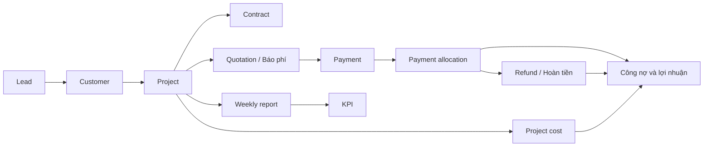
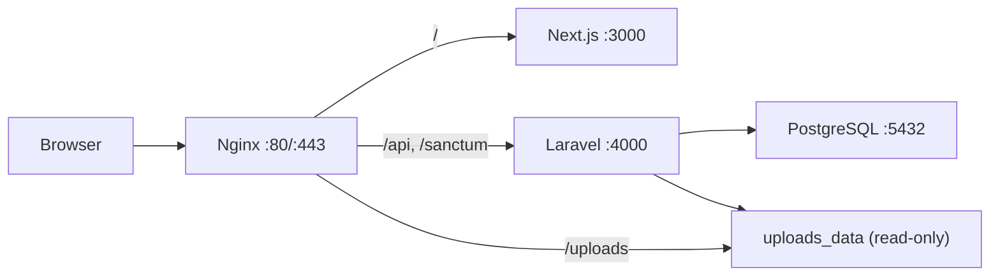

# X3 CRM

Tài liệu tổng duy nhất của dự án X3Sales CRM. File này là nguồn chuẩn cho cách cài đặt, lệnh chạy,
kiến trúc, luồng nghiệp vụ, API, quy ước frontend/backend và vận hành VPS.

> Cập nhật gần nhất: 26/07/2026. Khi thay đổi luồng, API, cấu trúc hoặc cách triển khai, cập nhật
> trực tiếp file này; không tạo thêm README hoặc thư mục `docs` rời.

## Lệnh chạy nhanh

Danh sách lệnh rút gọn để tra cứu khi thao tác nằm tại
[`tooling/COMMANDS.md`](tooling/COMMANDS.md). README này vẫn là nguồn giải thích đầy đủ và chuẩn cuối cùng.

### Cài đặt lần đầu trên Windows PowerShell

Yêu cầu: Node.js 20+, npm, Docker Desktop; nếu chạy backend ngoài Docker cần PHP 8.2+, Composer và
extension `pdo_pgsql`.

```powershell
# Từ thư mục gốc repository
npm install
Copy-Item apps/backend/.env.example apps/backend/.env

Set-Location apps/backend
composer install
php artisan key:generate
Set-Location ../..
```

Nếu PHP/Composer không nằm trong `PATH`, script backend mặc định dùng Laragon tại
`D:\laragon\bin\php\php-8.4.4\php.exe` và
`D:\laragon\bin\composer\composer.phar`. Có thể ghi đè bằng `PHP_PATH` và `COMPOSER_PHAR`.

### Chạy môi trường phát triển khuyến nghị

Backend chạy trên máy host, PostgreSQL chạy trong Docker. `npm run dev` chạy đồng thời frontend và
backend; backend tự migrate/seed database local và mặc định mở thêm ngrok cho webhook SePay.

```powershell
npm run dev:db
npm run dev
```

Các địa chỉ hỗ trợ:

| Thành phần | Địa chỉ |
| --- | --- |
| Frontend | http://localhost:3000 |
| Backend API | http://localhost:4000/api |
| Swagger UI | http://localhost:4000/api/documentation |
| PostgreSQL local | `127.0.0.1:5433` |
| Ngrok inspector | http://127.0.0.1:4040 |
| Production | https://crm.x3sales.com |

### Chạy từng phần

```powershell
npm run dev:frontend
npm run dev:backend

# Backend dùng domain ngrok dev cố định
npm run dev:backend:x3sales

# Không mở ngrok
$env:START_NGROK = '0'
npm run dev:backend
Remove-Item Env:START_NGROK
```

Webhook local:

```text
https://<ngrok-domain>/api/payments/webhook
```

Domain ngrok cố định hiện được cấu hình trong script:

```text
https://despitefully-ahungered-anh.ngrok-free.dev/api/payments/webhook
```

### Chạy toàn bộ bằng Docker

Đảm bảo `apps/backend/.env` đã có `APP_KEY`, sau đó:

```powershell
npm run dev:docker
docker compose -f tooling/development/compose.full.yml ps
docker compose -f tooling/development/compose.full.yml logs -f --tail=200
```

`tooling/development/compose.full.yml` cung cấp frontend `3000`, backend `4000` và PostgreSQL host
port `5433`. Backend container tự chạy migration và seed khi khởi động.

### Database, cache và Swagger

```powershell
npm run db:migrate
npm run db:seed

# CẢNH BÁO: xóa và tạo lại toàn bộ dữ liệu local
npm run db:fresh

Set-Location apps/backend
php artisan config:clear
php artisan route:list
php artisan migrate:status
php artisan l5-swagger:generate
Set-Location ../..
```

### Kiểm tra code

Project hiện chưa có test suite tự động. Kiểm tra tối thiểu trước khi bàn giao:

```powershell
Set-Location apps/frontend
npm exec tsc -- --noEmit
npm run format:check
Set-Location ../backend
php artisan route:list
php artisan migrate:status
Set-Location ../..
```

Trong công việc thường ngày, ưu tiên TypeScript check và kiểm tra trên dev server. Chỉ chạy build
toàn dự án khi cần xác nhận release hoặc có yêu cầu rõ ràng.

```powershell
npm run build:frontend
npm run build:backend
```

### Chuyển database local/server

Chọn profile trong `apps/backend/.env`:

```dotenv
DB_PROFILE=local
```

Local dùng các biến `DB_LOCAL_*` và PostgreSQL tại `127.0.0.1:5433`.

```powershell
npm run dev:db
Set-Location apps/backend
php artisan config:clear
php artisan serve --host=0.0.0.0 --port=4000
```

Muốn truy cập database VPS từ backend local:

```powershell
# Terminal 1: giữ cửa sổ này mở
npm run db:tunnel

# apps/backend/.env
# DB_PROFILE=server

# Terminal 2
Set-Location apps/backend
php artisan config:clear
php artisan serve --host=0.0.0.0 --port=4000
```

Profile `server` dùng các biến `DB_SERVER_*` qua tunnel `127.0.0.1:5434`. Script
`dev-backend.cmd` không tự migrate/seed khi profile là `server`. `DB_PROFILE=default` dùng trực tiếp
`DB_HOST`, `DB_PORT`, `DB_DATABASE`, `DB_USERNAME`, `DB_PASSWORD`.

### Deploy production

Lệnh chuẩn từ máy phát triển:

```powershell
npm run deploy:production
```

Hoặc dùng SSH key và tham số rõ ràng:

```powershell
.\tooling\deployment\deploy-production.ps1 `
  -Server 45.252.251.120 `
  -SshUser root `
  -SshKey C:\path\to\id_ed25519 `
  -PublicUrl https://crm.x3sales.com
```

Script build image `linux/amd64`, backup database VPS, tải image/cấu hình, chạy migration, khởi động
lại container và kiểm tra HTTP. Chi tiết và lệnh vận hành máy chủ nằm ở phần
[Triển khai và vận hành VPS](#triển-khai-và-vận-hành-vps).

## Tổng quan sản phẩm

X3 CRM là hệ thống nội bộ cho agency X3Sales, quản lý từ đầu mối bán hàng đến khách hàng, dự án,
báo phí, hợp đồng, tiền vào/tiền hoàn, chi phí thực hiện, báo cáo tuần và KPI.

Luồng nghiệp vụ chính:



Nguyên tắc cốt lõi:

- Luồng giao diện đi tuần tự `Lead → Customer → Project → Báo phí`; không tạo Báo phí khi chưa có
  Project.
- Customer là hồ sơ dùng chung của khách hàng/pháp nhân; một Customer có nhiều Project.
- Project là hồ sơ trung tâm, tồn tại qua nhiều tháng và có nhiều Báo phí, Payment, chi phí, hợp
  đồng và báo cáo tuần.
- Quotation là số tiền báo khách phải thanh toán cho một kỳ/lần; Payment là giao dịch ngân hàng đã
  thực nhận. Hai khái niệm không được dùng thay nhau.
- Giao dịch ngân hàng gốc không bị tách thành giao dịch giả. Phân bổ tiền vào Báo phí được lưu trong
  sổ riêng để luôn truy vết được.
- Backend là nguồn tính toán và kiểm tra cuối cùng cho mã nghiệp vụ, tổng tiền, công nợ, hạn mức và
  trạng thái khóa.

## Kiến trúc hệ thống

### Công nghệ

- Monorepo dùng npm workspaces.
- Frontend: Next.js 14 App Router, React 18, TypeScript, Tailwind CSS, MUI, Emotion, TanStack Query,
  Zustand, Axios, React Hook Form, Zod, Day.js, Recharts và dnd-kit.
- Backend: Laravel 11, PHP 8.2+ ở local, PHP 8.4 trong image production, Laravel Sanctum, L5
  Swagger.
- Database: PostgreSQL 17 ở `tooling/development/compose.local.yml` và production; full-Docker
  Compose local vẫn dùng PostgreSQL 16.
- Production: Docker Compose, Nginx reverse proxy, HTTPS Let's Encrypt.

### Luồng request production



- `/api/vietqr/banks` là ngoại lệ: Nginx chuyển route này sang frontend để Next.js proxy danh mục
  ngân hàng VietQR.
- PostgreSQL production chỉ bind loopback của VPS; máy ngoài phải đi qua SSH tunnel.
- Upload được lưu bằng đường dẫn tương đối `/uploads/YYYY/MM/...` và dùng volume
  `x3crm_uploads_data`.

### Cấu trúc repository

```text
.
├── apps/
│   ├── backend/
│   │   ├── app/                  # Controllers, Requests, Resources, Services, Repositories, Models
│   │   ├── database/             # Migrations và seeders
│   │   └── routes/api.php        # Toàn bộ route API
│   └── frontend/
│       ├── src/app/              # Next.js routes, layouts, loading/error
│       ├── src/features/         # UI và logic theo domain
│       ├── src/components/       # Component dùng chung
│       ├── src/services/         # API client
│       ├── src/stores/           # Client state, auth store
│       ├── src/lib/              # Helper dùng chung
│       ├── src/types/            # TypeScript types
│       ├── src/assets/           # Ảnh, icon, logo import qua source
│       ├── src/styles/           # Global/shared CSS
│       └── public/uploads/       # Upload public ở local
├── packages/shared/              # Kiểu dữ liệu dùng chung
└── tooling/
    ├── COMMANDS.md               # Bảng tra cứu nhanh các lệnh có thể chạy
    ├── development/              # Compose local, dev backend, ngrok, DB tunnel/migrate
    ├── deployment/               # Deploy script và cấu hình production
    ├── binaries/                 # Binary local như ngrok; bị Git ignore
    └── backups/                  # Database dump local; bị Git ignore
```

Backend đi theo luồng:

```text
Route → Controller → Form Request → Service → Repository/Model → API Resource
```

Frontend route page giữ mỏng; phần giao diện/nghiệp vụ lớn đặt trong
`src/features/<domain>/components`.

`tooling/` nằm cùng cấp với `README.md` để tách toàn bộ công cụ phát triển/triển khai khỏi source
runtime trong `apps/`. Production image chỉ nhận build context sạch được deployment script tạo tạm
trong `tooling/deployment/.work`; `binaries`, `backups` và `.work` không được commit hoặc đưa vào
image.

## Xác thực, API client và phân quyền

- Auth dùng Laravel Sanctum session cookie `x3_crm_session` dạng HttpOnly; không lưu access token
  hoặc user auth trong `localStorage`.
- Login gọi `/sanctum/csrf-cookie`, sau đó `POST /api/auth/login`.
- Frontend lưu current user trong Zustand memory. Khi refresh, `providers.tsx` gọi
  `GET /api/auth/me` để phục hồi session.
- Axios client tại `apps/frontend/src/services/api/client.ts` luôn gửi cookie bằng
  `withCredentials`; request thay đổi dữ liệu gửi XSRF token.
- API trả `401` thì frontend chuyển về `/login`. Lỗi kết nối backend hiển thị trạng thái `503` có
  nút thử lại, không render dữ liệu app từ cache.
- Mọi route nghiệp vụ, trừ login và webhook, đều đi qua `auth:sanctum` và middleware kiểm tra user
  còn hoạt động.
- Một số nhóm quản trị dùng middleware permission, ví dụ `option.manage`, `user.*`, `role.*`.
  Frontend ẩn/hiện menu theo quyền nhưng backend vẫn là lớp kiểm tra bắt buộc.
- Production dùng `SESSION_SECURE_COOKIE=true`, domain thật trong `SANCTUM_STATEFUL_DOMAINS` và
  CORS frontend tương ứng.

## Luồng nghiệp vụ chi tiết

### 1. Lead → Customer → Project

#### Lead

- Lead có mã `lead_code`, thông tin liên hệ, nguồn, ngành, dịch vụ quan tâm, người phụ trách, trạng
  thái và timeline chăm sóc.
- Status/source/industry lấy từ option groups `lead_status`, `lead_source`, `industry`.
- Trường nguồn cho phép chọn option có sẵn hoặc nhập mới; frontend tạo option trước rồi lưu Lead.
- Quick view Lead tải `GET /leads/{id}` để có timeline đầy đủ và giữ nguyên filter/list state.
- Lead chưa chuyển đổi có CTA `Chuyển thành khách hàng`; Lead đã chuyển đổi hiển thị `Mở khách
  hàng`.

#### Chuyển thành Customer

- Frontend mở `/customers/new?leadId=<id>` và gọi `POST /customers` với `leadId`.
- Backend khóa Lead trong transaction, kiểm tra `converted_customer_id` và Customer cùng `lead_id`
  để chặn tạo trùng.
- Trong cùng transaction, backend:
  1. tạo Customer;
  2. cập nhật Lead đã chuyển đổi và `closed_date`;
  3. ghi timeline;
  4. bổ sung `customer_id` cho Báo phí/Payment cũ của Lead nếu còn thiếu.
- Tạo Customer thành công mở hồ sơ Customer. Hệ thống không tự nhảy sang form tạo Project.
- Customer chỉ được tạo từ Lead hợp lệ. Mở lại URL của Lead đã chuyển đổi sẽ chuyển đến Customer
  hiện có.
- `customer_code` độc lập với `lead_code`, được backend cấp dạng `001`, `002`, `003`, ... bằng khóa
  transaction và `MAX(customer_code) + 1`. Frontend không gửi hoặc sửa mã này; transaction rollback
  không làm nhảy số.
- API cũ `POST /leads/{id}/convert` vẫn tồn tại cho tương thích, nhưng giao diện hiện tại dùng
  `POST /customers`.

#### Project

- Từ hồ sơ Customer, CTA `Tạo dự án` mở `/projects/new?customerId=<id>`.
- Project bắt buộc có Customer, service, tên, type, ngày bắt đầu, trạng thái, manager, sales phụ
  trách và thứ báo cáo theo yêu cầu giao diện hiện tại.
- Project type chỉ có `K` hoặc `M`.
- Backend luôn tự tạo lại mã:

```text
<customer_code>.<root_service_code>.<project_type>.<project_name>
```

Ví dụ:

```text
001.DV1.M.X3SALES
```

- Service con dùng mã của root service trong project code.
- Form Project không tạo Hợp đồng hoặc Báo phí ngầm. Hai nghiệp vụ này chỉ bắt đầu sau khi Project
  tồn tại.
- Hồ sơ `/projects/[id]` có bốn tab: `Thông tin dự án`, `Hợp đồng`, `Tài chính`, `Khách hàng`.
- Thanh luồng `Lead → Customer → Dự án` xuất hiện trên các hồ sơ liên quan.

### 2. Nhóm doanh thu 2.1 và 2.2

Không phân nhóm cứng theo mã DV1/DV2/DV3/DV4. Nhóm được quyết định từ option
`service_quote_config` của root service:

- Config tự động bật → nhóm `2.1`, `pricingMode=management_fee`.
- Không có config bật → nhóm `2.2`, `pricingMode=quantity_price`.
- Service con kế thừa config của root service.
- Khi tạo Báo phí, lưu snapshot `revenueGroup`, `pricingMode`, `serviceRootId`,
  `serviceRootCode` vào metadata. Thay đổi config sau này không được sửa lịch sử Báo phí cũ.

Nhóm 2.1 áp dụng ngân sách quảng cáo, bảng tỷ lệ phí quản lý và gói setup. Nhóm 2.2 dùng hạng mục,
số lượng, đơn giá và chi phí đối tác/thực hiện.

### 3. Báo phí

- Luồng bắt buộc: `Lead → Customer → Project → Báo phí`.
- Form chỉ chọn một Project. Customer, Lead nguồn, service, mã nền và phân nhóm được backend suy ra
  từ Project.
- Mỗi Project có nhiều Báo phí theo kỳ/lần.
- Mã Báo phí do backend tạo:

```text
<project-code-base>.Q001
<project-code-base>.Q002
```

- Mã này là nội dung chuyển khoản VietQR và không được đổi sau khi phát hành.
- Form có các dòng động: nội dung, đơn vị tính, số lượng/số lần, đơn giá, thành tiền. Nếu root
  service có auto pricing, frontend thêm các dòng ngân sách, phí quản lý và setup theo config.
- Tổng trước thuế, VAT và tổng thanh toán được tính nhất quán ở frontend và được backend kiểm tra.
- Trạng thái nghiệp vụ:
  - `draft` → `Báo phí`;
  - `won` → `Đã thanh toán`;
  - vòng đời hoàn tiền có thể hiển thị `Đã hoàn tiền`, `Đã hoàn toàn bộ`, hoặc
    `Đã hoàn + bù thêm`.
- Form không cho người dùng tự chọn trạng thái. Backend tính lại trạng thái theo sổ phân bổ và hoàn
  tiền.
- Khi tổng phân bổ gốc đạt tổng phải thu với sai số tối đa `0,01`, dữ liệu nghiệp vụ của Báo phí bị
  khóa; chỉ `Ghi chú` còn được sửa. Hủy phân bổ có thể mở khóa nếu tổng nhận xuống dưới mức phải
  thu. Hoàn tiền không xóa chứng từ thu gốc và không tự mở khóa lịch sử.
- Báo phí đã có phân bổ không được đổi tổng tiền hoặc xóa.

### 4. Hợp đồng

- Một Project có nhiều Hợp đồng; quản lý tại tab `Hợp đồng`.
- CRUD dùng `/contracts`, lọc theo `project_id`.
- Chủ thể nhận hóa đơn được snapshot trên từng Hợp đồng:
  - `customer`: lấy pháp lý hiện tại của Customer tại thời điểm lưu;
  - `other`: nhập chủ thể/pháp nhân độc lập.
- Snapshot gồm tên, đại diện, mã số thuế, địa chỉ, email hóa đơn và điện thoại. Sửa Customer sau
  này không viết lại lịch sử Hợp đồng.
- Khi Hợp đồng gắn Báo phí, backend đồng bộ `contract_id` sang Báo phí và Payment liên quan.

### 5. Payment, phân bổ và hoàn tiền

#### Giao dịch gốc

- `payments` là sổ giao dịch ngân hàng gốc: số tiền, nội dung, thời gian, tài khoản nhận, mã tham
  chiếu và raw webhook payload.
- Một giao dịch có thể trả nhiều Báo phí, và một Báo phí có thể nhận nhiều giao dịch qua
  `payment_allocations`.
- Không sửa/tách giao dịch webhook thành nhiều giao dịch giả.
- Webhook SePay chỉ auto-match khi nội dung chứa đúng `quotation_code`; không fuzzy match theo
  số tiền, tên hoặc chuỗi gần giống.
- Khi match, hệ thống tự phân bổ tối đa bằng số còn phải thu. Phần vượt vẫn là số dư chưa xử lý.
- Webhook không có mã hợp lệ tạo Payment `unmatched` và vẫn trả body gốc
  `{"success": true}` nếu payload hợp lệ.
- Webhook yêu cầu `PAYMENT_WEBHOOK_SECRET` qua `Authorization: Apikey ...` hoặc Bearer theo
  middleware. Secret rỗng khiến mọi webhook bị từ chối.

#### Phân bổ

```text
Tiền chưa phân bổ = Tiền nhận
                    - Tổng phân bổ
                    - Hoàn tiền thừa đang chờ/đã chuyển
```

- Không phân bổ vượt tiền chưa phân bổ hoặc công nợ Báo phí.
- Dự án và Customer luôn suy ra từ Báo phí được chọn; không còn thao tác gắn Project trực tiếp vào
  giao dịch.
- Hủy phân bổ là soft delete và trả tiền về số dư chưa xử lý. Không được hủy nếu dòng phân bổ đã có
  khoản trả khách `pending` hoặc `completed`.
- Danh sách `/payments` có thể group theo Báo phí để không cắt một nhóm giao dịch qua hai trang.
- `Chênh lệch = Tổng phân bổ ròng của nhóm - Tổng Báo phí`: âm là thiếu, dương là thừa, 0 là khớp.
- Số hóa đơn đầu ra lưu riêng tại `payments.output_invoice_number`, chỉnh qua
  `PATCH /payments/{id}/invoice`.

#### Hoàn tiền

`payment_refunds` quản lý nghiệp vụ trả khách, không tự phát lệnh chuyển tiền ngân hàng.

Các loại:

- `deposit`: hoàn cọc;
- `payment`: hoàn khoản đã phân bổ;
- `overpayment`: hoàn tiền chuyển thừa;
- `compensation`: bù thêm ngoài tiền khách đã nộp.

Trạng thái:

- `pending`: giữ chỗ hạn mức để chống hoàn trùng, chưa giảm công nợ;
- `completed`: đã trả thực tế và được tính vào số thu ròng;
- `cancelled`: hủy và giải phóng hạn mức.

Các chỉ số chính:

```text
Đã thu ròng = Tổng payment_allocations
               - Tổng refund completed (không gồm compensation)

Cần thu hiện tại = Tổng Báo phí - Cọc đã hoàn

Tiền ra = Tiền hoàn cọc/thanh toán + Tiền bù thêm

Lợi nhuận thực nhận của Project = Đã nhận
                                  - Đã hoàn
                                  - Bù thêm
                                  - Cọc còn giữ
                                  - Chi phí đã chi
```

- `Đã nhận` luôn là tổng phân bổ gốc trước hoàn để không mất dấu tiền khách từng chuyển.
- Hoàn cọc giảm nghĩa vụ cần thu tương ứng và không biến một Báo phí đã thanh toán thành thiếu.
- Hoàn toàn bộ giữ lại tổng Báo phí và tổng tiền nhận ban đầu để truy vết, nhưng các chỉ số cần thu,
  thực thu, còn phải thu và chênh lệch về 0.
- `compensation` hiển thị riêng, không tạo công nợ âm và không thay đổi số phải thu.

### 6. Chi phí Project và CID

- `project_costs` là dòng tiền công ty chi ra.
- `entryType=ad_spend` cho nhóm 2.1; `entryType=partner_cost` cho nhóm 2.2.
- Backend tính tổng, không tin tổng do frontend gửi:
  - 2.1: tiền trước VAT + VAT;
  - 2.2: tiền trước VAT + VAT - discount, tối thiểu 0.
- Chỉ `completed` được tính vào chi phí/lợi nhuận; `pending` chưa tính; `cancelled` bị loại.
- Một khoản chi có thể gắn Báo phí để đối chiếu theo kỳ nhưng không bắt buộc.
- `/costs` là sổ đối soát tập trung, group theo Project và hỗ trợ keyword, loại, trạng thái, đã
  khớp/chưa khớp và khoảng ngày.
- `POST /project-costs/{id}/reconcile` khóa khoản chi sau khi xác nhận; khoản đã khớp không được sửa
  hoặc xóa.

Với chi phí nạp quảng cáo:

- `cashOutAmount`: dòng tiền đã chi, không thay đổi sau đối soát;
- `actualCostAmount`: chi phí thực tế;
- `originalBalanceAmount`: số dư gốc khi CID dừng;
- `releasedBalanceAmount`: hạn mức đã trả lại Project.

Nếu CID dừng trước khi đối soát, kết quả reconcile tính phần thực chạy và trả toàn bộ số dư hợp lệ
vào hạn mức nạp. Nếu CID dừng sau khi khoản chi đã khóa:

1. nhân sự tạo `project_cost_cid_incidents` ở trạng thái `pending`;
2. nhập ngày dừng, số thực chạy, phần không thu hồi và ghi chú;
3. kế toán xác nhận tại `/costs`;
4. backend tính:

```text
releasedAmount = totalAmount - spentAmount - unrecoverableAmount
actualCostAmount = spentAmount + unrecoverableAmount
```

Sự kiện đã xác nhận bị khóa; sự kiện pending có thể sửa/hủy. Các endpoint:

- `PUT /project-costs/{id}/cid-incident`;
- `POST /project-costs/{id}/cid-incident/confirm`;
- `DELETE /project-costs/{id}/cid-incident`.

### 7. Báo cáo tuần

- Cấu hình nằm tại `project_weekly_settings`, được đồng bộ cùng transaction tạo/sửa Project.
- `report_weekday` dùng ISO weekday: Thứ 2 = 1, Chủ nhật = 7.
- Sales phụ trách đồng thời là `report_owner_user_id`.
- API assignment summary giúp form Project cảnh báo một Sales có bao nhiêu Project cùng ngày báo
  cáo.
- `/weekly-reports` có:
  - `Theo dõi tuần`: bảng điều phối từ cấu hình Project;
  - `Lịch sử báo cáo`: các báo cáo đã tạo.
- Backend tính kỳ báo cáo từ ngày bắt đầu Project và thứ báo cáo. Không cho chọn khoảng ngày tùy ý
  hoặc tạo báo cáo cho tuần tương lai.
- Hạn đúng ngày là `Đến hạn hôm nay`; từ ngày kế tiếp mới là `Quá hạn`.
- Mỗi Project chỉ có một báo cáo cho một kỳ.
- Vòng đời:

```text
draft → submitted → approved
          └──────→ return-to-draft
```

- `draft` được sửa/xóa/gắn ảnh và submit; `submitted` khóa nội dung, chờ approve hoặc trả về draft;
  `approved` chỉ xem.
- Báo cáo chỉ dùng ảnh từ media library. Ảnh thư viện được liên kết metadata/URL, không nhân đôi file.

### 8. KPI

- KPI dùng `/kpi-points`, có CRUD và action approve.
- Danh mục KPI được cấu hình tại `/settings/kpi-categories`.
- Route và menu được kiểm soát bằng permission `kpipoint.view` và các quyền liên quan ở backend.

### 9. Media library

- API: `GET /media`, `POST /media/upload`, `PATCH /media/{id}`, `DELETE /media/{id}`.
- File vật lý nằm dưới frontend `public/uploads/YYYY/MM` ở local hoặc shared volume ở production.
- Database chỉ lưu đường dẫn tương đối `/uploads/...`; không lưu domain đầy đủ.
- `ImageUpload` dùng chung cho avatar, CCCD, ảnh đối soát và báo cáo.
- Hỗ trợ chọn file hoặc dán `Ctrl+V`; ảnh clipboard phải qua bước preview rồi mới upload.
- Định dạng: JPG, PNG, GIF, WEBP; tối đa 3 MB theo validation hiện tại.
- Danh sách media hỗ trợ phân trang, keyword, debounce và hủy request cũ.

## Màn hình frontend

Các route authenticated nằm trong `apps/frontend/src/app/(app)`.

| Nhóm | Route chính | Vai trò |
| --- | --- | --- |
| Auth | `/login`, `/forgot-password` | Đăng nhập và khôi phục truy cập |
| Dashboard | `/dashboard` | KPI và biểu đồ; dữ liệu dashboard hiện còn dùng JSON tạm |
| Lead | `/leads`, `/leads/new`, `/leads/[id]` | CRUD, quick view, timeline, chuyển Customer |
| Customer | `/customers`, `/customers/new`, `/customers/[id]` | Hồ sơ khách hàng từ Lead, mở Project |
| Project | `/projects`, `/projects/new`, `/projects/[id]` | Hồ sơ trung tâm và bốn tab nghiệp vụ |
| Báo phí | `/quotations`, `/quotations/new`, `/quotations/[id]` | Báo phí, VietQR, công nợ |
| Redirect cũ | `/projects/quotes` | Chuyển sang `/quotations` |
| Thanh toán | `/payments` | Tiền nhận, phân bổ, hoàn tiền, hóa đơn đầu ra |
| Chi phí | `/costs` | Đối soát chi phí và sự kiện CID |
| Báo cáo tuần | `/weekly-reports`, `/weekly-reports/new`, `/weekly-reports/[id]` | Điều phối và vòng đời báo cáo |
| KPI | `/kpi` | Điểm KPI và duyệt |
| Thư viện | `/media-library` | Media dùng chung |
| User | `/users`, `/users/new`, `/users/[id]` | Tài khoản nhân viên |
| Phòng ban | `/users/departments` | CRUD phòng ban |
| Vai trò | `/users/roles`, `/users/roles/new`, `/users/roles/[id]` | Role và gán permission |
| Permission | `/users/permissions` | Danh sách permission; chưa có UI CRUD |
| Cài đặt | `/settings` | Hồ sơ công ty/website |
| Dịch vụ | `/projects/services` | Cây dịch vụ và cấu hình Báo phí root service |
| Đối tác | `/projects/partners` | Option đối tác |
| Ngân hàng | `/settings/bank-accounts` | Tài khoản nhận tiền công ty |
| Thẻ nạp QC | `/settings/ad-topup-cards` | Nguồn chi/nạp quảng cáo |
| Hạng mục KPI | `/settings/kpi-categories` | Danh mục KPI |
| Danh mục chung | `/settings/options` | Option theo group, kéo thả thứ tự |
| Hồ sơ cá nhân | `/profile` | Current user, avatar và thông tin tài khoản |

## Tổng quan API

API prefix là `/api`. Frontend đã cấu hình base URL nên thường gọi `/leads`, `/projects`, ... trong
client code.

### Public

| Method | Route | Mục đích |
| --- | --- | --- |
| `GET` | `/api/` | Health/info API |
| `POST` | `/api/auth/login` | Tạo Sanctum session |
| `POST` | `/api/payments/webhook` | Nhận webhook ngân hàng có secret |
| `GET` | `/sanctum/csrf-cookie` | Khởi tạo CSRF cookie |

### Authenticated CRUD

| Resource | Route gốc |
| --- | --- |
| Auth profile/logout/password | `/api/auth/*` |
| Media | `/api/media` |
| Options | `/api/options` |
| Services | `/api/services` |
| Users / departments | `/api/users`, `/api/departments` |
| Roles / permissions | `/api/roles`, `/api/permissions` |
| Leads / customers | `/api/leads`, `/api/customers` |
| Projects / contracts | `/api/projects`, `/api/contracts` |
| Quotations | `/api/quotations` |
| Payments / refunds | `/api/payments`, `/api/payment-refunds` |
| Project costs | `/api/project-costs` |
| Weekly settings/reports | `/api/project-weekly-settings`, `/api/weekly-reports` |
| KPI | `/api/kpi-points` |

Hầu hết resource hỗ trợ `GET list/show`, `POST create`, `PUT/PATCH update`, `DELETE soft delete` theo
route hiện có.

### Action endpoints quan trọng

| Method | Route | Mục đích |
| --- | --- | --- |
| `POST` | `/leads/{id}/convert` | Luồng chuyển đổi cũ, giữ để tương thích |
| `PATCH` | `/options/reorder` | Sắp xếp option trong group |
| `PATCH` | `/services/reorder` | Sắp xếp cây dịch vụ |
| `POST` | `/roles/{id}/permissions` | Đồng bộ permission cho role |
| `POST` | `/payments/{id}/allocations` | Phân bổ giao dịch vào Báo phí |
| `DELETE` | `/payments/{paymentId}/allocations/{allocationId}` | Hủy phân bổ |
| `POST` | `/payments/{id}/refunds` | Tạo khoản trả khách |
| `PATCH` | `/payment-refunds/{id}` | Cập nhật khoản trả |
| `POST` | `/payments/{id}/classification` | Phân loại customer/internal/other |
| `PATCH` | `/payments/{id}/invoice` | Số hóa đơn đầu ra của giao dịch |
| `POST` | `/project-costs/{id}/reconcile` | Khóa/đối soát chi phí |
| `PUT` | `/project-costs/{id}/cid-incident` | Báo CID dừng sau đối soát |
| `POST` | `/project-costs/{id}/cid-incident/confirm` | Kế toán xác nhận CID |
| `GET` | `/project-weekly-settings/assignment-summary` | Kiểm tra tải lịch Sales |
| `GET` | `/weekly-reports/board` | Bảng điều phối tuần từ backend |
| `POST` | `/weekly-reports/{id}/submit` | Gửi duyệt |
| `POST` | `/weekly-reports/{id}/approve` | Duyệt |
| `POST` | `/weekly-reports/{id}/return-to-draft` | Trả về nháp |
| `POST` | `/weekly-reports/{id}/attachments` | Gắn ảnh báo cáo |
| `POST` | `/kpi-points/{id}/approve` | Duyệt KPI |

Swagger được cấu hình tại `/api/documentation`; source OpenAPI chính ở
`apps/backend/app/OpenApi.php` và annotations liên quan.

## Mô hình dữ liệu chính

```text
Lead
 └─ Customer
     └─ Project
         ├─ Contract
         ├─ Quotation ─┬─ QuotationItem
         │             └─ PaymentAllocation ─ Payment ─ PaymentRefund
         ├─ ProjectCost ─ ProjectCostCidIncident
         ├─ ProjectWeeklySetting
         └─ WeeklyReport ─┬─ WeeklyReportItem
                         └─ WeeklyReportAttachment

User ─ Role ─ RolePermission ─ Permission
Service ─ Service child/package
Option ─ các group cấu hình nghiệp vụ
Attachment ─ media library
KpiPoint ─ User/Project/WeeklyReport theo ngữ cảnh
```

Các model dùng soft delete ở những nơi cần giữ lịch sử. Khi chỉnh sửa luồng tài chính, luôn kiểm tra
cả migration, Service, Resource và frontend type/helper; không chỉ sửa giao diện.

## Quy ước frontend

### Phân lớp thư mục

- `src/app`: chỉ route segment, layout, page, loading/error và composition theo route.
- `src/features/<domain>/components`: màn hình/logic lớn theo nghiệp vụ.
- `src/components`: component dùng chung như shell, form, table, feedback, upload.
- `src/services/api/client.ts`: Axios base URL, cookie, CSRF và xử lý 401.
- `src/stores/auth-store.ts`: current user/session state trong memory.
- `src/lib`: helper chung; không đặt component hoặc logic route lớn tại đây.
- `src/types`: type dùng qua nhiều component.

### UI và interaction

- Tailwind CSS là hệ thống chính cho layout/visual. MUI dùng cho input, select, table, checkbox,
  dialog, date picker, menu, icon và behavior.
- Tránh `sx`/inline style nếu Tailwind xử lý được.
- Font toàn app là Public Sans Variable.
- Màu chính `#2563eb`; xanh hỗ trợ `#16a34a`; cam nhấn `#f97316`.
- UI theo hướng CRM vận hành: dày thông tin, dễ quét, ít trang trí. Minimal UI là tham chiếu cho
  login, shell, list và form.
- Form CRUD lớn mặc định là full page; chỉ dùng popup khi nghiệp vụ yêu cầu rõ.
- Route page giữ mỏng, không nhét cả table/form manager vào `page.tsx`.
- Money input dùng `src/components/form/money-input.tsx`, hiển thị ngăn cách hàng nghìn kiểu Việt
  Nam nhưng giữ raw digits cho payload/tính toán.
- Date picker hiển thị `DD/MM/YYYY`, API nhận `YYYY-MM-DD`.
- Không dùng native `alert`/`confirm`. Dùng `useAppNotification()` và shared confirm dialog.
- First load có thể dùng content loading; filter/refetch giữ dữ liệu cũ bằng TanStack Query
  `keepPreviousData` và chỉ loading vùng bảng.
- User mutation của current user phải cập nhật auth store để header/avatar đổi ngay.

### Assets và style

- Ảnh import qua source đặt trong `src/assets/images`, dùng alias `@assets/images/...` và
  `next/image` khi phù hợp.
- Logo/brand đặt trong `src/assets/logos`; logo chính:
  `src/assets/logos/x3sales-logo.svg`.
- Icon tùy biến đặt trong `src/assets/icons`; ưu tiên `@mui/icons-material` cho icon UI phổ biến.
- Global CSS entry là `src/styles/globals.css`, được root layout import bằng `@/styles/globals.css`.
- CSS Module riêng đặt cạnh component dưới dạng `*.module.css`.
- Shared CSS đặt trong `src/styles` và import qua `@styles/...`.

### Component dùng chung cần ưu tiên

- Toast: `src/components/feedback/notification-provider.tsx`.
- API error: `src/lib/api-error.ts`.
- Confirm: `src/components/feedback/confirm-dialog.tsx`.
- Full-page splash: `src/components/shell/app-splash-screen.tsx`.
- In-shell loading: `src/components/shell/content-loading.tsx`.
- Image picker: `src/components/upload/image-upload.tsx`.
- Money input: `src/components/form/money-input.tsx`.
- Server paginated autocomplete:
  `src/components/form/server-paginated-autocomplete.tsx`.

## Danh mục cấu hình

`options` lưu các danh mục linh hoạt. Một số group quan trọng:

| Group | Mục đích |
| --- | --- |
| `lead_status` | Trạng thái Lead |
| `lead_source` | Nguồn Lead |
| `industry` | Ngành |
| `customer_type` | Loại Customer |
| `project_status` | Trạng thái Project |
| `contract_status` | Trạng thái Hợp đồng |
| `service_quote_config` | Auto pricing theo root service |
| `project_partner` | Hồ sơ đối tác dạng option |
| `site_profile` | Thông tin công ty/website |
| `company_bank_account` | Tài khoản nhận tiền |
| `ad_topup_card` | Tài khoản/thẻ dùng nạp quảng cáo |
| `kpi_category` | Hạng mục KPI |

Trang `/settings/options` chỉ hiển thị tên, màu và trạng thái cho option thông thường. Thứ tự được
kéo thả trong từng group; mutation chỉ cập nhật/refetch group bị ảnh hưởng.

Mapping đặc biệt:

- `project_partner`: `key` mã đối tác, `label` tên, `value` dịch vụ,
  `meta.accountNo`/`meta.bankName` là ngân hàng.
- `company_bank_account`: `key` mã VietQR, `label` chủ tài khoản, `value` số tài khoản,
  `meta.bankName`, `branch`, `isDefault`.
- `service_quote_config`: `key` root service code, `value` root service id, metadata chứa trạng
  thái bật, bảng tỷ lệ và gói setup.

## Biến môi trường

### Backend local

Các key chính trong `apps/backend/.env`:

```dotenv
APP_URL=http://localhost:4000
FRONTEND_URL=http://localhost:3000
FRONTEND_URLS=http://localhost:3000,http://127.0.0.1:3000

SANCTUM_STATEFUL_DOMAINS=localhost:3000,127.0.0.1:3000
SESSION_DRIVER=database
SESSION_COOKIE=x3_crm_session
SESSION_SECURE_COOKIE=false

DB_PROFILE=local
DB_LOCAL_HOST=127.0.0.1
DB_LOCAL_PORT=5433
DB_LOCAL_DATABASE=x3crm
DB_LOCAL_USERNAME=x3crm

PAYMENT_WEBHOOK_SECRET=<secret>
```

### Frontend

```dotenv
NEXT_PUBLIC_API_URL=http://localhost:4000/api
NEXT_PUBLIC_MEDIA_URL=http://localhost:3000
```

Fallback API trong code là `http://localhost:4000/api`. Media URL đã lưu trong database phải là
relative path, nên `NEXT_PUBLIC_MEDIA_URL` chỉ dùng khi render.

Không commit `.env`, `APP_KEY`, database password, webhook secret, SSH password hoặc ngrok token.

## Dữ liệu seed local

Chỉ dùng cho môi trường phát triển. Đổi/xóa các credential mặc định ở môi trường thật.

| Vai trò | Email | Mật khẩu |
| --- | --- | --- |
| Admin | `admin@x3crm.com` | `Admin@123` |
| Leader | `leader@x3crm.com` | `Leader@123` |
| Nhân viên NV002 | `nv002@x3crm.com` | `Nv002@123` |
| Nhân viên NV003 | `nv003@x3crm.com` | `Nv003@123` |
| Kế toán | `ketoan@x3crm.com` | `Ketoan@123` |

Seeder cũng tạo role, permission và cây dịch vụ mẫu.

## Triển khai và vận hành VPS

### Trạng thái production

- Public URL: https://crm.x3sales.com.
- VPS hiện được cấu hình tại `45.252.251.120`, thư mục `/opt/x3crm`.
- Compose project: `x3crm`.
- Bốn service: `nginx`, `frontend`, `backend`, `db`.
- Nginx public `80/443`; HTTP redirect HTTPS.
- Backend và frontend chỉ giao tiếp qua network Compose.
- PostgreSQL bind `127.0.0.1:5432` trên VPS, không mở ra Internet.
- Database volume do Compose quản lý; uploads dùng external volume `x3crm_uploads_data`.
- `.env` thật chỉ nằm trên VPS, nên đặt permission `600`.

Các file triển khai nguồn:

| File | Vai trò |
| --- | --- |
| `tooling/deployment/production/compose.yml` | Bốn service, volume, healthcheck, log rotation |
| `tooling/deployment/production/backend.Dockerfile` | Laravel/PHP 8.4, pdo_pgsql, OPcache |
| `tooling/deployment/production/frontend.Dockerfile` | Next.js standalone/Node 20 |
| `tooling/deployment/production/nginx.conf` | HTTPS, frontend, API, Sanctum, VietQR, uploads |
| `tooling/deployment/production/env.template` | Mẫu production, không chứa secret thật |
| `tooling/deployment/production/opcache.ini` | OPcache backend |
| `tooling/deployment/production/next.config.production.js` | Standalone và public env khi build |
| `tooling/deployment/production/reset-keep-accounts-services.sql` | Reset nghiệp vụ có kiểm soát |
| `tooling/deployment/production/certbot-renew-*.sh` | Dừng/chạy Nginx khi renew chứng chỉ |

### Deploy tự động làm gì

`tooling/deployment/deploy-production.ps1`:

1. kiểm tra Docker và SSH;
2. tạo frontend build context sạch;
3. build backend/frontend `linux/amd64`;
4. đóng `NEXT_PUBLIC_API_URL` và `NEXT_PUBLIC_MEDIA_URL` vào frontend image;
5. tạo tar image;
6. kiểm tra `PAYMENT_WEBHOOK_SECRET` trên server;
7. backup database `pre-deploy-<release>.dump` và kiểm tra bằng `pg_restore -l`;
8. upload image, Compose và Nginx config;
9. tag image hiện tại thành `rollback-<release>`;
10. load image mới, chạy migration và recreate backend/frontend/nginx;
11. kiểm tra frontend, API, container và migration status;
12. xóa artifact tạm local/remote sau khi thành công.

`NEXT_PUBLIC_*` được đóng vào bundle lúc build. Đổi domain/API URL bắt buộc build lại frontend;
chỉ sửa `.env` VPS là chưa đủ.

### Lệnh vận hành thường ngày trên VPS

```bash
cd /opt/x3crm
docker compose ps
docker compose logs -f --tail=200
docker compose logs -f --tail=200 backend
docker compose up -d
docker compose restart backend
docker compose exec -T backend php artisan migrate --force
docker stats --no-stream
df -h
free -h
```

Không chạy `docker compose down -v` trong vận hành bình thường vì có thể xóa database volume. Không
xóa `/opt/x3crm/.env` nếu chưa có bản sao secret.

### Kiểm tra sau deploy

```bash
cd /opt/x3crm
docker compose ps
docker compose logs --since=10m --tail=200
curl -I https://crm.x3sales.com/
curl -H 'Accept: application/json' -i https://crm.x3sales.com/api/
```

Xác nhận:

- bốn container ở trạng thái Up, database Healthy;
- frontend và `/api/` trả HTTP 200;
- login thành công;
- API nghiệp vụ chính hoạt động;
- upload trả URL `/uploads/...` HTTP 200;
- không có `production.ERROR` mới hoặc vòng restart.

### Backup database

```bash
cd /opt/x3crm
ts=$(date +%Y%m%d-%H%M%S)
mkdir -p backups
docker compose exec -T db pg_dump \
  -U x3crm -d x3crm -Fc --no-owner --no-privileges \
  > "backups/x3crm-db-${ts}.dump"
chmod 600 "backups/x3crm-db-${ts}.dump"
docker compose exec -T db pg_restore -l < "backups/x3crm-db-${ts}.dump" > /dev/null
sha256sum "backups/x3crm-db-${ts}.dump"
```

### Backup uploads

```bash
cd /opt/x3crm
ts=$(date +%Y%m%d-%H%M%S)
mkdir -p backups
docker run --rm \
  -v x3crm_uploads_data:/source:ro \
  -v /opt/x3crm/backups:/backup alpine:3.22 \
  sh -c "tar -czf /backup/x3crm-uploads-${ts}.tar.gz -C /source ."
chmod 600 "backups/x3crm-uploads-${ts}.tar.gz"
sha256sum "backups/x3crm-uploads-${ts}.tar.gz"
```

Backup phải được tải sang máy khác hoặc object storage. Backup trên cùng ổ VPS không bảo vệ được
khi VPS/ổ đĩa hỏng.

### Restore database đầy đủ

Có downtime. Xác minh file và checksum trước khi chạy.

```bash
cd /opt/x3crm
backup_file="backups/<ten-file>.dump"

docker compose stop backend
docker compose exec -T db dropdb -U x3crm --if-exists --force x3crm
docker compose exec -T db createdb -U x3crm x3crm
docker compose exec -T db pg_restore \
  -U x3crm -d x3crm --no-owner --no-privileges \
  < "$backup_file"
docker compose start backend
docker compose logs --since=5m --tail=200 backend
```

### Restore uploads

```bash
cd /opt/x3crm
upload_backup="<ten-file>.tar.gz"

docker run --rm \
  -v x3crm_uploads_data:/target \
  -v /opt/x3crm/backups:/backup alpine:3.22 \
  sh -c "find /target -mindepth 1 -delete && tar -xzf /backup/$upload_backup -C /target"
```

Sau restore, kiểm tra login, danh sách, URL ảnh, log, migration và trạng thái container.

### Reset dữ liệu nghiệp vụ, giữ tài khoản/dịch vụ

> CẢNH BÁO: Đây là thao tác phá hủy dữ liệu thật, không thể undo nếu không có backup đọc được.
> Chỉ chạy sau khi xác nhận đúng VPS/database và đã kiểm tra backup.

Script giữ:

- `migrations`;
- `users`, `roles`, `permissions`, `role_permissions`, `departments`;
- `services`, `service_packages`.

Mọi bảng public khác bị `TRUNCATE ... RESTART IDENTITY CASCADE`.

Trước khi chạy, bảo đảm file nguồn
`tooling/deployment/production/reset-keep-accounts-services.sql` đã được copy thành
`/opt/x3crm/reset-keep-accounts-services.sql`.

```bash
cd /opt/x3crm

# Bắt buộc backup database và uploads trước.
docker compose exec -T db psql \
  -U x3crm -d x3crm \
  < reset-keep-accounts-services.sql

docker run --rm -v x3crm_uploads_data:/target alpine:3.22 \
  sh -c 'find /target -mindepth 1 -delete'

docker compose exec -T backend php artisan config:clear
docker compose exec -T backend php artisan route:clear
docker compose exec -T backend php artisan view:clear
docker compose restart backend
```

Không dùng `php artisan optimize:clear` nếu production đang dùng database cache mà chưa có bảng
`cache`; dùng ba lệnh clear riêng như trên.

### Rollback image

Deploy script gắn image cũ bằng tag `rollback-<release>`. Chọn đúng release trước khi tag lại:

```bash
cd /opt/x3crm
docker image ls --filter 'reference=x3crm-*'

docker tag x3crm-backend:rollback-<release> x3crm-backend:deploy
docker tag x3crm-frontend:rollback-<release> x3crm-frontend:deploy
docker compose up -d --force-recreate backend frontend nginx
docker compose ps
docker compose logs --since=5m --tail=200
```

Rollback image không tự rollback migration/database. Nếu migration không tương thích ngược, restore
đúng database backup `pre-deploy-<release>.dump`.

### Xử lý sự cố nhanh

| Triệu chứng | Kiểm tra |
| --- | --- |
| Trang không mở | `docker compose ps`, Nginx log, DNS, firewall 80/443 |
| API 502 | Backend đang restart/migrate; xem backend logs |
| API 500 khi chưa đăng nhập | Gửi `Accept: application/json`, kiểm tra middleware |
| Login lỗi | DB healthy, user/role, Sanctum domains, secure cookie, thời gian hệ thống |
| Ảnh 404 | File trong upload volume, relative path DB, Nginx `/uploads/` alias |
| DB refused | Service `db`, healthcheck, backend `DB_HOST=db` |
| Restart liên tục | Log service, RAM/swap, disk, `.env`, migration |
| Đĩa đầy | `df -h`, `docker system df`, backup/log/image cũ |
| Đổi domain nhưng frontend gọi URL cũ | Build lại frontend với `NEXT_PUBLIC_*` mới |
| Webhook bị từ chối | `PAYMENT_WEBHOOK_SECRET` và header Authorization |

### Lịch sử vận hành cần biết

Ngày 18/07/2026 đã có một lần backup/reset môi trường chạy thử:

- giữ account/role/permission/service;
- xóa sessions, dữ liệu nghiệp vụ và uploads;
- backup được ghi nhận trên VPS dưới tên
  `pre-reset-db-20260718-120112.dump` và
  `pre-reset-uploads-20260718-120112.tar.gz`.

Snapshot hạ tầng được ghi nhận tại thời điểm đó: Ubuntu 24.04.3 LTS, hostname
`crm.x3sales.vn`, 1 vCPU, khoảng 709 MiB RAM, 1 GiB swap, Docker Engine 29.1.3 và Docker Compose
2.37.1. Sau reset có 5 users, 5 roles, 10 permissions, 54 services, 64 migration records và không
còn dữ liệu nghiệp vụ/uploads. Các số này chỉ là mốc lịch sử; code hiện tại đã có thêm migration và
tính năng.

| Backup lịch sử | SHA-256 đã ghi nhận |
| --- | --- |
| `pre-reset-db-20260718-120112.dump` | `784f4a59eed078e735eefecfac2bf25238b310134efe775489cc6f855917e6d7` |
| `pre-reset-uploads-20260718-120112.tar.gz` | `899f651de2e0004cfe2824e96cffb9b3fca1644d66848ed7842db0051b1a19ea` |

Thông tin trên là nhật ký lịch sử, không phải cam kết các file vẫn tồn tại. Luôn kiểm tra trực tiếp
VPS và tạo backup mới trước thao tác.

## Giới hạn và việc cần duyệt

- Hồ sơ đối tác hiện vẫn là option; chưa có pháp nhân, mã số thuế, người liên hệ, hợp đồng và lịch sử
  công nợ riêng.
- Nghiệm thu/hóa đơn đầu vào của chi phí có trạng thái nhưng chưa có đầy đủ số chứng từ, ngày và
  file đính kèm chuyên biệt.
- Hợp đồng hỗ trợ nhiều bản ghi nhưng chưa phân loại rõ Hợp đồng/Phụ lục/Gia hạn và chưa có chuỗi
  phiên bản.
- Chưa có màn xuất báo cáo 2.1/2.2 theo đúng cấu trúc từng tab Google Sheet.
- Công thức lợi nhuận hiện theo dòng tiền; chưa cộng chi phí nhân sự, thuế khác hoặc lợi nhuận dự
  kiến/trước VAT.
- Cần chốt cách hiển thị lịch sử khi Project đã phát sinh dữ liệu rồi đổi service config giữa nhóm
  2.1 và 2.2. Báo phí cũ vẫn giữ snapshot.
- Dashboard còn dùng JSON tạm cho biểu đồ cho đến khi có API dashboard.
- Permission chỉ có màn danh sách; chưa có route/API CRUD permission.
- Trang `/projects/services` đã được xác nhận ổn định; không thay đổi nếu không có yêu cầu trực tiếp.
- Production hiện vẫn chạy PHP built-in server trong container. Khi tải tăng, nên chuyển sang
  PHP-FPM + Nginx hoặc FrankenPHP, bổ sung healthcheck frontend/backend, giám sát và backup offsite
  tự động.

## Quy tắc bảo trì tài liệu

- `README.md` này là tài liệu tổng và nguồn chuẩn duy nhất của repository.
- `tooling/COMMANDS.md` chỉ là bảng tra cứu lệnh rút gọn; không chứa mô tả kiến trúc hoặc nghiệp vụ riêng.
- Không tạo lại `apps/backend/docs`, `apps/frontend/docs` hoặc README con trong `src`.
- Công cụ dev/deploy, binary cục bộ và backup phải đặt dưới `tooling/`, không đưa ngược vào
  `apps/backend` hoặc `apps/frontend`.
- Khi thêm module, cập nhật đồng thời lệnh liên quan, luồng nghiệp vụ, route frontend, API và mô hình
  dữ liệu trong file này.
- Khi nội dung tài liệu mâu thuẫn với code, kiểm tra hành vi thực tế và sửa file này trong cùng
  change set.
- Không ghi secret thật, mật khẩu VPS, `APP_KEY`, database password hoặc webhook secret vào tài
  liệu/Git.
