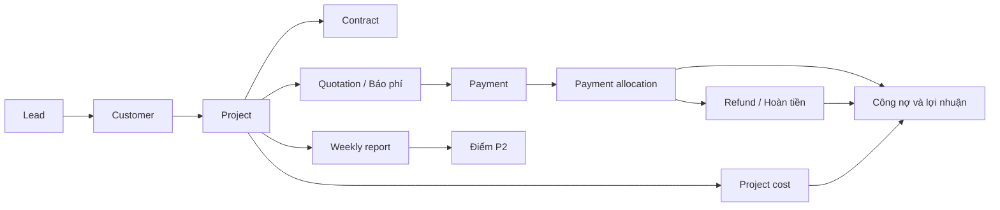
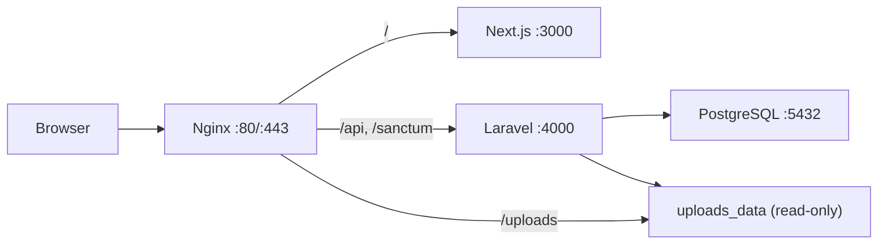

# X3 CRM

Tài liệu tổng duy nhất của dự án X3Sales CRM. File này là nguồn chuẩn cho cách cài đặt, lệnh chạy,
kiến trúc, luồng nghiệp vụ, API, quy ước frontend/backend và vận hành VPS.

> Cập nhật gần nhất: 08/08/2026. Khi thay đổi luồng, API, cấu trúc hoặc cách triển khai, cập nhật
> trực tiếp file này; không tạo thêm README hoặc thư mục `docs` rời.

## Quy tắc xử lý yêu cầu

### Tra cứu trước khi sửa

- Khi yêu cầu chưa đủ rõ về phạm vi, nghiệp vụ hoặc cấu trúc, phải quét README theo tiêu đề và từ khóa
  liên quan trước khi sửa; sau đó đối chiếu với code thực tế của module.
- Thay đổi cục bộ chỉ cần đọc các phần README liên quan. Thay đổi xuyên module, luồng nghiệp vụ, API,
  dữ liệu hoặc deployment phải kiểm tra toàn bộ các phần bị tác động.
- Không tự suy đoán khi README và code chưa đủ kết luận. Nếu README mâu thuẫn với hành vi thực tế, code
  đang chạy là bằng chứng để xác minh và README phải được cập nhật trong cùng change set.
- Chỉ mở rộng phạm vi sang module khác khi có phụ thuộc thực tế. Không build hoặc deploy nếu yêu cầu
  không cần đến các bước đó.

### Đồng bộ giao diện toàn site

- Trước khi tạo hoặc sửa một màn hình, phải đối chiếu shell, layout và các trang cùng loại đang có.
  Không thiết kế riêng từng page theo một format độc lập.
- Giữ thống nhất cách bố trí tiêu đề, breadcrumb, action, card, filter, table, form, khoảng cách,
  typography, màu sắc, responsive và các trạng thái loading/empty/error.
- Ưu tiên component, hook, helper và design token dùng chung. Nếu một pattern mới có khả năng tái sử
  dụng, đặt nó ở lớp shared phù hợp thay vì nhúng riêng vào page.
- Route page phải giữ mỏng; UI và logic nghiệp vụ lớn nằm trong `src/features/<domain>`. Không thay
  toàn bộ style của màn hình khi yêu cầu chỉ sửa content hoặc một hành vi cục bộ.
- Sau thay đổi giao diện, kiểm tra logic theo code, TypeScript và format trong phạm vi bị tác động.
  Không tự mở rộng sang kiểm thử giao diện chi tiết, mở trình duyệt, chụp ảnh hoặc rà mọi tương tác
  khi người dùng chưa yêu cầu; người dùng sẽ mô tả sai lệch hiển thị để sửa đúng trọng tâm.
- Chỉ chạy build hoặc kiểm thử sâu khi thay đổi có rủi ro tương ứng, cần xác nhận release hoặc được
  yêu cầu rõ. Không kéo dài công việc bằng các bước xác minh ngoài phạm vi cần thiết.

### Đồng bộ API toàn hệ thống

- Trước khi sửa API, phải lần theo đầy đủ luồng `Route → Controller → Form Request → Service →
Repository/Model → API Resource` và kiểm tra các frontend consumer liên quan.
- Endpoint mới hoặc đã sửa phải thống nhất với API hiện có về naming, HTTP method/status, validation,
  response resource, pagination, error format, authentication, permission và soft delete.
- Business rule và tính toán đặt ở Service/backend, không đẩy sang Controller hoặc frontend để xử lý
  riêng cho một màn hình.
- Khi request hoặc response thay đổi, phải cập nhật đồng bộ frontend service, type, form/helper,
  Swagger/OpenAPI và các màn hình đang sử dụng; đồng thời xem xét tương thích với dữ liệu hoặc client cũ.
- Thay đổi migration/model phải kiểm tra ảnh hưởng đến seed, resource, nghiệp vụ liên quan và dữ liệu
  production. Thay đổi luồng hoặc contract API phải cập nhật README trong cùng change set.

## Lệnh chạy nhanh

Danh sách lệnh rút gọn để tra cứu khi thao tác nằm tại
[`tooling/COMMANDS.md`](tooling/COMMANDS.md). README này vẫn là nguồn giải thích đầy đủ và chuẩn cuối cùng.

### Cài đặt lần đầu trên Windows PowerShell

Yêu cầu: Node.js 20+, npm, Docker Desktop; nếu chạy backend ngoài Docker cần PHP 8.2+, Composer và
extension `pdo_pgsql`.

```powershell
# Từ thư mục gốc repository
npm install
Copy-Item apps/backend/.env.example apps/backend/.env

Set-Location apps/backend
composer install
php artisan key:generate
Set-Location ../..
```

Nếu PHP/Composer không nằm trong `PATH`, script backend mặc định dùng Laragon tại
`D:\laragon\bin\php\php-8.4.4\php.exe` và
`D:\laragon\bin\composer\composer.phar`. Có thể ghi đè bằng `PHP_PATH` và `COMPOSER_PHAR`.

### Chạy môi trường phát triển khuyến nghị

Backend chạy trên máy host, PostgreSQL chạy trong Docker. `npm run dev` chạy đồng thời frontend,
backend, Reverb, database queue worker và Laravel scheduler; backend tự migrate/seed database local
và mặc định mở thêm ngrok cho webhook SePay. Nếu local đã được đồng bộ từ production và tồn tại
`tooling/backups/last-production-sync.json`, backend chỉ migrate, không chạy seeder mẫu để tránh sửa
hoặc xung đột với dữ liệu thật. Chỉ đặt `FORCE_LOCAL_SEED=1` khi chủ động muốn seed lại.

```powershell
npm run dev:db
npm run dev
```

Các địa chỉ hỗ trợ:

| Thành phần       | Địa chỉ                                 |
| ---------------- | --------------------------------------- |
| Frontend         | http://localhost:3000                   |
| Backend API      | http://localhost:4000/api               |
| Reverb WebSocket | ws://localhost:8080                     |
| Swagger UI       | http://localhost:4000/api/documentation |
| PostgreSQL local | `127.0.0.1:5433`                        |
| Ngrok inspector  | http://127.0.0.1:4040                   |
| Production       | https://crm.x3sales.com                 |

### Chạy từng phần

```powershell
npm run dev:frontend
npm run dev:backend
npm run dev:realtime
npm run dev:scheduler

# Hoặc chạy riêng từng process realtime
npm run dev:reverb
npm run dev:queue

# Backend dùng domain ngrok dev cố định
npm run dev:backend:x3sales

# Không mở ngrok
$env:START_NGROK = '0'
npm run dev:backend
Remove-Item Env:START_NGROK
```

Webhook local:

```text
https://<ngrok-domain>/api/payments/webhook
```

Domain ngrok cố định hiện được cấu hình trong script:

```text
https://despitefully-ahungered-anh.ngrok-free.dev/api/payments/webhook
```

### Chạy toàn bộ bằng Docker

Đảm bảo `apps/backend/.env` đã có `APP_KEY`, sau đó:

```powershell
npm run dev:docker
docker compose -f tooling/development/compose.full.yml ps
docker compose -f tooling/development/compose.full.yml logs -f --tail=200
```

`tooling/development/compose.full.yml` cung cấp frontend `3000`, backend `4000`, Reverb `8080` và
PostgreSQL host port `5433`; queue worker dùng chung backend image. Backend container tự chạy migration
và seed khi khởi động.

### Database, cache và Swagger

```powershell
npm run db:migrate
npm run db:seed

# CẢNH BÁO: xóa và tạo lại toàn bộ dữ liệu local
npm run db:fresh

Set-Location apps/backend
php artisan config:clear
php artisan route:list
php artisan migrate:status
php artisan l5-swagger:generate
Set-Location ../..
```

### Kiểm tra code

Project hiện chưa có test suite tự động. Kiểm tra tối thiểu trước khi bàn giao:

```powershell
Set-Location apps/frontend
npm exec tsc -- --noEmit
npm run format:check
Set-Location ../backend
php artisan route:list
php artisan migrate:status
Set-Location ../..
```

Trong công việc thường ngày, ưu tiên kiểm tra logic theo luồng code, TypeScript và format. Không cần
tự kiểm tra chi tiết trên trình duyệt nếu người dùng chưa yêu cầu. Chỉ chạy build toàn dự án khi cần
xác nhận release, thay đổi có rủi ro cao hoặc có yêu cầu rõ ràng.

```powershell
npm run build:frontend
npm run build:backend
```

### Chuyển database local/server

Để thay toàn bộ database và ảnh upload local bằng dữ liệu production hiện tại:

```powershell
# CẢNH BÁO: database và ảnh upload local hiện tại sẽ bị xóa.
npm run sync:production-data
```

Script `tooling/development/sync-production-to-local.ps1` hỏi mật khẩu SSH ở chế độ ẩn, stream
`pg_dump` và volume `x3crm_uploads_data` trực tiếp về máy nên không tạo backup chiếm dung lượng VPS.
Script kiểm tra dump/archive, restore database thử vào database tạm, rồi mới thay database `x3crm`
local và nội dung `apps/frontend/public/uploads`. Hai file marker `.gitignore`/`.gitkeep` được giữ lại;
file tải trung gian bị dọn sau khi sync thành công hoặc thất bại. Source code và production không bị
thay đổi. Sau khi thành công, file `tooling/backups/last-production-sync.json` đồng thời đánh dấu để
`dev-backend.cmd` không tự chạy seeder mẫu trên snapshot production.

Nếu chỉ muốn đổi backend local sang đọc database server mà không sao chép dữ liệu, chọn profile trong
`apps/backend/.env`:

```dotenv
DB_PROFILE=local
```

Local dùng các biến `DB_LOCAL_*` và PostgreSQL tại `127.0.0.1:5433`.

```powershell
npm run dev:db
Set-Location apps/backend
php artisan config:clear
php artisan serve --host=0.0.0.0 --port=4000
```

Muốn truy cập database VPS từ backend local:

```powershell
# Terminal 1: giữ cửa sổ này mở
npm run db:tunnel

# apps/backend/.env
# DB_PROFILE=server

# Terminal 2
Set-Location apps/backend
php artisan config:clear
php artisan serve --host=0.0.0.0 --port=4000
```

Profile `server` dùng các biến `DB_SERVER_*` qua tunnel `127.0.0.1:5434`. Script
`dev-backend.cmd` không tự migrate/seed khi profile là `server`. `DB_PROFILE=default` dùng trực tiếp
`DB_HOST`, `DB_PORT`, `DB_DATABASE`, `DB_USERNAME`, `DB_PASSWORD`.

### Deploy production

Lệnh chuẩn từ máy phát triển:

```powershell
npm run deploy:production
```

Hoặc dùng SSH key và tham số rõ ràng:

```powershell
.\tooling\deployment\deploy-production.ps1 `
  -Server 45.252.251.120 `
  -SshUser root `
  -SshKey C:\path\to\id_ed25519 `
  -PublicUrl https://crm.x3sales.com
```

Script build image `linux/amd64`, tải image/cấu hình, chạy migration, khởi động lại container, dọn
image cũ và kiểm tra HTTP. Deploy không lưu backup hoặc image rollback trên VPS; backup sẽ được cấu
hình riêng trên hạ tầng lưu trữ ngoài. Production chặn toàn bộ search engine bằng `robots.txt`,
metadata robots và response header `X-Robots-Tag`. Chi tiết và lệnh vận hành máy chủ nằm ở phần
[Triển khai và vận hành VPS](#triển-khai-và-vận-hành-vps).

## Tổng quan sản phẩm

X3 CRM là hệ thống nội bộ cho agency X3Sales, quản lý từ đầu mối bán hàng đến khách hàng, dự án,
báo phí, hợp đồng, tiền vào/tiền hoàn, chi phí thực hiện, báo cáo tuần, điểm P2 và KPI tài chính theo
dịch vụ/phòng ban.

Luồng nghiệp vụ chính:



Nguyên tắc cốt lõi:

- Luồng giao diện đi tuần tự `Lead → Customer → Project → Báo phí`; không tạo Báo phí khi chưa có
  Project.
- Customer là hồ sơ dùng chung của khách hàng/pháp nhân; một Customer có nhiều Project.
- Project là hồ sơ trung tâm, tồn tại qua nhiều tháng và có nhiều Báo phí, Payment, chi phí, hợp
  đồng và báo cáo tuần.
- Quotation là số tiền báo khách phải thanh toán cho một kỳ/lần; Payment là giao dịch ngân hàng đã
  thực nhận. Hai khái niệm không được dùng thay nhau.
- Giao dịch ngân hàng gốc không bị tách thành giao dịch giả. Phân bổ tiền vào Báo phí được lưu trong
  sổ riêng để luôn truy vết được.
- Backend là nguồn tính toán và kiểm tra cuối cùng cho mã nghiệp vụ, tổng tiền, công nợ, hạn mức và
  trạng thái khóa.

## Kiến trúc hệ thống

### Công nghệ

- Monorepo dùng npm workspaces.
- Frontend: Next.js 14 App Router, React 18, TypeScript, Tailwind CSS, MUI, Emotion, TanStack Query,
  Zustand, Axios, React Hook Form, Zod, Day.js, MUI X Charts và dnd-kit.
- Backend: Laravel 11, PHP 8.2+ ở local, PHP 8.4 trong image production, Laravel Sanctum, L5
  Swagger.
- Database: PostgreSQL 17 ở `tooling/development/compose.local.yml` và production; full-Docker
  Compose local vẫn dùng PostgreSQL 16.
- Production: Docker Compose, Nginx reverse proxy, HTTPS Let's Encrypt.

### Luồng request production



- `/api/vietqr/banks` là ngoại lệ: Nginx chuyển route này sang frontend để Next.js proxy danh mục
  ngân hàng VietQR.
- PostgreSQL production chỉ bind loopback của VPS; máy ngoài phải đi qua SSH tunnel.
- Upload được lưu bằng đường dẫn tương đối `/uploads/YYYY/MM/...` và dùng volume
  `x3crm_uploads_data`.

### Cấu trúc repository

```text
.
├── apps/
│   ├── backend/
│   │   ├── app/                  # Controllers, Requests, Resources, Services, Repositories, Models
│   │   ├── database/             # Migrations và seeders
│   │   └── routes/api.php        # Toàn bộ route API
│   └── frontend/
│       ├── src/app/              # Next.js routes, layouts, loading/error
│       ├── src/features/         # UI và logic theo domain
│       ├── src/components/       # Component dùng chung
│       ├── src/services/         # API client
│       ├── src/stores/           # Client state, auth store
│       ├── src/lib/              # Helper dùng chung
│       ├── src/types/            # TypeScript types
│       ├── src/assets/           # Ảnh, icon, logo import qua source
│       ├── src/styles/           # Global/shared CSS
│       └── public/uploads/       # Upload public ở local
├── packages/shared/              # Kiểu dữ liệu dùng chung
└── tooling/
    ├── COMMANDS.md               # Bảng tra cứu nhanh các lệnh có thể chạy
    ├── development/              # Compose local, dev backend, ngrok, DB tunnel/migrate
    ├── deployment/               # Deploy script và cấu hình production
    ├── binaries/                 # Binary local như ngrok; bị Git ignore
    └── backups/                  # Database dump local; bị Git ignore
```

Backend đi theo luồng:

```text
Route → Controller → Form Request → Service → Repository/Model → API Resource
```

Frontend route page giữ mỏng; phần giao diện/nghiệp vụ lớn đặt trong
`src/features/<domain>/components`.

`tooling/` nằm cùng cấp với `README.md` để tách toàn bộ công cụ phát triển/triển khai khỏi source
runtime trong `apps/`. Production image chỉ nhận build context sạch được deployment script tạo tạm
trong `tooling/deployment/.work`; `binaries`, `backups` và `.work` không được commit hoặc đưa vào
image.

## Xác thực, Role và phân quyền

### Xác thực và thứ tự kiểm tra request

- Auth dùng Laravel Sanctum session cookie `x3_crm_session` dạng HttpOnly; không lưu access token
  hoặc user auth trong `localStorage`.
- Login gọi `/sanctum/csrf-cookie`, sau đó `POST /api/auth/login`. Login sai thông tin hoặc tài khoản
  bị khóa trả `401`.
- `POST /api/auth/login` nhận thêm `remember` dạng boolean. Phiên thường hết hạn sau 120 phút không
  hoạt động; khi chọn `Ghi nhớ đăng nhập trong 30 ngày`, Laravel phát hành remember cookie trong
  `43200` phút theo `AUTH_REMEMBER_DURATION`. Cookie vẫn là HttpOnly/Secure ở production và bị thu
  hồi khi người dùng đăng xuất.
- Lịch sử đăng nhập phục vụ audit chưa được lưu riêng. Khi triển khai, thời hạn mặc định đề xuất là
  180 ngày; đây là dữ liệu khác với session và remember cookie.
- Frontend lưu current user trong Zustand memory. Khi refresh, đổi route hoặc cửa sổ lấy lại focus,
  frontend gọi `GET /api/auth/me` để xác minh session và lấy lại permission mới nhất.
- Trong lúc auth store ở trạng thái `checking`, khi `/login` đang chuyển user đã đăng nhập về
  Dashboard, khi route nghiệp vụ chuyển user hết phiên về `/login`, hoặc khi Next.js dùng
  `app/loading.tsx` để tải route, frontend hiển thị `AppSplashScreen`. Splash dùng logo/màu thương hiệu,
  chỉ hiển thị nhận diện thương hiệu cùng loading progress, không hiện nội dung kỹ thuật của tác vụ đang
  chờ và tôn trọng `prefers-reduced-motion`; việc `verify()` chạy nền khi đổi route/focus tab không tự
  bật splash nếu phiên vẫn còn hợp lệ.
- Axios client tại `apps/frontend/src/services/api/client.ts` luôn gửi cookie bằng
  `withCredentials`; request thay đổi dữ liệu gửi XSRF token.
- Mọi route nghiệp vụ, trừ `POST /api/auth/login`, health endpoint và webhook thanh toán, đều đi qua
  `auth:sanctum` và middleware `active`.
- `active` cho request đi tiếp khi `users.is_active=true`; nếu user còn tồn tại nhưng bị khóa,
  middleware logout session, invalidate session/CSRF token và trả `401` với thông báo
  `Tài khoản không tồn tại hoặc đã bị khóa`.
- User đã bị soft-delete hoặc session không còn resolve được user sẽ bị `auth:sanctum` từ chối trước
  middleware `active`.

Thứ tự kiểm tra backend:

```text
Request
  → auth:sanctum
  → active
  → permission:<code> ở route, nếu route có khai báo
  → Controller / Form Request
  → Service
  → Policy hoặc kiểm tra quyền theo nghiệp vụ, nếu thao tác có khai báo
  → Repository / Model
```

- Middleware `permission` đọc các code từ role của user. Nếu truyền nhiều code thì dùng điều kiện OR:
  có ít nhất một code là được phép. Route hiện tại chủ yếu truyền một code.
- Khi một thao tác bắt buộc nhiều quyền, route gắn nhiều middleware `permission` riêng để tạo điều
  kiện AND; tạo/sửa Role là trường hợp đang dùng cách này.
- Thiếu permission trả `403` với thông báo `Bạn không có quyền thực hiện thao tác này`.
- Policy bị từ chối cũng trả `403`. Validation trả `422`; resource không tồn tại trả `404`.
- Alias middleware `role` có tồn tại và kiểm tra trực tiếp `users.role`, nhưng chưa được route nào
  sử dụng. Luồng chính phải kiểm tra bằng permission, không branch theo tên role.
- Production dùng `SESSION_SECURE_COOKIE=true`, domain thật trong `SANCTUM_STATEFUL_DOMAINS` và
  CORS frontend tương ứng.

### Mô hình dữ liệu Role/Permission

| Thành phần         | Ý nghĩa                                                                              |
| ------------------ | ------------------------------------------------------------------------------------ |
| `users.role_id`    | Khóa ngoại đến một Role; đây là nguồn dùng để tính permission                        |
| `users.role`       | Chuỗi tên role được giữ song song cho tương thích cũ và một số báo cáo thống kê      |
| `roles`            | `id` số nguyên, `name` duy nhất, `description`, audit fields và soft delete          |
| `permissions`      | `id` số nguyên, `code`, `name`, `module`, `description`, audit fields và soft delete |
| `role_permissions` | Bảng nhiều-nhiều giữa Role và Permission, unique theo `(role_id, permission_id)`     |

Nguyên tắc hiện tại:

- Mỗi user chỉ có một Role; một Role có nhiều Permission.
- Quyền hiệu lực được lấy từ `users.role_id → roles → role_permissions → permissions`.
- `User::hasPermission($code)` cache danh sách code trên instance user trong phạm vi một request.
- Không có cơ chế mặc định kiểu `ADMIN` tự động bỏ qua mọi kiểm tra. Admin có toàn quyền vì seeder và
  migration gán tất cả permission hiện có cho Role `ADMIN`.
- Tạo/cập nhật user nhận trường `role` là tên Role đang hoạt động. Backend tự resolve `role_id` và ghi
  đồng thời `users.role`; frontend không gửi trực tiếp `role_id`.
- Auth profile trả object `{ user, role, permissions }`; `permissions` là mảng code của Role hiện tại.

### Quy ước mã permission

- Mẫu thông thường: `<module>.<action>`, ví dụ `lead.create`, `user.update`.
- `<module>.view` là quyền mở page: frontend dùng để hiện menu/chặn route, backend dùng để bảo vệ
  API đọc chính của page đó.
- `<entity>.lookup` chỉ cho phép lấy dữ liệu tra cứu dùng trong form, không cho mở page quản trị của
  entity; hiện có `user.lookup`, `department.lookup` và `customer.lookup`.
- Quyền action không hậu tố áp dụng cho dữ liệu của chính user. Hậu tố `_department` mở rộng đến dữ
  liệu của các user cùng `department_id`; hậu tố `_all` bỏ qua toàn bộ giới hạn sở hữu.
- `manage` là quyền thao tác quản trị rộng của module, ví dụ `option.manage`, `payment.manage`.
- Quyền nhiều cấp dùng thêm segment, ví dụ `role.permission.update`.
- Permission phải được khai báo trong migration/seeder, gán cho Role và được kiểm tra ở route hoặc
  Policy. Chỉ tồn tại trong bảng `permissions` không tự bảo vệ endpoint.

### Role mặc định và quyền seed

Seeder tạo năm Role:

| Role         | Mô tả             | Số quyền seed | Phạm vi mặc định                                           |
| ------------ | ----------------- | ------------: | ---------------------------------------------------------- |
| `ADMIN`      | Quản trị hệ thống |           134 | Tất cả permission hiện có                                  |
| `LEADER`     | Trưởng nhóm       |            79 | Bộ quyền cơ sở, quản lý dữ liệu và lập KPI trong phòng ban |
| `EMPLOYEE`   | Nhân sự           |            41 | Bộ quyền cơ sở, thao tác dữ liệu trong phạm vi sở hữu      |
| `SALES`      | Sales             |            41 | Hiện giống hoàn toàn `EMPLOYEE`                            |
| `ACCOUNTANT` | Kế toán           |            48 | Bộ quyền cơ sở, quyền Payment và đối soát mọi chi phí      |

Bộ quyền cơ sở gồm:

- `lead.view/create/update/delete`;
- `customer.view/create/update/delete`;
- `project.view/create/update/delete`;
- `quotation.view/create/update/delete`;
- `weeklyreport.view/create/update/delete/approve`;
- `meeting.view/create/update/delete`;
- `p2point.view/create/update/delete/approve`;
- `kpi.view`, `dashboard.view`;
- `payment.view`, `media.view/create/update/delete`;
- `user.lookup`, `department.lookup`, `customer.lookup`.

`LEADER` được cộng thêm quyền phạm vi phòng ban của Lead, Customer, Project, Báo phí, Thanh toán,
Lịch hẹn, Báo cáo tuần, KPI, Điểm P2 và Thư viện, cùng `user.view`, `department.view`. Leader không được seed quyền
`_all`; phạm vi xác định bằng phòng ban chính trong `users.department_id` cộng toàn bộ Department có
`leader_user_id` là user đó, không bằng tên Role. Quyền duyệt Báo cáo tuần và P2 của Leader cũng chỉ
áp dụng trong các phòng ban này. `EMPLOYEE` và `SALES` được seed
`cost.manage` để báo/cập nhật khoản chi trong tab Tài chính Project nhưng không có `cost.view`, vì vậy
không thấy menu và không mở được `/costs`. `LEADER` được xem chi phí phòng ban và dùng `cost.fund_department`
để xác nhận đã nạp/đã chi. `ACCOUNTANT` được seed `cost.view_all` + `cost.approve_all` để đối soát/xác
nhận CID trên mọi Project nhưng không được sửa dữ liệu gốc của khoản chi.

### Danh mục 134 permission hiện tại

Ký hiệu Role: `A` = ADMIN, `L` = LEADER, `E` = EMPLOYEE, `S` = SALES,
`K` = ACCOUNTANT. Cột “Kiểm tra backend” mô tả code đang chạy, không phải thiết kế mong muốn.

| Code                               | Ý nghĩa                                           | Role seed     | Kiểm tra backend hiện tại                                                   |
| ---------------------------------- | ------------------------------------------------- | ------------- | --------------------------------------------------------------------------- |
| `dashboard.view`                   | Mở Dashboard                                      | A, L, E, S, K | API Dashboard và route/menu frontend                                        |
| `payment.view`                     | Xem khoản mồ côi và thanh toán dự án mình quản lý | A, L, E, S, K | Scope cơ sở của API Payment/Refund và route/menu frontend                   |
| `payment.view_department`          | Xem thanh toán dự án trong phòng ban              | A, L          | Theo phòng ban của manager Project; vẫn thấy khoản mồ côi                   |
| `payment.view_all`                 | Xem mọi khoản thanh toán                          | A, K          | Bỏ qua scope Project; tự đi kèm `payment.manage`                            |
| `cost.view`                        | Xem chi phí của mình                              | A, L, K       | Mở `/costs`; xem khoản mình tạo hoặc Project mình phụ trách                 |
| `cost.view_department`             | Xem chi phí trong phòng ban                       | A, L          | Theo phòng ban của manager/sales Project                                    |
| `cost.view_all`                    | Xem mọi chi phí                                   | A, K          | Bỏ qua scope Project                                                        |
| `cost.manage`                      | Nạp, cập nhật chi phí                             | A, L, E, S    | Tạo/sửa yêu cầu `pending` trong tab Tài chính Project mình phụ trách        |
| `cost.manage_department`           | Nạp, cập nhật chi phí trong phòng ban             | A, L          | Theo phòng ban của manager/sales Project                                    |
| `cost.manage_all`                  | Nạp, cập nhật mọi chi phí                         | A             | Bỏ qua scope Project                                                        |
| `cost.fund`                        | Xác nhận đã nạp/đã chi                            | A, L          | Chuyển trạng thái khoản chi Project mình phụ trách                          |
| `cost.fund_department`             | Xác nhận đã nạp/đã chi trong phòng ban            | A, L          | Lead xác nhận khoản chi trong phòng ban                                     |
| `cost.fund_all`                    | Xác nhận mọi khoản đã nạp/đã chi                  | A             | Bỏ qua scope Project                                                        |
| `cost.approve`                     | Đối soát chi phí                                  | A, K          | Policy kiểm tra manager/sales của Project cha                               |
| `cost.approve_department`          | Đối soát chi phí trong phòng ban                  | -             | Theo phòng ban của manager/sales Project                                    |
| `cost.approve_all`                 | Đối soát mọi chi phí                              | A, K          | Bỏ qua scope Project                                                        |
| `media.view`                       | Xem ảnh mình tải lên                              | A, L, E, S, K | Query Media, route guard/menu frontend                                      |
| `media.view_department`            | Xem ảnh do phòng ban tải lên                      | L             | Theo phòng ban của `uploaded_by`                                            |
| `media.view_all`                   | Xem toàn bộ Thư viện                              | A             | Bỏ qua scope người tải                                                      |
| `media.create`                     | Tải ảnh vào Thư viện                              | A, L, E, S, K | Route upload và nút thêm ảnh frontend                                       |
| `media.update`                     | Đổi tên ảnh mình tải                              | A, L, E, S, K | `AttachmentPolicy::update`                                                  |
| `media.update_department`          | Đổi tên ảnh trong phòng ban                       | L             | Theo phòng ban người tải                                                    |
| `media.update_all`                 | Đổi tên mọi ảnh                                   | A             | Bỏ qua scope người tải                                                      |
| `media.delete`                     | Xóa ảnh mình tải                                  | A, L, E, S, K | `AttachmentPolicy::delete`; vẫn kiểm tra ảnh đang được sử dụng              |
| `media.delete_department`          | Xóa ảnh trong phòng ban                           | L             | Theo phòng ban người tải                                                    |
| `media.delete_all`                 | Xóa mọi ảnh                                       | A             | Bỏ qua scope người tải                                                      |
| `department.view`                  | Mở trang Phòng ban                                | A, L          | API đọc Department và route/menu frontend                                   |
| `option.view`                      | Mở trang Danh mục chung                           | A             | Chỉ route/menu frontend; GET Options là dữ liệu dùng chung                  |
| `service.view`                     | Mở trang Dịch vụ                                  | A             | Chỉ route/menu frontend; GET Services là dữ liệu dùng chung                 |
| `partner.view`                     | Mở trang Đối tác                                  | A             | Chỉ route/menu frontend; dữ liệu đọc từ GET Options dùng chung              |
| `bankaccount.view`                 | Mở trang Ngân hàng                                | A             | Chỉ route/menu frontend; dữ liệu đọc từ GET Options dùng chung              |
| `adtopupcard.view`                 | Mở trang Thẻ nạp quảng cáo                        | A             | Chỉ route/menu frontend; dữ liệu đọc từ GET Options dùng chung              |
| `p2category.view`                  | Mở trang Hạng mục P2                              | A             | Chỉ route/menu frontend; dữ liệu đọc từ GET Options dùng chung              |
| `user.lookup`                      | Tra cứu nhân sự trong form                        | A, L, E, S, K | `GET /api/users/lookup`; có `context` để giới hạn theo scope module         |
| `department.lookup`                | Tra cứu phòng ban trong form                      | A, L, E, S, K | `GET /api/departments/lookup`; không mở page Phòng ban                      |
| `customer.lookup`                  | Tra cứu Customer trong form Dự án                 | A, L, E, S, K | `GET /api/customers/lookup`; scope theo quyền Dự án, không mở page Customer |
| `user.view`                        | Xem nhân sự                                       | A, L          | List/detail/stats User và route/menu frontend                               |
| `user.create`                      | Tạo nhân sự/Department                            | A             | Route middleware                                                            |
| `user.update`                      | Cập nhật nhân sự/Department                       | A             | Route middleware                                                            |
| `user.delete`                      | Xóa nhân sự/Department                            | A             | Route middleware                                                            |
| `role.view`                        | Xem Role                                          | A             | Bao nhóm route Role; Permission có quyền xem riêng                          |
| `role.create`                      | Tạo Role                                          | A             | Cần đồng thời `role.view`                                                   |
| `role.update`                      | Đổi tên/mô tả Role                                | A             | Cần đồng thời `role.view`                                                   |
| `role.delete`                      | Soft-delete Role                                  | A             | Cần đồng thời `role.view`                                                   |
| `role.permission.update`           | Thay toàn bộ permission của Role                  | A             | Cần đồng thời `role.view`                                                   |
| `permission.view`                  | Xem danh sách Permission                          | A             | API Permission và route/menu frontend                                       |
| `lead.view`                        | Xem Lead được giao                                | A, L, E, S, K | Query list/detail, Policy và route guard/menu frontend                      |
| `lead.view_department`             | Xem Lead trong phòng ban                          | L             | `assignedUser.department_id` bằng phòng ban user                            |
| `lead.view_all`                    | Xem mọi Lead                                      | A             | Bỏ qua scope query                                                          |
| `lead.create`                      | Tạo Lead                                          | A, L, E, S, K | `LeadPolicy::create`                                                        |
| `lead.update`                      | Sửa Lead được giao                                | A, L, E, S, K | `LeadPolicy::update` + `assigned_user_id`                                   |
| `lead.update_department`           | Sửa Lead trong phòng ban                          | L             | Policy kiểm tra phòng ban của người phụ trách                               |
| `lead.update_all`                  | Sửa mọi Lead                                      | A             | `LeadPolicy::update`, bỏ qua ownership                                      |
| `lead.delete`                      | Xóa Lead được giao                                | A, L, E, S, K | `LeadPolicy::delete` + `assigned_user_id`                                   |
| `lead.delete_department`           | Xóa Lead trong phòng ban                          | L             | Policy kiểm tra phòng ban của người phụ trách                               |
| `lead.delete_all`                  | Xóa mọi Lead                                      | A             | `LeadPolicy::delete`, bỏ qua ownership                                      |
| `customer.view`                    | Xem Customer mình phụ trách                       | A, L, E, S, K | Query list/detail, Policy và route guard/menu frontend                      |
| `customer.view_department`         | Xem Customer trong phòng ban                      | L             | Theo phòng ban của `sales_user_id`                                          |
| `customer.view_all`                | Xem mọi Customer                                  | A             | Bỏ qua scope query                                                          |
| `customer.create`                  | Tạo Customer                                      | A, L, E, S, K | `CustomerPolicy::create` khi không đi từ Lead                               |
| `customer.update`                  | Sửa Customer mình phụ trách                       | A, L, E, S, K | `CustomerPolicy::update` + `sales_user_id`                                  |
| `customer.update_department`       | Sửa Customer trong phòng ban                      | L             | Policy kiểm tra phòng ban của sales phụ trách                               |
| `customer.update_all`              | Sửa mọi Customer                                  | A             | Bỏ qua ownership; cho tạo Project dưới mọi Customer                         |
| `customer.delete`                  | Xóa Customer mình phụ trách                       | A, L, E, S, K | `CustomerPolicy::delete` + `sales_user_id`                                  |
| `customer.delete_department`       | Xóa Customer trong phòng ban                      | L             | Policy kiểm tra phòng ban của sales phụ trách                               |
| `customer.delete_all`              | Xóa mọi Customer                                  | A             | `CustomerPolicy::delete`, bỏ qua ownership                                  |
| `project.view`                     | Xem Project mình quản lý/phụ trách sales          | A, L, E, S, K | Query list/detail, Policy và route guard/menu frontend                      |
| `project.view_department`          | Xem Project trong phòng ban                       | L             | Manager hoặc sales thuộc cùng phòng ban                                     |
| `project.view_all`                 | Xem mọi Project                                   | A             | Bỏ qua scope query                                                          |
| `project.create`                   | Tạo Project                                       | A, L, E, S, K | Cần scope phù hợp trên Customer cha                                         |
| `project.update`                   | Sửa Project mình quản lý/phụ trách sales          | A, L, E, S, K | `manager_user_id` hoặc `sales_user_id`                                      |
| `project.update_department`        | Sửa Project trong phòng ban                       | L             | Manager hoặc sales thuộc cùng phòng ban                                     |
| `project.update_all`               | Sửa mọi Project                                   | A             | Bỏ qua ownership                                                            |
| `project.delete`                   | Xóa Project mình quản lý/phụ trách sales          | A, L, E, S, K | `manager_user_id` hoặc `sales_user_id`                                      |
| `project.delete_department`        | Xóa Project trong phòng ban                       | L             | Manager hoặc sales thuộc cùng phòng ban                                     |
| `project.delete_all`               | Xóa mọi Project                                   | A             | Bỏ qua ownership                                                            |
| `quotation.view`                   | Xem Báo phí thuộc dữ liệu mình phụ trách          | A, L, E, S, K | Scope kế thừa Project → Customer → Lead                                     |
| `quotation.view_department`        | Xem Báo phí trong phòng ban                       | L             | Scope kế thừa Project → Customer → Lead                                     |
| `quotation.view_all`               | Xem mọi Báo phí                                   | A             | Bỏ qua scope query                                                          |
| `quotation.create`                 | Tạo Báo phí                                       | A, L, E, S, K | Phải có quyền xem parent Project/Customer/Lead                              |
| `quotation.update`                 | Sửa Báo phí thuộc dữ liệu mình phụ trách          | A, L, E, S, K | Theo Project, Customer hoặc Lead cha                                        |
| `quotation.update_department`      | Sửa Báo phí trong phòng ban                       | L             | Theo phòng ban của parent ưu tiên                                           |
| `quotation.update_all`             | Sửa mọi Báo phí                                   | A             | Bỏ qua ownership                                                            |
| `quotation.delete`                 | Xóa Báo phí thuộc dữ liệu mình phụ trách          | A, L, E, S, K | Theo Project, Customer hoặc Lead cha                                        |
| `quotation.delete_department`      | Xóa Báo phí trong phòng ban                       | L             | Theo phòng ban của parent ưu tiên                                           |
| `quotation.delete_all`             | Xóa mọi Báo phí                                   | A             | Bỏ qua ownership                                                            |
| `weeklyreport.view`                | Xem báo cáo mình lập/Project mình phụ trách       | A, L, E, S, K | Scope list/detail và bảng lịch báo cáo                                      |
| `weeklyreport.view_department`     | Xem báo cáo tuần trong phòng ban                  | L             | Theo người báo cáo hoặc manager/sales Project                               |
| `weeklyreport.view_all`            | Xem mọi báo cáo tuần                              | A             | Bỏ qua scope dữ liệu                                                        |
| `weeklyreport.create`              | Tạo báo cáo tuần                                  | A, L, E, S, K | Project phải thuộc phạm vi xem của user                                     |
| `weeklyreport.update`              | Sửa/gửi/đính kèm báo cáo thuộc phạm vi mình       | A, L, E, S, K | Policy dùng chung cho sửa, submit và attachment                             |
| `weeklyreport.update_department`   | Sửa báo cáo trong phòng ban                       | L             | Theo người báo cáo hoặc Project                                             |
| `weeklyreport.update_all`          | Sửa mọi báo cáo tuần                              | A             | Bỏ qua scope dữ liệu                                                        |
| `weeklyreport.delete`              | Xóa báo cáo thuộc phạm vi mình                    | A, L, E, S, K | `WeeklyReportPolicy::delete`                                                |
| `weeklyreport.delete_department`   | Xóa báo cáo trong phòng ban                       | L             | Theo người báo cáo hoặc Project                                             |
| `weeklyreport.delete_all`          | Xóa mọi báo cáo tuần                              | A             | Bỏ qua scope dữ liệu                                                        |
| `weeklyreport.approve`             | Duyệt báo cáo Project mình quản lý                | A, L, E, S, K | Không cho tự duyệt báo cáo của mình                                         |
| `weeklyreport.approve_department`  | Duyệt báo cáo trong phòng ban                     | L             | Không cho tự duyệt                                                          |
| `weeklyreport.approve_all`         | Duyệt mọi báo cáo tuần                            | A             | Bỏ qua scope Project                                                        |
| `meeting.view`                     | Xem lịch hẹn liên quan đến mình                   | A, L, E, S, K | Người tạo, tổ chức, tham gia hoặc phụ trách đối tượng liên quan             |
| `meeting.view_department`          | Xem lịch hẹn trong phòng ban                      | L             | Theo người tổ chức/tham gia và đối tượng liên quan                          |
| `meeting.view_all`                 | Xem mọi lịch hẹn                                  | A             | Bỏ qua scope dữ liệu                                                        |
| `meeting.create`                   | Tạo lịch hẹn                                      | A, L, E, S, K | Route middleware và `MeetingPolicy::create`                                 |
| `meeting.update`                   | Sửa/chuyển trạng thái lịch liên quan              | A, L, E, S, K | `MeetingPolicy::update`                                                     |
| `meeting.update_department`        | Sửa lịch hẹn trong phòng ban                      | L             | Policy kiểm tra toàn bộ quan hệ của lịch                                    |
| `meeting.update_all`               | Sửa mọi lịch hẹn                                  | A             | Bỏ qua scope dữ liệu                                                        |
| `meeting.delete`                   | Xóa lịch hẹn liên quan                            | A, L, E, S, K | `MeetingPolicy::delete`                                                     |
| `meeting.delete_department`        | Xóa lịch hẹn trong phòng ban                      | L             | Policy kiểm tra toàn bộ quan hệ của lịch                                    |
| `meeting.delete_all`               | Xóa mọi lịch hẹn                                  | A             | Bỏ qua scope dữ liệu                                                        |
| `p2point.view`                     | Xem điểm P2 của mình                              | A, L, E, S, K | Scope theo người được ghi nhận P2                                           |
| `p2point.view_department`          | Xem điểm P2 trong phòng ban                       | L             | Theo phòng ban người được ghi nhận                                          |
| `p2point.view_all`                 | Xem mọi điểm P2                                   | A             | Bỏ qua scope người được ghi nhận                                            |
| `p2point.create`                   | Ghi P2 cho Project mình quản lý                   | A, L, E, S, K | `P2PointPolicy::create`, Project bắt buộc thuộc manager                     |
| `p2point.create_department`        | Ghi P2 trong phòng ban                            | L             | Người nhận và Project phải thuộc phòng ban                                  |
| `p2point.create_all`               | Ghi P2 không cần Project/ownership                | A             | Bỏ qua giới hạn Project                                                     |
| `p2point.update/delete`            | Sửa/xóa P2 thuộc phạm vi mình                     | A, L, E, S, K | Người tạo hoặc manager Project                                              |
| `p2point.update/delete_department` | Sửa/xóa P2 trong phòng ban                        | L             | Theo phòng ban người nhận                                                   |
| `p2point.update/delete_all`        | Sửa/xóa mọi điểm P2                               | A             | Bỏ qua scope dữ liệu                                                        |
| `p2point.approve`                  | Duyệt P2 của Project mình quản lý                 | A, L, E, S, K | `P2PointPolicy::approve`                                                    |
| `p2point.approve_department`       | Duyệt P2 trong phòng ban                          | L             | Theo phòng ban người nhận                                                   |
| `p2point.approve_all`              | Duyệt mọi điểm P2                                 | A             | Bỏ qua giới hạn Project                                                     |
| `kpi.view`                         | Xem KPI của chính mình                            | A, L, E, S, K | Mở page/API; response chỉ có dòng nhân sự của user                          |
| `kpi.view_department`              | Xem KPI trong phòng ban                           | L             | Trả phòng ban chính, các team đang Lead và nhân sự thuộc các phòng ban đó   |
| `kpi.view_all`                     | Xem toàn bộ KPI                                   | A             | Trả KPI dịch vụ, mọi phòng ban và mọi nhân sự                               |
| `kpi.manage`                       | Lập KPI của mình                                  | L             | Chỉ cập nhật kế hoạch nhân sự của chính user                                |
| `kpi.manage_department`            | Lập KPI trong phòng ban                           | L             | Phòng ban chính, các team đang Lead và nhân sự thuộc các phòng ban đó       |
| `kpi.manage_all`                   | Lập toàn bộ KPI                                   | A             | Dịch vụ/nhóm dịch vụ, mọi phòng ban và mọi nhân sự                          |
| `payment.allocate`                 | Phân bổ/hủy phân bổ Payment vào Báo phí           | A, K          | Quyền hành động độc lập; Project/Customer suy ra từ Báo phí                 |
| `payment.refund.create`            | Tạo khoản trả khách                               | A, K          | Chỉ tạo mới; cập nhật/hoàn tất/hủy khoản trả vẫn dùng `payment.manage`      |
| `payment.manage`                   | Quản trị nghiệp vụ kế toán Payment                | A, K          | Phân loại, hóa đơn, sửa giao dịch và quản lý khoản trả đã tạo               |
| `option.manage`                    | Quản lý Options và Services                       | A             | Route middleware cho create/update/delete/reorder                           |

### Phạm vi sở hữu bản ghi

- Ba scope chuẩn là `own`, `department`, `all`. Backend luôn lấy scope cao nhất mà Role được cấp;
  Role động nào cũng dùng được, không có nhánh đặc biệt theo tên `LEADER`.
- Lead thuộc user khi `leads.assigned_user_id` bằng user hiện tại.
- Customer thuộc user khi `customers.sales_user_id` bằng user hiện tại.
- Project thuộc user khi user là `manager_user_id` hoặc `sales_user_id`.
- Payment dùng scope riêng: `payment.view` chỉ trả khoản thu mồ côi `unmatched` chưa có Báo phí/Dự án/
  phân bổ và khoản thanh toán liên quan đến Project có `manager_user_id` là user hiện tại. Scope
  `payment.view_department` mở rộng theo phòng ban của manager Project; `payment.view_all` hoặc
  `payment.manage` được xem toàn bộ. Scope này áp dụng đồng thời cho list, detail, Payment Refund và
  các action phân bổ/trả khách để không thể bỏ qua bằng cách gọi API trực tiếp.
- Báo phí ưu tiên kiểm tra Project cha; nếu chưa có Project thì kiểm tra Customer, sau đó Lead.
- Mỗi user vẫn chỉ có một phòng ban chính qua `users.department_id`, nhưng một user có thể là Lead của
  nhiều team qua nhiều dòng `departments.leader_user_id`. Scope phòng ban là hợp của phòng ban chính
  và tất cả team user đang Lead; vì vậy một Lead nhiều team xem, chọn nhân sự, thao tác, duyệt,
  Dashboard và KPI đúng trên toàn bộ các team được giao. User không có cả hai quan hệ này tự rơi về
  scope dữ liệu của mình.
- Query list và Policy detail/update/delete dùng cùng quy tắc. API Resource trả thêm `canUpdate`,
  `canDelete` để frontend không phải tự suy đoán quyền theo quan hệ chưa được tải.
- `GET /api/users/lookup?context=<module>` áp dụng scope tương ứng cho Lead, Customer, Project, Lịch
  hẹn, Báo cáo tuần và P2. Có quyền `_all` của bất kỳ action nào trong module thì được tra toàn bộ;
  có quyền `_department` thì tra trong phòng ban; chỉ có quyền cơ sở thì tra chính user hiện tại.
  Backend còn từ chối đổi người phụ trách Lead/Customer sang user ngoài scope, kể cả khi bỏ qua FE.
- `payment.allocate` và `payment.refund.create` là hai quyền hành động độc lập với
  `payment.manage`. Khi chọn một trong hai ở form Role, backend tự giữ `payment.view` để user vẫn mở
  được trang Thanh toán. Role có `payment.manage` luôn được phép thực hiện cả hai hành động.
- Hợp đồng và cấu hình báo cáo tuần dùng quyền cập nhật của Project cha qua
  `authorizeProjectOwnership()`.
- `cost.view`, `cost.view_department`, `cost.view_all` chỉ quyết định phạm vi của trang `/costs`.
  API đọc dùng trong tab Tài chính Project đi với `context=project_finance` và kiểm tra quyền xem
  chính Project, nên nhân viên vẫn thấy khoản chi liên quan mà không được mở sổ chi phí tập trung.
- Tạo/cập nhật yêu cầu chi và báo/hủy CID dùng `cost.manage*`. Khoản mới luôn là `pending`; nhân viên
  không được gửi trạng thái khác qua API, không được xóa và không được sửa sau khi Lead xác nhận.
- Chuyển `Chờ nạp/Chờ chi` sang `Đã nạp/Đã chi` hoặc `Đã hủy` dùng riêng `cost.fund*`. Chọn quyền này
  không tự cấp `cost.view`, vì action được thao tác ngay trong tab Tài chính Project.
- Đối soát và xác nhận CID dùng `cost.approve*`. Backend chỉ cho đối soát khi trạng thái chi đã là
  `completed`; kết quả `Chưa khớp` không đưa khoản chi ngược về `pending`.
- Tạo Customer từ Lead không dùng `customer.create`; backend yêu cầu quyền sửa chính Lead đó để bảo
  toàn luồng chuyển đổi.
- Báo cáo tuần có đủ scope xem/sửa/xóa/duyệt. Scope phòng ban xét người báo cáo và manager/sales của
  Project; quyền duyệt cơ sở/phòng ban không cho user tự duyệt báo cáo do chính mình lập.
- Lịch hẹn thuộc phạm vi khi user là người tạo, người phụ trách, người tham gia nội bộ, người sở hữu
  Lead/Customer/Project liên quan. Quyền `_department` mở rộng các quan hệ này theo phòng ban;
  quyền `_all` bỏ qua giới hạn.
- P2 xem theo `user_id` của người được ghi nhận; tạo/sửa/xóa/duyệt có scope cơ sở, phòng ban và toàn
  bộ. Scope phòng ban kiểm tra phòng ban người nhận; quyền cơ sở tạo/duyệt vẫn yêu cầu manager Project.
- Thư viện xem/sửa/xóa theo người tải ảnh, phòng ban người tải hoặc toàn bộ. Không còn nhánh đặc biệt
  theo chuỗi tên Role `ADMIN`.

### API quản lý Role và Permission

Tất cả endpoint dưới đây còn yêu cầu `auth:sanctum` và `active`.

| Method      | Route                               | Permission thực tế                                     | Hành vi                                             |
| ----------- | ----------------------------------- | ------------------------------------------------------ | --------------------------------------------------- |
| `GET`       | `/api/roles?keyword=`               | `role.view`                                            | Danh sách Role, kèm permissions, tìm theo tên/mô tả |
| `POST`      | `/api/roles`                        | `role.view` + `role.create` + `role.permission.update` | Tạo Role và gán permission nguyên tử, trả `201`     |
| `GET`       | `/api/roles/{id}`                   | `role.view`                                            | Chi tiết Role kèm permissions                       |
| `PUT/PATCH` | `/api/roles/{id}`                   | `role.view` + `role.update` + `role.permission.update` | Sửa thông tin và thay permission nguyên tử          |
| `DELETE`    | `/api/roles/{id}`                   | `role.view` + `role.delete`                            | Soft-delete Role                                    |
| `GET`       | `/api/roles/{id}/permissions`       | `role.view`                                            | Danh sách quyền của Role                            |
| `POST`      | `/api/roles/{id}/permissions`       | `role.view` + `role.permission.update`                 | Endpoint tương thích cũ để chỉ thay permission      |
| `GET`       | `/api/permissions?module=&keyword=` | `permission.view`                                      | Danh sách quyền, lọc module/từ khóa                 |

Payload Role:

```json
{
  "name": "SALES_MANAGER",
  "description": "Quản lý đội Sales",
  "permission_ids": [1, 2, 3]
}
```

- `name` bắt buộc khi tạo, là chuỗi tối đa 100 ký tự và duy nhất trong Role chưa bị soft-delete.
- `description` cho phép null.
- `permission_ids` là mảng ID không trùng và chỉ nhận Permission chưa bị soft-delete; mảng rỗng gỡ
  toàn bộ quyền. Trường này là optional cho client API cũ nhưng form Role luôn gửi lên.
- Khi chọn một chức năng, backend tự bổ sung quyền `.view` của page tương ứng. Quyền chỉnh sửa Role
  cũng tự bổ sung `permission.view` để form có thể tải danh mục quyền. Các page Lead, Customer,
  Project, Meeting, Weekly Report và P2 tự nhận thêm quyền lookup mà form cần dùng; riêng Project tự
  nhận `customer.lookup` nên vẫn chọn được Customer khi Role không có `customer.view`.
- Role API dùng ID số nguyên theo database, dù Controller nhận route parameter dưới dạng string.
- `RoleResource` trả `id`, `name`, `description`, mảng `permissions`, `createdAt`, `updatedAt`.
- `PermissionResource` trả `id`, `code`, `name`, `module`, `description`, `createdAt`, `updatedAt`.

Payload đồng bộ quyền:

```json
{
  "permission_ids": [1, 2, 3]
}
```

- `permission_ids` bắt buộc là array; mỗi ID phải là integer, không trùng và tồn tại.
- Mảng rỗng hợp lệ và sẽ gỡ toàn bộ quyền của Role.
- Backend chạy transaction: xóa tất cả liên kết hiện tại rồi insert đúng danh sách mới.
- Permission hiện là danh mục chỉ đọc qua API; không có show/create/update/delete endpoint.

### Luồng tạo, sửa, gán và áp dụng Role

Form Role chỉ gửi một request `POST /api/roles` hoặc `PUT /api/roles/{id}` gồm cả thông tin Role và
`permission_ids`. Backend lưu Role và thay toàn bộ liên kết `role_permissions` trong cùng transaction;
nếu một phần lỗi thì toàn bộ request rollback. Endpoint sync quyền riêng vẫn giữ để tương thích.

Giao diện thêm/sửa Role dùng bố cục 12/12: thông tin vai trò ở toàn chiều rộng phía trên, ma trận
phân quyền ở toàn chiều rộng phía dưới. Các module được sắp đúng thứ tự sidebar và hiển thị đồng thời
theo grid để không phải mở từng nhóm. Trong mỗi card:

1. chọn page được phép xem;
2. chọn trực tiếp các chức năng bên trong;
3. nếu page/chức năng có scope, chọn `Dữ liệu của mình`, `Phòng ban của mình` hoặc `Toàn bộ dữ liệu`;
4. backend tự bổ sung action gốc, quyền `.view` của page và tự nâng scope xem tối thiểu bằng scope
   thao tác khi nhận `_department`/`_all`;
5. bỏ quyền xem page sẽ gỡ toàn bộ chức năng thuộc page đó.

Gán Role cho user:

1. frontend gửi tên Role trong trường `role` của `POST/PUT/PATCH /api/users`;
2. `UsersService` tìm Role đang hoạt động theo `roles.name`;
3. backend ghi cả `users.role_id` và `users.role`;
4. request đăng nhập/profile tiếp theo tải permission từ `role_id`.

Thay permission của Role có hiệu lực ở request backend kế tiếp và lần frontend verify profile kế tiếp.
Không cần logout/login lại, nhưng UI đang mở có thể chưa đổi cho đến khi auth được verify.

### Frontend sử dụng permission

- `apps/frontend/src/lib/route-permissions.ts` chặn truy cập route theo prefix; danh sách permission
  trong một route là điều kiện OR.
- Sidebar dùng cùng permission để ẩn/hiện menu.
- `apps/frontend/src/lib/ownership.ts` mirror các Policy backend để ẩn/disable action theo ownership.
- Trang `/users/permissions` dùng `permission.view`; trang Role cần thêm `permission.view` để tải dữ
  liệu cho form gán quyền.
- Frontend chỉ là lớp UX. Ẩn menu, chặn route hoặc disable nút không thay thế kiểm tra backend.

Route guard frontend hiện tại:

| Route                                      | Permission                                                            |
| ------------------------------------------ | --------------------------------------------------------------------- |
| `/dashboard`                               | `dashboard.view`                                                      |
| `/leads`                                   | `lead.view`                                                           |
| `/customers`                               | `customer.view`                                                       |
| `/projects`                                | `project.view`                                                        |
| `/settings/services`, `/settings/partners` | `service.view` / `partner.view`                                       |
| `/meetings`                                | `meeting.view`; nút tạo cần thêm `meeting.create`                     |
| `/quotations`                              | `quotation.view`                                                      |
| `/payments`                                | `payment.view`; action dùng quyền Payment tương ứng                   |
| `/costs`                                   | `cost.view`                                                           |
| `/weekly-reports`                          | `weeklyreport.view`                                                   |
| `/p2-points`                               | `p2point.view`                                                        |
| `/kpi`                                     | `kpi.view`; sửa kế hoạch dùng `kpi.manage`, `_department` hoặc `_all` |
| `/media-library`                           | `media.view`                                                          |
| `/users`, `/users/departments`             | `user.view` / `department.view`                                       |
| `/users/roles`, `/users/permissions`       | `role.view` / `permission.view`                                       |
| Các page con `/settings`                   | Quyền `.view` riêng của từng page                                     |

### Giới hạn phân quyền còn lại

Các điểm dưới đây là technical debt còn lại sau lần chuẩn hóa ngày 29/07/2026, không được hiểu thành
quy tắc bảo mật mong muốn:

1. Scope phòng ban hỗ trợ một phòng ban chính và nhiều team do cùng một Lead phụ trách; chưa có cây
   phòng ban nhiều cấp hoặc scope team tùy biến ngoài quan hệ Lead này.
2. `option.manage` vẫn là quyền mutation chung cho Options, Services và các page danh mục. Các API
   GET Options/Services được mở cho user đã đăng nhập vì đồng thời là nguồn lookup của nhiều form;
   quyền `.view` riêng chỉ quyết định có được mở page quản trị tương ứng hay không.
3. Role `ADMIN` đã bị chặn đổi tên/xóa. Các Role khác vẫn chưa kiểm tra user đang sử dụng trước khi
   xóa; vì là soft delete, foreign key không chặn và user trỏ đến Role đã xóa sẽ không còn lấy được
   permission ở request sau.
4. Đổi tên Role không đồng bộ `users.role` của user hiện có. `role_id` và permission vẫn hoạt động,
   nhưng chuỗi role cũ có thể làm sai thống kê hoặc logic cũ.
5. Các Role hệ thống ngoài `ADMIN` (`LEADER`, `EMPLOYEE`, `SALES`, `ACCOUNTANT`) chưa được khóa
   đổi tên/xóa.
6. Form Request chỉ kiểm tra trùng tên với Role chưa bị xóa, nhưng unique index database áp dụng cả
   bản ghi soft-delete. Vì vậy chưa thể tạo lại sạch một tên Role đã từng bị xóa.

### Quy trình thêm hoặc sửa permission

Khi bổ sung một quyền mới, phải làm đủ:

1. thêm permission bằng migration để database đang chạy được cập nhật;
2. thêm cùng code/name/module vào `DatabaseSeeder` cho môi trường mới;
3. quyết định Role mặc định nào nhận quyền và cấp cho Admin trong migration;
4. gắn middleware route hoặc Policy/Service thực sự kiểm tra code đó;
5. cập nhật auth/profile consumer, route guard, sidebar và helper ownership frontend nếu liên quan;
6. cập nhật Swagger/OpenAPI và mục phân quyền trong README;
7. kiểm tra ít nhất các trường hợp chưa đăng nhập `401`, thiếu quyền `403`, quyền theo ownership,
   quyền `_all` và tài khoản bị khóa.

## Luồng nghiệp vụ chi tiết

### 1. Lead → Customer → Project

#### Lead

- Lead có mã `lead_code`, thông tin liên hệ, nguồn, ngành, dịch vụ quan tâm, người phụ trách, trạng
  thái và timeline chăm sóc.
- Status/source/industry lấy từ option groups `lead_status`, `lead_source`, `industry`.
- Trường nguồn cho phép chọn option có sẵn hoặc nhập mới; frontend tạo option trước rồi lưu Lead.
- Quick view Lead tải `GET /leads/{id}` để có timeline đầy đủ và giữ nguyên filter/list state; popup
  chỉ gồm `Thông tin` và `Lịch sử chăm sóc`. Báo phí đã gắn theo Project nên được tra cứu tại hồ sơ
  Project, không hiển thị lịch sử Báo phí trong popup Lead.
- Lead chưa chuyển đổi có CTA `Chuyển thành khách hàng`; Lead đã chuyển đổi hiển thị `Mở khách
hàng`.

#### Chuyển thành Customer

- Frontend mở `/customers/new?leadId=<id>` và gọi `POST /customers` với `leadId`.
- Backend khóa Lead trong transaction, kiểm tra `converted_customer_id` và Customer cùng `lead_id`
  để chặn tạo trùng.
- Trong cùng transaction, backend:
  1. tạo Customer;
  2. cập nhật Lead đã chuyển đổi và `closed_date`;
  3. ghi timeline;
  4. bổ sung `customer_id` cho Báo phí/Payment cũ của Lead nếu còn thiếu.
- Tạo Customer thành công mở hồ sơ Customer. Hệ thống không tự nhảy sang form tạo Project.
- Customer chỉ được tạo từ Lead hợp lệ. Mở lại URL của Lead đã chuyển đổi sẽ chuyển đến Customer
  hiện có.
- Nguồn và ngành của Customer luôn kế thừa từ Lead nguồn. Form tạo/sửa chỉ hiển thị ngành ở trạng
  thái chỉ đọc; muốn thay đổi phải cập nhật tại Lead. Backend tự ghi đè `industry` và
  `industry_option_id` từ Lead khi lưu Customer, đồng thời đồng bộ lại Customer khi nguồn/ngành của
  Lead thay đổi để API trực tiếp cũng không thể làm lệch dữ liệu.
- Cột `Loại` tại danh sách Customer hiển thị theo `meta.color` của option group `customer_type`,
  không dùng màu gắn cứng.
- Form tạo/sửa Customer viết hoa `Tên khách hàng` ngay khi nhập; danh sách cũng luôn hiển
  thị tên dạng chữ hoa, kể cả với dữ liệu cũ. Backend tiếp tục chuẩn hóa Unicode sang chữ hoa
  trước khi lưu để các luồng gọi API trực tiếp cũng đồng nhất.
- Mọi nhãn nhận diện Customer trên giao diện dùng duy nhất format
  `<MÃ KHÁCH HÀNG>-<TÊN KHÁCH HÀNG VIẾT HOA>`, không có khoảng trắng quanh dấu gạch nối; ví dụ
  `078-CONGLUAT-C.THẢO`. Quy tắc dùng chung cho bảng, bộ chọn, popup, Project, Lịch hẹn, Báo phí,
  Thanh toán/hoàn tiền, Báo cáo tuần và Thư viện. Đây chỉ là format hiển thị: form vẫn lưu riêng
  `customer_code` và `customer_name`, còn tên pháp nhân/hóa đơn không bị ghép mã.
- Danh sách Customer không hiển thị cột Email; Email vẫn được lưu và hiển thị trong
  form/hồ sơ chi tiết.
- Trường Website của Customer có thể lưu liên kết Website, Google Map hoặc Fanpage; form phải hiển
  thị chú thích này để người nhập dữ liệu dùng đúng mục đích.
- `customer_code` độc lập với `lead_code`, được backend cấp dạng `001`, `002`, `003`, ... bằng khóa
  transaction và `MAX(customer_code) + 1`. Frontend không gửi hoặc sửa mã này; transaction rollback
  không làm nhảy số.
- API cũ `POST /leads/{id}/convert` vẫn tồn tại cho tương thích, nhưng giao diện hiện tại dùng
  `POST /customers`.

#### Project

- Từ hồ sơ Customer, CTA `Tạo dự án` mở `/projects/new?customerId=<id>`.
- Project bắt buộc có Customer, service, tên, type, ngày bắt đầu, trạng thái, manager và sales phụ
  trách. `Thứ báo cáo` là tùy chọn; `Chưa chọn` nghĩa là Project không cần báo cáo tuần.
- Project type dùng value `K`, `M` hoặc `O`; `O` hiển thị là `Không chọn` và không tạo segment loại
  trong mã Project. Dữ liệu cũ dùng `N` được migration đổi sang `O`; API vẫn nhận `N` để tương thích
  client cũ nhưng Service luôn chuẩn hóa thành `O` trước khi lưu.
- Backend luôn tự tạo lại mã:

```text
<customer_code>.<root_service_code>.<project_type>.<project_name>
```

Ví dụ:

```text
001.DV1.M.X3SALES
```

- Service con dùng mã của root service trong project code.
- Form Project không còn trường `Link báo cáo tuần`. `Link báo cáo tổng hợp` chiếm một
  hàng riêng; hàng tiếp theo chia 50/50 giữa textarea `Tài khoản Admin Web` và cột xếp
  dọc `Ngày bắt đầu`/`Ngày kết thúc`.
- Form Project có `Ngân sách/tháng` dùng `MoneyInput`, nằm cùng hàng với `Link plan` theo tỷ lệ
  `8/4`. Giá trị lưu tại `project_weekly_settings.monthly_budget` để Project và Báo cáo tuần dùng
  chung một nguồn; setting vẫn được tạo ở trạng thái inactive khi Project chưa chọn thứ báo cáo.
- Form Project không tạo Hợp đồng hoặc Báo phí ngầm. Hai nghiệp vụ này chỉ bắt đầu sau khi Project
  tồn tại.
- Hồ sơ `/projects/[id]` có bốn tab: `Thông tin dự án`, `Hợp đồng`, `Tài chính`, `Khách hàng`.
- Tab `Khách hàng` đọc trực tiếp hồ sơ Customer đang liên kết qua
  `GET /api/customers/lookup/{id}` và không lưu bản sao trên Project. API chi tiết lookup trả đủ
  thông tin liên hệ, pháp lý/hóa đơn, phân loại, nguồn, ngành và nhân sự phụ trách; API danh sách
  lookup vẫn chỉ trả dữ liệu rút gọn để bộ chọn nhẹ. Quyền `customer.lookup` cho phép form Project
  dùng dữ liệu này dù user không được mở page quản trị Khách hàng.
- Summary hồ sơ Project hiển thị năm số liệu: `Tiền cọc`, `Còn phải thu` để nhân sự lưu ý thu,
  `Số tiền có thể nạp` để Lead kiểm tra trước khi nạp, `Chi phí đã chi` từ các khoản chi completed
  thực tế và `Lợi nhuận thực nhận` theo công thức dòng tiền của Project. `Còn phải thu`
  trong summary và từng dòng Báo phí dùng màu đỏ khi còn công nợ.
- Mọi form frontend dùng `noValidate` ở thẻ form cha. Thuộc tính `required` trên MUI chỉ đánh dấu
  trường bắt buộc; validation và thông báo lỗi phải đi qua React Hook Form/MUI để lỗi hiển thị ngay
  dưới field, không dùng tooltip validation mặc định của trình duyệt.
- Trong tab `Tài chính`, bảng Báo phí và Giao dịch hiển thị tối đa 3 dòng mỗi trang; bảng chi phí
  Project hiển thị tối đa 7 dòng mỗi trang. Cả ba dùng thanh phân trang chung của hệ thống và phân
  trang client-side trên tập dữ liệu đầy đủ để không làm sai các số tổng.
- Khi tạo hoặc sửa Project, backend ghi timeline trong `customer_timelines` với người thao tác,
  trạng thái và danh sách giá trị cũ/mới của từng trường thay đổi, bao gồm `Thứ báo cáo tuần`.
  `GET /projects/{id}` trả timeline này; popup chi tiết Project hiển thị ba tab `Thông tin`,
  `Liên kết` và `Lịch sử chỉnh sửa` theo cùng format timeline của Lead. Tab `Thông tin`
  hiển thị thêm `Tổng ngân sách` từ `weeklySetting.monthlyBudget`; tab `Liên kết` bỏ Nhóm Zalo,
  hiển thị Plan, Link BC tổng hợp và toàn bộ Báo phí thuộc Project dưới dạng liên kết.
- Thanh luồng `Lead → Customer → Dự án` xuất hiện trên các hồ sơ liên quan.

### 2. Nhóm doanh thu 2.1 và 2.2

Không phân nhóm cứng theo mã DV1/DV2/DV3/DV4. Nhóm được quyết định từ option
`service_quote_config` của root service:

- Config tự động bật → nhóm `2.1`, `pricingMode=management_fee`.
- Không có config bật → nhóm `2.2`, `pricingMode=quantity_price`.
- Service con kế thừa config của root service.
- Khi tạo Báo phí, lưu snapshot `revenueGroup`, `pricingMode`, `serviceRootId`,
  `serviceRootCode` vào metadata. Thay đổi config sau này không được sửa lịch sử Báo phí cũ.

Nhóm 2.1 áp dụng ngân sách quảng cáo, bảng tỷ lệ phí quản lý và gói setup. Nhóm 2.2 dùng hạng mục,
số lượng, đơn giá và chi phí đối tác/thực hiện.

### 3. Báo phí

- Luồng bắt buộc: `Lead → Customer → Project → Báo phí`.
- Form chỉ chọn một Project. Customer, Lead nguồn, service, mã nền và phân nhóm được backend suy ra
  từ Project.
- Mỗi Project có nhiều Báo phí theo kỳ/lần.
- Mã Báo phí do backend tạo:

```text
<project-code-base>.Q001
<project-code-base>.Q002
```

- Mã này là nội dung chuyển khoản VietQR và không được đổi sau khi phát hành.
- Form có các dòng động: nội dung, đơn vị tính, số lượng/số lần, đơn giá, thành tiền. Nếu root
  service có auto pricing, frontend thêm các dòng ngân sách, phí quản lý và setup theo config.
- Với Project loại `M`, mỗi hạng mục nhập thêm có checkbox `Tính vào số tiền có thể nạp`. Lựa chọn
  được snapshot tại `quotation_items.metadata.countsTowardTopupBudget`; khi bật, toàn bộ
  `amount_after_vat` của hạng mục được cộng vào hạn mức nạp của Project. Ngân sách tự động vẫn lấy
  từ `quotations.metadata.budget` và không bị cộng trùng với các hạng mục khóa.
- Gói setup mặc định trên form thêm mới là `Không tính phí setup`. Khi chỉnh sửa, hệ thống giữ lựa
  chọn đã lưu; báo phí cũ chưa có metadata gói setup cũng dùng mặc định không tính phí.
- Loại Project `O` và dữ liệu cũ `N` đều hiển thị thống nhất là `Không chọn` trên form Báo phí.
- Danh sách Báo phí chỉ hiển thị mã ở cột Dịch vụ, không hiển thị cột Khách hàng; trạng thái nghiệp
  vụ và trạng thái thanh toán được gom trong cùng một cột để đối chiếu nhanh. Trạng thái
  `Báo phí` dùng màu đỏ; bộ lọc danh sách có thêm `Người tạo` và backend lọc theo `created_by`.
- Tổng trước thuế, VAT và tổng thanh toán được tính nhất quán ở frontend và được backend kiểm tra.
- Trạng thái nghiệp vụ:
  - `draft` → `Báo phí`;
  - `won` → `Đã thanh toán`;
  - vòng đời hoàn tiền có thể hiển thị `Đã hoàn tiền`, `Đã hoàn toàn bộ`, hoặc
    `Đã hoàn + bù thêm`.
- Form không cho người dùng tự chọn trạng thái. Backend tính lại trạng thái theo sổ phân bổ và hoàn
  tiền.
- Khi tổng phân bổ gốc đạt tổng phải thu với sai số tối đa `0,01`, dữ liệu nghiệp vụ của Báo phí bị
  khóa; chỉ `Ghi chú` và cờ hạng mục `Tính vào số tiền có thể nạp` còn được sửa vì cờ này không làm
  thay đổi tổng tiền khách phải thanh toán. Hủy phân bổ có thể mở khóa nếu tổng nhận xuống dưới mức
  phải thu. Hoàn tiền không xóa chứng từ thu gốc và không tự mở khóa lịch sử.
- Báo phí đã có phân bổ không được đổi tổng tiền hoặc xóa.
- Trong `Bản gửi khách`, nhân sự chọn `Số tiền yêu cầu thanh toán lần này`; giá trị mặc định bằng
  `Còn phải thu`, phải lớn hơn `0` và không được vượt công nợ hiện tại. Giá trị này chỉ dùng để đóng
  số tiền vào VietQR/ảnh gửi khách, không lưu thành Payment, không làm tăng `Đã thu` và không tác động
  KPI. Validation, số hiển thị và số đóng vào QR cùng làm tròn theo đơn vị VND để giá trị nhập
  bằng đúng `Còn phải thu` không bị báo vượt do phần thập phân ẩn. Chỉ webhook hoặc thao tác
  Payment thực tế mới ghi nhận tiền đã nhận.
- Logo X3Sales trong popup tạo nhanh và `Bản gửi khách` dùng cùng kích thước lớn. Mỗi dòng Báo phí
  có action `Tải PDF` với icon tải xuống; file PDF được render trực tiếp từ chính vùng
  `Bản gửi khách` nên giữ nguyên logo, thông tin khách hàng, bảng hạng mục, QR và ghi chú như bản
  xem trước.
- Nút `Xuất Excel` ở header danh sách tải toàn bộ Báo phí thuộc scope quyền và bộ lọc hiện tại,
  không chỉ trang đang xem. Workbook gồm sheet `Tổng hợp báo phí` chứa đầy đủ Project, Customer,
  dịch vụ, trạng thái, công nợ, VAT, cọc, người tạo và metadata nghiệp vụ chính; sheet `Hạng mục báo
  phí` chứa từng dòng, số lượng, đơn giá, VAT và cờ tính vào số tiền có thể nạp.

### 4. Hợp đồng

- Một Project có nhiều Hợp đồng; quản lý tại tab `Hợp đồng`.
- CRUD dùng `/contracts`, lọc theo `project_id`.
- Chủ thể nhận hóa đơn được snapshot trên từng Hợp đồng:
  - `customer`: lấy pháp lý hiện tại của Customer tại thời điểm lưu;
  - `other`: nhập chủ thể/pháp nhân độc lập.
- Snapshot gồm tên, đại diện, mã số thuế, địa chỉ, email hóa đơn và điện thoại. Sửa Customer sau
  này không viết lại lịch sử Hợp đồng.
- Khi Hợp đồng gắn Báo phí, backend đồng bộ `contract_id` sang Báo phí và Payment liên quan.

### 5. Payment, phân bổ và hoàn tiền

#### Giao dịch gốc

- `payments` là sổ giao dịch ngân hàng gốc: số tiền, nội dung, thời gian, tài khoản nhận, mã tham
  chiếu và raw webhook payload.
- Một giao dịch có thể trả nhiều Báo phí, và một Báo phí có thể nhận nhiều giao dịch qua
  `payment_allocations`.
- Không sửa/tách giao dịch webhook thành nhiều giao dịch giả.
- Webhook SePay chỉ auto-match khi nội dung chứa đúng `quotation_code`; không fuzzy match theo
  số tiền, tên hoặc chuỗi gần giống.
- Khi match, hệ thống tự phân bổ tối đa bằng số còn phải thu. Phần vượt vẫn là số dư chưa xử lý.
- Webhook không có mã hợp lệ tạo Payment `unmatched` và vẫn trả body gốc
  `{"success": true}` nếu payload hợp lệ.
- Webhook yêu cầu `PAYMENT_WEBHOOK_SECRET` qua `Authorization: Apikey ...` hoặc Bearer theo
  middleware. Secret rỗng khiến mọi webhook bị từ chối.
- Nhân sự có scope Payment cơ sở chỉ xem được giao dịch mồ côi cần xác nhận và giao dịch thuộc dự án
  do chính mình quản lý; không nhận toàn bộ sổ giao dịch. Leader có thể được cấp scope phòng ban,
  còn kế toán/Admin dùng scope toàn bộ.

#### Phân bổ

```text
Tiền chưa phân bổ = Tiền nhận
                    - Tổng phân bổ
                    - Hoàn tiền thừa đang chờ/đã chuyển
```

- Không phân bổ vượt tiền chưa phân bổ hoặc công nợ Báo phí.
- Dự án và Customer luôn suy ra từ Báo phí được chọn; không còn thao tác gắn Project trực tiếp vào
  giao dịch.
- Hủy phân bổ là soft delete và trả tiền về số dư chưa xử lý. Không được hủy nếu dòng phân bổ đã có
  khoản trả khách `pending` hoặc `completed`.
- Danh sách `/payments` có thể group theo Báo phí để không cắt một nhóm giao dịch qua hai trang.
- Danh sách tiền nhận chỉ dùng một bộ lọc `Trạng thái`: chờ xử lý, chưa phân bổ, đã phân bổ hết,
  còn tiền thừa, có khoản trả khách hoặc không phải khoản thu. Không tách thêm bộ lọc đối soát nguồn
  thu để tránh hai điều khiển cùng mô tả một vòng đời giao dịch.
- Không có thao tác phân loại giao dịch thủ công trên CRM. `receipt_type` chỉ được giữ để tương thích
  với dữ liệu lịch sử hoặc dữ liệu do hệ thống tích hợp tạo ra; người dùng xử lý khoản thu bằng luồng
  xác nhận và phân bổ Báo phí.
- `Chênh lệch = Tổng phân bổ ròng của nhóm - Tổng Báo phí`: âm là thiếu, dương là thừa, 0 là khớp.
- Số hóa đơn đầu ra lưu riêng tại `payments.output_invoice_number`, chỉnh qua
  `PATCH /payments/{id}/invoice`.
- Bảng tiền nhận không hiển thị cột Dự án; hai cột `Thời gian` và `Số tiền` được ghim cố định khi
  cuộn ngang. Ghi chú của từng dòng phân bổ được hiển thị ngay trong popup chi tiết khoản thu, dưới
  Báo phí tương ứng.
- Click vào vùng nội dung của một dòng tiền nhận hoặc tiền hoàn sẽ mở popup chi tiết đang dùng bởi
  icon mắt. Click vào Số hóa đơn, liên kết Báo phí/Dự án hoặc nút tác vụ vẫn giữ hành vi riêng và
  không làm mở popup chi tiết ngoài ý muốn.
- Nút `Xuất Excel` ở header tải toàn bộ dữ liệu trong scope quyền theo bộ lọc hiện tại của cả hai tab,
  không phụ thuộc trang phân trang đang mở. Workbook gồm `Tiền nhận vào`, `Phân bổ báo phí` và `Tiền
  hoàn ra`; các sheet giữ số tiền/ngày giờ ở đúng kiểu dữ liệu và gồm cả nội dung trong popup như
  ghi chú phân bổ, người nhận, tài khoản, lý do, tham chiếu và số hóa đơn.

#### Hoàn tiền

`payment_refunds` quản lý nghiệp vụ trả khách, không tự phát lệnh chuyển tiền ngân hàng.

Các loại:

- `deposit`: hoàn cọc;
- `payment`: hoàn khoản đã phân bổ;
- `overpayment`: hoàn tiền chuyển thừa;
- `compensation`: bù thêm ngoài tiền khách đã nộp.

Trạng thái:

- `pending`: giữ chỗ hạn mức để chống hoàn trùng, chưa giảm công nợ;
- `completed`: đã trả thực tế và được tính vào số thu ròng;
- `cancelled`: hủy và giải phóng hạn mức.

Các chỉ số chính:

```text
Đã thu ròng = Tổng payment_allocations
               - Tổng refund completed (không gồm compensation)

Cần thu hiện tại = Tổng Báo phí - Cọc đã hoàn

Tiền ra = Tiền hoàn cọc/thanh toán + Tiền bù thêm

Lợi nhuận thực nhận của Project = Đã nhận
                                  - Đã hoàn
                                  - Bù thêm
                                  - Cọc còn giữ
                                  - Chi phí đã chi
```

- `Đã nhận` luôn là tổng phân bổ gốc trước hoàn để không mất dấu tiền khách từng chuyển.
- Hoàn cọc giảm nghĩa vụ cần thu tương ứng và không biến một Báo phí đã thanh toán thành thiếu.
- Hoàn toàn bộ giữ lại tổng Báo phí và tổng tiền nhận ban đầu để truy vết, nhưng các chỉ số cần thu,
  thực thu, còn phải thu và chênh lệch về 0.
- `compensation` hiển thị riêng, không tạo công nợ âm và không thay đổi số phải thu.
- Tab `Tiền hoàn ra` hiển thị `Số hóa đơn` của Payment nguồn (`payments.output_invoice_number`),
  không tạo thêm một số hóa đơn riêng trên `payment_refunds`.

### 6. Chi phí Project và CID

- `project_costs` là dòng tiền công ty chi ra.
- Luồng chuẩn có ba bước độc lập:
  1. nhân viên dùng `cost.manage*` trong tab Tài chính Project để thêm lần nạp/báo chi và sửa khi còn
     `pending`; form không có bộ chọn trạng thái;
  2. Lead dùng `cost.fund*` để chuyển `Chờ nạp/Chờ chi` thành `Đã nạp/Đã chi` hoặc `Đã hủy`;
  3. kế toán dùng `cost.approve*` tại `/costs` để đối soát, nhập số hóa đơn và xác nhận CID.
- Nhân viên có `cost.manage` nhưng không có `cost.view` vẫn làm được bước 1 trong Project, đồng thời
  không thấy menu Chi phí và bị chặn khi truy cập `/costs`.
- `/costs` có ba scope xem: `cost.view` (của mình/Project mình phụ trách),
  `cost.view_department` và `cost.view_all`.
- Backend luôn ép khoản mới về `pending`. Chỉ `cost.fund*` được đổi trạng thái; chỉ khoản `completed`
  mới xuất hiện nút đối soát cho kế toán. Gọi API trực tiếp không thể bỏ qua thứ tự này.
- Tại `/costs`, người có quyền `cost.fund*` đổi trực tiếp `Trạng thái chi` trên từng dòng giữa
  `Chờ nạp/Chờ chi`, `Đã nạp/Đã chi` và `Đã hủy`. Khoản đã đối soát hiển thị trạng thái tĩnh và bị
  khóa đổi để bảo toàn dữ liệu kế toán.
- `entryType=ad_spend` cho nhóm 2.1; `entryType=partner_cost` cho nhóm 2.2.
- Backend tính tổng, không tin tổng do frontend gửi:
  - 2.1: ngân sách nạp theo tổng số tiền đã nhập;
  - 2.2: chi phí đối tác theo đúng số tiền đã nhập, không dùng VAT, tiền VAT, giảm trừ, nghiệm thu
    hoặc trạng thái hóa đơn đầu vào.
- Popup chi tiết Chi phí đối tác chỉ giữ thông tin đối tác, số tiền, trạng thái chi, ghi chú và dữ
  liệu đối soát/hóa đơn thực tế; không hiển thị lại các trường nghiệp vụ đã bỏ ở trên.
- Chỉ `completed` được tính vào chi phí/lợi nhuận; `pending` chưa tính; `cancelled` bị loại.
- Một khoản chi có thể gắn Báo phí để đối chiếu theo kỳ nhưng không bắt buộc.
- `/costs` là sổ đối soát tập trung, group theo Project và hỗ trợ keyword, loại, trạng thái, đã
  khớp/chưa khớp và khoảng ngày.
- Cột `Dự án` tại `/costs` hiển thị thêm hạn mức `Có thể nạp`; nếu hạn mức nhỏ hơn `0`, giao diện
  hiển thị rõ `Đang âm` cùng giá trị tuyệt đối. Công thức dùng chung với summary Project:
  `Ngân sách báo phí gồm VAT + các hạng mục được đánh dấu gồm VAT - chi phí nạp completed thực tế`.
- Popup đối soát chỉ có hai kết quả: `Khớp chuẩn` và `Chưa khớp`. Hai kết quả chỉ cập nhật dữ liệu
  đối soát; trạng thái `completed` do Lead xác nhận được giữ nguyên để phản ánh tiền đã thực chi.
- Người có quyền duyệt có thể nhấn lại trạng thái `Đã khớp` để mở popup, sửa thông tin hoặc chuyển
  về `Chưa khớp` khi thao tác nhầm. Khoản chi bị khóa sửa dữ liệu gốc khi đang `Khớp chuẩn`; sau khi
  chuyển về `Chưa khớp`, chỉ người có cả quyền quản lý và xác nhận chi mới được sửa dữ liệu gốc.
- Đối soát không yêu cầu chọn trạng thái hoặc chủ thể nhận hóa đơn. Backend tự suy ra trạng thái từ
  số hóa đơn và luôn lưu chủ thể nhận hóa đơn là Công ty X3Sales, không tin giá trị khác từ client.
- Payload đối soát hỗ trợ camelCase từ frontend và chuẩn hóa `invoiceNumber` thành
  `project_costs.invoice_number`, `reconciliationNote` thành `project_costs.reconciliation_note`
  trước khi lưu.
- Sau khi lưu đối soát, frontend cập nhật ngay record API trả về vào cache danh sách trước khi
  refetch để không mở lại dữ liệu cũ. Cột `Chi tiết` hiển thị thêm số hóa đơn và ghi chú đối soát;
  nội dung dài được rút gọn trên bảng và vẫn xem đầy đủ qua tooltip/popup chi tiết.
- Nút `Xuất Excel` tại `/costs` tải toàn bộ khoản chi thuộc scope quyền và bộ lọc hiện tại, không chỉ
  nhóm Project đang phân trang. Workbook gồm `Tổng hợp chi phí`, `Điều chỉnh chi phí` và `Sự kiện
  CID`, bao gồm số tiền có thể nạp, dòng tiền/chi phí thực tế, số dư, kết quả và ghi chú đối soát,
  hóa đơn, người xử lý cùng dữ liệu CID đã báo/xác nhận.

Với chi phí nạp quảng cáo:

- `cashOutAmount`: dòng tiền đã chi, không thay đổi sau đối soát;
- `actualCostAmount`: chi phí thực tế;
- `originalBalanceAmount`: số dư gốc khi CID dừng;
- `releasedBalanceAmount`: hạn mức đã trả lại Project.

Nếu CID dừng trước khi đối soát, kết quả reconcile tính phần thực chạy và trả toàn bộ số dư hợp lệ
vào hạn mức nạp. Nếu CID dừng sau khi khoản chi đã khóa:

1. nhân sự tạo `project_cost_cid_incidents` ở trạng thái `pending`;
2. nhập ngày dừng, số thực chạy, phần không thu hồi và ghi chú;
3. kế toán xác nhận tại `/costs`;
4. backend tính:

```text
releasedAmount = totalAmount - spentAmount - unrecoverableAmount
actualCostAmount = spentAmount + unrecoverableAmount
```

Sự kiện đã xác nhận bị khóa; sự kiện pending có thể sửa/hủy. Các endpoint:

- `PUT /project-costs/{id}/cid-incident`;
- `POST /project-costs/{id}/cid-incident/confirm`;
- `DELETE /project-costs/{id}/cid-incident`.

### 7. Lịch hẹn

Module lịch hẹn nằm tại `/meetings`, dùng để quản lý cuộc hẹn trong toàn bộ luồng
`Lead → Customer → Project`. Mỗi lịch bắt buộc gắn ít nhất một đối tượng liên quan:

- chọn Project: backend tự suy ra Customer và Lead của Project;
- chọn Customer: backend tự suy ra Lead của Customer;
- chọn Lead: lưu trực tiếp với Lead;
- khi đối tượng cha bị soft-delete, khóa ngoại lịch vẫn được giữ; khi bản ghi bị xóa vật lý, khóa
  ngoại được đưa về `null`.

Giao diện theo đúng format chung của CRM:

1. bốn thẻ tổng quan dạng compact `Lịch hôm nay`, `7 ngày tới`, `Chờ xác nhận`, `Quá giờ`; bấm thẻ
   chuyển sang tab danh sách và lọc đúng nhóm;
2. tab `Lịch tháng` và `Danh sách`;
3. bộ lọc từ khóa, người phụ trách, phòng ban, hình thức và trạng thái dùng `ListFilterBar`; các
   filter rộng `220px`, riêng search co giãn để chiếm phần chiều ngang còn lại trên tablet/desktop
   và tất cả tự giãn toàn chiều rộng trên màn hình nhỏ; option `Người phụ trách` được lấy từ những
   người đang phụ trách ít nhất một lịch mà user hiện tại có quyền xem, nên mọi Role dùng được filter
   nhưng không nhìn thấy nhân sự ngoài scope lịch hẹn;
4. lịch tháng bắt đầu từ Thứ 2, hiển thị đủ 42 ngày bằng các ô compact cao cố định `84px`; mỗi
   lịch hiển thị trực tiếp bằng giờ và tiêu đề, tối đa ba lịch trong một ô; bấm ngày để tạo lịch,
   bấm lịch để xem chi tiết;
5. nếu một ngày có hơn ba lịch, nút `+n lịch khác` chuyển sang tab `Danh sách`, tự chọn đúng ngày
   vừa bấm trong filter `Ngày hẹn` và chỉ tải các lịch giao với ngày đó;
6. danh sách hỗ trợ phân trang, xem, sửa và menu chuyển trạng thái.

Mỗi lịch có:

- người phụ trách nội bộ `organizer_user_id`;
- người tham gia nội bộ nhiều-nhiều trong `meeting_participants`;
- hình thức `online`, `onsite` hoặc `phone`;
- giờ bắt đầu/kết thúc dạng timezone-aware, timezone mặc định `Asia/Ho_Chi_Minh`;
- nội dung cần trao đổi, địa điểm/link Meet, kết quả, hành động tiếp theo và ngày thực hiện tiếp.

Form dùng hai `DateTimePicker` riêng cho `Bắt đầu` và `Kết thúc`, vì vậy cuộc hẹn có thể kéo dài qua
nhiều ngày. Ô người tham gia nội bộ là multi-select tự tăng chiều cao khi chip xuống dòng. Form
không nhập thêm khách ngoài hệ thống: Lead/Customer/Project đã là ngữ cảnh khách hàng của lịch hẹn.
Table `meeting_guests` và dữ liệu guest cũ vẫn được giữ để tương thích; sửa lịch cũ không tự xóa
guest đã lưu.

Vòng đời:

```text
scheduled → confirmed → completed
    │            ├────→ cancelled
    │            └────→ no_show
    ├─────────────────→ cancelled
    └─────────────────→ no_show
```

- `scheduled`: Chờ xác nhận;
- `confirmed`: Đã xác nhận;
- `completed`: Hoàn thành, bắt buộc nhập kết quả; có thể nhập hành động/ngày tiếp theo;
- `cancelled`: Đã hủy, bắt buộc nhập lý do;
- `no_show`: Khách không tham gia;
- `Quá giờ` là trạng thái hiển thị được tính từ lịch `scheduled/confirmed` có `ends_at` nhỏ hơn thời
  điểm hiện tại, không phải một giá trị riêng lưu trong database.

Chỉ lịch `scheduled/confirmed` được sửa hoặc chuyển trạng thái. Khi đổi giờ, lịch tự quay lại
`scheduled` để xác nhận lại. Backend kiểm tra trùng thời gian của người phụ trách và người tham gia
nội bộ; nếu trùng trả HTTP `422` kèm danh sách lịch xung đột. UI hiển thị xác nhận và chỉ gửi
`allowConflict=true` khi người dùng chủ động chọn `Vẫn lưu lịch`.

Dữ liệu được tách thành:

- `meetings`: thông tin chính, liên kết CRM, audit fields và soft delete;
- `meeting_participants`: nhân sự tham gia và trạng thái tham dự;
- `meeting_guests`: khách ngoài hệ thống;
- `meeting_histories`: snapshot/action của mọi lần tạo, sửa, đổi lịch và chuyển trạng thái.

Mọi thao tác tạo/sửa/đổi trạng thái/xóa còn ghi một snapshot `type=meeting` vào
`customer_timelines`, vì vậy cuộc hẹn xuất hiện trong lịch sử Lead/Customer/Project mà không dùng
timeline làm nơi lưu dữ liệu lịch chính.

Phạm vi đọc và thao tác được tính đồng nhất ở repository và `MeetingPolicy`:

- user tạo lịch, là người phụ trách hoặc người tham gia nội bộ;
- user phụ trách Lead/Customer/Project liên quan;
- scope `_department` xét phòng ban của người tổ chức, người tham gia, người tạo và nhân sự phụ trách
  Lead/Customer/Project liên quan;
- scope `_all` nhìn và thao tác toàn bộ.

Các endpoint đều nằm dưới `permission:meeting.view`; tạo thêm `meeting.create`, còn
sửa/xóa/chuyển trạng thái kiểm tra `MeetingPolicy`. API chính:

- `GET /api/meetings`: danh sách; nếu có `page`/`per_page` thì trả phân trang, nếu không thì trả mảng
  cho lịch tháng; hỗ trợ filter và khoảng ngày;
- `GET /api/meetings/summary`: bốn chỉ số tổng quan;
- `GET /api/meetings/organizers`: danh sách người phụ trách lấy theo scope lịch hẹn của user hiện tại,
  dùng riêng cho filter và không phụ thuộc quyền mở trang Nhân sự;
- `POST /api/meetings`, `GET/PUT/PATCH/DELETE /api/meetings/{id}`;
- `POST /api/meetings/{id}/confirm`;
- `POST /api/meetings/{id}/complete`;
- `POST /api/meetings/{id}/cancel`;
- `POST /api/meetings/{id}/no-show`.

Lịch hẹn đã nối notification nội bộ Phase 1: người tổ chức và người tham gia nhận thông báo khi tạo,
cập nhật/đổi giờ, hủy/xóa; scheduler nhắc một lần khi còn tối đa 24 giờ và thêm một lần khi còn tối đa
30 phút. Email, lời mời Google Calendar/Outlook, lịch lặp và kéo thả đổi giờ chưa nằm trong Phase 1.

### 7.1. Notification nội bộ - Phase 1

Notification là inbox cá nhân có lưu database, độc lập với toast phản hồi thao tác và
`customer_timelines`. Dữ liệu nằm tại `user_notifications`; mỗi bản ghi thuộc đúng một người nhận và
có khóa `dedupe_key` để một event/scheduler có thể chạy lại an toàn mà không sinh bản ghi trùng.

Hai trạng thái phải hiểu riêng:

- `read_at`: người dùng đã nhìn thấy thông báo hay chưa;
- `resolved_at`: công việc yêu cầu hành động đã được xử lý hay chưa. Đọc thông báo không tự hoàn tất
  công việc; duyệt/từ chối/nộp lại nghiệp vụ mới resolve đúng event;
- `archived_at`: người dùng chủ động ẩn thông báo khỏi inbox cá nhân, không thay đổi dữ liệu nghiệp vụ.

Người nhận không được tính theo tên role cố định. `NotificationRecipientResolver` lọc user active theo
permission động, sau đó kiểm tra lại Policy/Gate và scope `của mình / phòng ban / tất cả` trên chính
entity. Các quan hệ trực tiếp như người được phân công, người tổ chức/tham gia, reporter, manager và
sales được gửi thẳng tới user liên quan. Notification chỉ dẫn tới màn đích; API của màn đích vẫn kiểm
tra authorization bình thường, vì vậy notification không phải là cách vượt quyền dữ liệu.

Các luồng đã bật trong Phase 1:

- Lead/Project: báo cho người vừa được phân công hoặc phân công lại; không báo ngược cho chính người
  đang thao tác;
- Lịch hẹn: tạo, cập nhật/đổi giờ, hủy/xóa và nhắc trước 24 giờ/30 phút;
- Báo cáo tuần: đến hạn hôm nay, quá hạn, gửi duyệt, duyệt, từ chối/trả nháp và trao đổi mới;
- Chi phí: yêu cầu nạp/chi mới báo đúng Lead có quyền xác nhận; sau khi Lead xác nhận mới báo kế toán
  đối soát, cùng các kết quả khớp hoặc chưa khớp cần kiểm tra lại;
- Thanh toán: khoản thu mới đã phân bổ báo người phụ trách; khoản thu còn dư hoặc chưa nhận diện tạo
  việc cần xử lý cho user có `payment.manage` và tự resolve khi dòng tiền đã được xử lý;
- Hoàn tiền/bù thêm: trạng thái chờ tạo việc cho user có `payment.manage`; khi hoàn tất hoặc hủy sẽ
  resolve việc và báo lại người tạo cùng nhân sự liên quan đến Customer/Project;
- Điểm P2: điểm mới/chỉnh sửa đang chờ báo đúng người có quyền duyệt theo scope; khi duyệt, cập nhật
  hoặc xóa điểm đã duyệt sẽ báo người được ghi nhận và người tạo nếu họ còn quyền xem;
- không tạo notification cho Dashboard/KPI, Báo phí, Thư viện, thao tác mở trang/filter/upload media
  hoặc chỉnh setting thông thường.

Frontend dùng Laravel Echo kết nối Laravel Reverb qua private channel `users.{id}`. Mọi lần tạo, đọc,
đọc tất cả, lưu trữ, khôi phục hoặc resolve notification đều phát event `notifications.changed` sau khi
transaction database commit; event chạy qua database queue `realtime`. Frontend nhận event thì invalidate
summary/list của React Query ngay. Summary còn polling nền mỗi 15 giây, refetch khi focus và refetch khi
mở panel để badge chuông không bị đứng nếu WebSocket tạm mất kết nối.

Notification, Máy tính và Hồ sơ cá nhân dùng chung utility drawer bên phải,
chiều rộng `420px` trên desktop và full width trên mobile; layout chỉ cho phép mở một utility tại một thời
điểm để không chồng panel. Notification có filter `Tất cả`, `Chưa đọc`, `Đã lưu trữ`; danh sách hiển thị
phẳng theo thời gian, không hiện nhãn trạng thái nghiệp vụ trên từng item, hỗ trợ đánh dấu toàn bộ đã đọc,
lưu trữ, phân trang mỗi lần 10 thông báo và điều hướng
tới entity. Lưu trữ không xóa dữ liệu; người dùng xem lại trong tab `Đã lưu trữ` và có thể khôi phục về
inbox. Badge trên icon chuông chỉ đếm bản ghi chưa đọc và giảm ngay khi mở item. Trạng thái nghiệp vụ cần
xử lý vẫn được backend theo dõi để resolve đúng event nhưng không hiển thị thành nhãn trong danh sách;
trạng thái này không tự mất chỉ vì notification đã được xem. Mọi tab luôn sắp xếp theo `created_at DESC`,
sau đó `id DESC`; thông báo cần xử lý không được đẩy lên trước thông báo mới hơn. API dưới middleware `auth:sanctum,active`,
không cần permission page riêng:

Favicon dùng logo X3Sales tại `public/favicon.png`. Khi có thông báo chưa đọc, frontend vẽ badge đỏ có số
lên favicon, thêm `(n)` trước title của tab và gọi App Badging API nếu trình duyệt hỗ trợ; khi đọc hết hoặc
đăng xuất sẽ tự trả favicon/title về trạng thái thường.

- `GET /api/notifications/summary`;
- `GET /api/notifications?filter=all|unread|action|archived&page=1&per_page=10`;
- `PATCH /api/notifications/{id}/read`;
- `POST /api/notifications/read-all`;
- `POST /api/notifications/{id}/archive`;
- `POST /api/notifications/{id}/restore`.

Nhắc việc theo thời gian chạy bằng `notifications:dispatch-reminders`, được Laravel scheduler gọi mỗi
phút với `withoutOverlapping`. Nhắc Báo cáo tuần đến hạn/quá hạn chỉ bắt đầu phát từ `08:00` theo múi
giờ `Asia/Ho_Chi_Minh`; scheduler chạy lại sau đó vẫn an toàn nhờ `dedupe_key`, còn báo cáo đã nộp hoặc
duyệt không phát nhắc việc. Production dùng chung backend image cho `backend`, `scheduler`, `reverb` và
`queue-worker`; Nginx proxy `/app/`, `/apps/` tới Reverb và `/broadcasting/` tới API để xác thực private
channel bằng Sanctum. Phase này chưa gửi email, Web Push hoặc Zalo.

### 8. Báo cáo tuần

- Cấu hình nằm tại `project_weekly_settings`, được đồng bộ cùng transaction tạo/sửa Project.
- Project chỉ cần báo cáo tuần khi đồng thời thỏa hai điều kiện:
  `project_status.meta.requiresWeeklyReport` không phải `false` và `project_weekly_settings` đang
  active với `report_weekday` hợp lệ. Không so sánh tên, key hoặc ID trạng thái. Admin cấu hình cổng
  theo trạng thái bằng công tắc `Yêu cầu báo cáo tuần` tại `/settings/options`; từng Project quyết
  định có lịch thực tế bằng trường `Thứ báo cáo`.
- `Thứ báo cáo` là trường không bắt buộc và chỉ nhận ISO weekday từ `1` đến `5`, tương ứng Thứ 2
  đến Thứ 6. Chọn `Chưa chọn` lưu `report_weekday = null`, tắt weekly setting và Project không xuất
  hiện trên bảng `Theo dõi tuần`, không được tính vào số lịch đã phân công, đồng thời API từ chối
  tạo báo cáo mới. Thứ 7 và Chủ nhật không còn là lựa chọn hợp lệ ở frontend lẫn backend.
- Khi cờ trạng thái là `false` hoặc thứ báo cáo đang `Chưa chọn`, lịch sử báo cáo đã có vẫn được giữ
  để tra cứu; chỉ lịch tương lai và việc tạo báo cáo mới bị dừng.
- Migration `2026_07_31_000100_configure_project_status_weekly_reporting.php` khởi tạo cờ cho dữ
  liệu cũ; các trạng thái Dừng/Stopped/Cancelled hiện có được nhận diện một lần khi migrate, còn từ
  sau migration hành vi chỉ phụ thuộc cờ cấu hình.
- Migration `2026_07_31_000300_limit_project_report_weekdays.php` cho phép
  `project_weekly_settings.report_weekday` nullable, chuyển lịch cũ ngoài Thứ 2–Thứ 6 về
  `Chưa chọn`/inactive và thêm database check constraint `NULL hoặc 1..5`.
- Sales phụ trách đồng thời là `report_owner_user_id`.
- API assignment summary giúp form Project cảnh báo một Sales có bao nhiêu Project cùng ngày báo
  cáo.
- `/weekly-reports` có:
  - `Theo dõi tuần`: bảng điều phối từ cấu hình Project;
  - `Lịch sử báo cáo`: các báo cáo đã tạo.
- Backend tính kỳ báo cáo từ ngày bắt đầu Project và thứ báo cáo. Không cho chọn khoảng ngày tùy ý
  hoặc tạo báo cáo cho tuần tương lai.
- Hạn đúng ngày là `Đến hạn hôm nay`; từ ngày kế tiếp mới là `Quá hạn`.
- Báo cáo được nộp sau hạn mang tag `Nộp muộn` màu đỏ; `Quá hạn` cũng dùng màu đỏ, còn
  `Đến hạn hôm nay` dùng màu vàng để phân biệt mức độ.
- Cả `Theo dõi tuần` và `Lịch sử báo cáo` đặt cột `Nhân sự / Kỳ dữ liệu` ở đầu bảng, hiển thị
  nhân sự trên dòng chính và khoảng dữ liệu ở dòng phụ. Khi báo cáo đã tồn tại, nhấn vào cụm này
  mở popup `Bản gửi khách`; khi chưa có báo cáo và user có quyền lập, nhấn vào sẽ mở form tạo đúng
  Project/kỳ. User không có quyền lập chỉ thấy thông tin lịch. Cột `Dự án` luôn đứng thứ hai và liên
  kết tới hồ sơ Project.
- Trong bảng theo dõi và lịch sử, action tạo/mở báo cáo dùng nút chỉ có icon theo chuẩn các trang
  danh sách khác; tooltip và `aria-label` giữ đầy đủ ý nghĩa. Các tác vụ phụ vẫn nằm trong menu ba
  chấm. Không hiển thị icon mắt `Bản gửi khách` riêng vì thao tác này đã nằm ở cột đầu; icon chỉnh
  sửa vẫn đi vào trang báo cáo.
- Tiêu đề màn tạo/chỉnh sửa lấy trực tiếp từ tên Project, không có ô nhập tiêu đề riêng. Form dùng
  đúng bố cục của Báo phí: lưới `5/7`, cột trái là thông tin báo cáo và chỉ tiêu, cột phải là tổng
  quan bằng hình ảnh cùng đánh giá/phương án triển khai.
- `Tình trạng tuần` là trường bắt buộc khi tạo hoặc cập nhật báo cáo. Form dùng validation MUI và
  hiển thị lỗi ngay dưới field; API cũng yêu cầu một trong `weeklyCondition`/`weekly_condition` để
  chặn payload gọi trực tiếp. Báo cáo cũ chưa có giá trị vẫn đọc được nhưng phải chọn trước khi lưu.
- Bốn chỉ tiêu tiền do người lập báo cáo nhập bằng `MoneyInput`:
  - `weeklySpendAmount` / `weekly_spend_amount`: Chi phí;
  - `averageWeeklyBudget` / `average_weekly_budget`: Ngân sách trung bình/tuần, khi tạo mới mặc định
    bằng `project_weekly_settings.monthly_budget / 4`;
  - `remainingAccountBudget` / `remaining_account_budget`: Ngân sách tài khoản còn lại;
  - `totalBudget` / `total_budget`: Tổng ngân sách, khi tạo mới mặc định theo ngân sách tháng trong
    cấu hình báo cáo của Project.
- Nút `Bản gửi khách` trên danh sách mở preview kích thước `lg`. Header báo cáo chỉ gồm logo bên
  trái, nhãn `Báo cáo tuần` cùng tên Project căn giữa và khoảng ngày căn phải trong khung rộng theo
  nội dung, có icon lịch và border giống DatePicker; không hiển thị khối thông tin công ty. Mục
  `3. Đánh giá & phương án triển khai` trong bản gửi khách chỉ lấy `summary` (Ghi chú gửi khách),
  tuyệt đối không đưa hội thoại nội bộ vào ảnh. Nút `Lấy ảnh` kết xuất toàn bộ preview thành PNG vào
  clipboard để người dùng tự dán gửi khách; không tạo public link và không gửi trực tiếp từ backend.
- Phần Vấn đề/Giải pháp trong form được thay bằng `Trao đổi vấn đề & phản hồi` dạng hội thoại:
  - người tạo có thể thêm nhiều tin nhắn nháp khi lập báo cáo; các tin này được tạo cùng báo cáo;
  - người có quyền xem báo cáo được gửi tin nhắn mới hoặc phản hồi một luồng bằng
    `POST /weekly-reports/{id}/messages`, kể cả khi báo cáo đã `submitted` hoặc `approved`;
  - tin nhắn người báo cáo và phản hồi của quản lý/phụ trách có vị trí, màu sắc, tên người gửi và
    thời gian khác nhau để dễ phân biệt;
  - người gửi được sửa hoặc xóa tin nhắn của chính mình qua menu ba chấm. Tin đã có phản hồi vẫn
    sửa được nhưng không được xóa để giữ nguyên ngữ cảnh của luồng trao đổi; thao tác xóa luôn có
    hộp xác nhận;
  - hội thoại lưu trong `weekly_report_items`; `reply_to_item_id` nối phản hồi với tin gốc. Cập nhật
    nội dung báo cáo không xóa hoặc đồng bộ lại hội thoại đã gửi.
- Mỗi Project chỉ có một báo cáo cho một kỳ.
- Vòng đời:

```text
draft → submitted → approved
          └──────→ rejected → chỉnh sửa → submitted
```

- `draft` được sửa/xóa/gắn ảnh và submit; `submitted` khóa nội dung và chờ xử lý; `approved` chỉ
  xem. Người có quyền duyệt (`weeklyreport.approve`, `_department` hoặc `_all`) được từ chối báo cáo
  đang submitted nhưng bắt buộc nhập lý do. Báo cáo `rejected` hiển thị lý do/người từ chối, cho
  phép người lập sửa nội dung, thay ảnh rồi gửi duyệt lại. API dùng
  `POST /weekly-reports/{id}/reject` với payload `{ reason }`.
- Báo cáo chỉ dùng ảnh từ media library. Ảnh thư viện được liên kết metadata/URL, không nhân đôi file.
- Danh sách, bảng theo dõi, detail, sửa, xóa và duyệt đều dùng scope `own/department/all`; Resource
  trả `canUpdate`, `canDelete`, `canApprove` để action frontend khớp Policy backend.
- Tag `Tình trạng tuần` ở cả tab `Theo dõi tuần` và `Lịch sử báo cáo` lấy màu động từ
  `weekly_condition.meta.color` trong `/settings/options`; không suy màu theo tên option.
- Migration `2026_07_28_000300_add_customer_metrics_to_weekly_reports.php` phải được chạy trước khi
  tạo/chỉnh sửa báo cáo có bốn chỉ tiêu mới; nếu chưa chạy, PostgreSQL sẽ trả lỗi thiếu cột và API
  thành HTTP 500.
- Migration `2026_07_31_000400_add_rejection_to_weekly_reports.php` bổ sung lý do, người từ chối và
  thời điểm từ chối; phải chạy trước khi dùng action từ chối.

### 9. Điểm P2

- Điểm P2 là chức năng ghi nhận điểm cộng/trừ hiện tại; không được gọi là KPI.
- API chuẩn dùng `/p2-points`, có CRUD, phân trang, tổng hợp theo nhân viên và action approve.
- Màn hình chuẩn là `/p2-points`; nghiệp vụ KPI thật dùng riêng `/kpi`.
- Tab `Lịch sử ghi nhận` hiển thị mã Project bằng `EntityTableLink` cùng format với bảng Báo phí;
  bấm mã mở trang chi tiết Project, điểm không gắn Project hiển thị `Chưa gắn dự án`.
- Danh mục P2 được cấu hình tại `/settings/p2-categories`, option group `p2_category`.
- Route và menu được kiểm soát bằng permission `p2point.view`; list/detail/tổng hợp scope theo người
  nhận P2. Create, update, delete và approve dùng `P2PointPolicy`, hỗ trợ `own/department/all`.
- Table dữ liệu là `p2_points`; model/service/resource dùng tên `P2Point`.
- Migration `2026_07_28_000100_rename_kpi_points_to_p2_points.php` đổi tên table, option group và
  permission tại chỗ nên giữ nguyên dữ liệu cùng các liên kết Role đã có.
- API `/kpi-points` cũ không còn được đăng ký.

### 10. KPI theo tháng

KPI là module tài chính riêng, không liên quan đến điểm P2. Trang `/kpi` có ba phạm vi:

- `Theo dịch vụ`: mỗi dòng là một dịch vụ gốc chưa được nhóm hoặc một nhóm KPI của nhiều dịch vụ gốc;
- `Theo phòng ban`: mỗi dòng là một phòng ban và cộng hai nhánh đóng góp độc lập;
- `Theo nhân sự`: mỗi dòng là một user và cộng đúng hai nhánh đóng góp của riêng user đó.

Ba chỉ số dùng chung:

- `Kế hoạch`: người có quyền nhập tay lợi nhuận trước VAT cho từng tháng và đúng đối tượng thuộc phạm vi được cấp;
- `Lợi nhuận trước VAT`: lợi nhuận thực nhận đã loại VAT của đúng tháng đang xem;
- `Hoàn thành`: `Lợi nhuận / Kế hoạch × 100%`; nếu Kế hoạch bằng 0 thì để trống thay vì chia cho 0.

Kế hoạch lưu tại `kpi_targets` với khóa duy nhất `(scope_type, scope_id, period_month)`.
`scope_type` nhận `service`, `service_group`, `department` hoặc `employee`; kế hoạch không được âm.
Quyền lập kế hoạch có ba scope động, không dựa vào tên Role khi xử lý request:

- `kpi.manage`: chỉ lập kế hoạch nhân sự của chính user;
- `kpi.manage_department`: lập kế hoạch cho phòng ban chính, các team user đang Lead và nhân sự thuộc các phòng ban đó;
- `kpi.manage_all`: lập kế hoạch cho dịch vụ/nhóm dịch vụ, mọi phòng ban và mọi nhân sự.

Seed mặc định cấp `kpi.manage_department` cho Leader và `kpi.manage_all` cho Admin. Backend vẫn kiểm tra
`scope_type/scope_id` khi lưu, nên việc ẩn nút trên frontend không phải lớp bảo vệ duy nhất.

Phạm vi đọc dùng permission động, không kiểm tra tên Role:

- `kpi.view`: chỉ trả tab `KPI của tôi` và dòng của user hiện tại;
- `kpi.view_department`: trả các phòng ban trong phạm vi gồm phòng ban chính và mọi team user đang
  Lead, cùng các nhân sự thuộc những phòng ban đó; user không có phòng ban nào tự rơi về scope của mình;
- `kpi.view_all`: trả đủ tab dịch vụ, mọi phòng ban và mọi nhân sự;
- `kpi.manage_department` bao hàm scope xem phòng ban; `kpi.manage_all` bao hàm scope xem toàn bộ;
- `kpi.manage` đơn lẻ không còn mở toàn bộ dữ liệu và chỉ đi cùng dòng KPI của chính user;
- backend lọc mảng và tính lại `summary` theo scope trước khi trả response, không chỉ ẩn tab frontend.

Màn hình mặc định mở tháng hiện tại. Bộ lọc hỗ trợ `Theo tháng`, `Theo quý`, `Theo năm` và
`Khoảng tháng`; tháng/năm dùng MUI DatePicker giống các form khác trong CRM. Khi khoảng lọc có từ
hai tháng trở lên:

- mỗi tháng được hiển thị thành một table riêng;
- phía trên có table so sánh Kế hoạch, Lợi nhuận, Hoàn thành và chênh lệch lợi nhuận so với tháng
  liền trước;
- các thẻ tổng quan cộng Kế hoạch/Lợi nhuận của toàn khoảng và tính Hoàn thành trên tổng.

Bố cục theo chuẩn `/weekly-reports`: tổng quan → tab phạm vi → bộ lọc → bảng. Bộ lọc dùng
`ListFilterBar`; mỗi filter rộng `220px` trên tablet/desktop và tự giãn toàn chiều rộng trên màn
hình nhỏ.

Trang KPI tách rõ số nguồn để đối soát và số dùng để tính lợi nhuận:

| Trường hiển thị       | Cơ sở số tiền                                               | Mục đích                |
| --------------------- | ----------------------------------------------------------- | ----------------------- |
| `Đã thu`              | Số tiền phân bổ gốc, gồm VAT và cọc                         | Khớp dữ liệu thanh toán |
| `Chi phí thực tế`     | Chi phí thực tế gốc, gồm VAT và adjustment chi phí hoàn tất | Khớp dữ liệu chi phí    |
| `Hoàn tiền`           | Số tiền hoàn gốc đã hoàn tất, gồm VAT và mọi loại hoàn      | Khớp dữ liệu hoàn tiền  |
| `Lợi nhuận trước VAT` | Số nội bộ đã chuẩn hóa về trước VAT theo quy tắc từng nhánh | Đánh giá KPI            |

Vì ba cột nguồn có VAT còn Lợi nhuận không có VAT, không được lấy trực tiếp
`Đã thu - Chi phí thực tế - Hoàn tiền` trên giao diện để kiểm tra Lợi nhuận. Backend phải giữ riêng
các accumulator số nguồn và số trước VAT; không được sửa một trường để dùng chung cho cả hiển thị
và công thức. Giao diện chỉ ghi rõ `trước VAT` tại Kế hoạch/Lợi nhuận, không thêm thanh hoặc note
diễn giải lặp lại.

Mỗi dòng ở cả ba tab có nút con mắt `Xem dữ liệu đối soát`. Dữ liệu chi tiết chỉ được gọi khi mở
popup, không nhồi vào response báo cáo chính. Popup hiển thị từng khoản thu đã phân bổ, chi phí hoàn
tất, hoàn tiền và lần ghi nhận Báo phí đầu; mỗi dòng có ngày phát sinh, Project, Báo phí/tham chiếu,
`Số nguồn có VAT` và `Tác động LN trước VAT`. Tab phòng ban/nhân sự tiếp tục tách `Nhánh triển khai`
và `Nhánh phụ trách khách hàng`; các liên kết Project/Báo phí mở đúng màn hình nguồn để kiểm tra.
Popup chỉ hiển thị nhánh có ít nhất một phát sinh; nhánh không có dữ liệu bị ẩn hoàn toàn, không
render header hoặc bảng trống.
- Riêng tab `Theo nhân sự` có nút `Xuất Excel` trên thanh lọc. File xuất toàn bộ nhân sự thuộc phạm
  vi quyền và toàn bộ các tháng đang lọc, không chỉ các dòng đang nhìn thấy. Workbook gồm sheet
  `Tổng hợp KPI` chứa kế hoạch, tổng nguồn có VAT, lợi nhuận trước VAT, từng nhánh và tỷ lệ hoàn
  thành; sheet `Chi tiết đối soát` chứa đầy đủ từng phát sinh đang có trong popup, gồm thời gian,
  Project, Báo phí/tham chiếu, số nguồn có VAT và tác động lợi nhuận trước VAT.
Backend áp dụng lại phạm vi `own/department/all` khi trả chi tiết, nên người dùng không thể dùng API
đối soát để xem dữ liệu ngoài phạm vi KPI được cấp.

Chỉ Project chưa bị soft-delete mới được tính. Báo phí không gắn Project, hoặc dữ liệu thuộc Project
đã xóa, không được tính vào số nguồn lẫn bất kỳ nhánh lợi nhuận KPI nào dù Payment/chi phí/hoàn tiền
vẫn còn lưu trong database.

#### KPI theo dịch vụ

Project được quy về dịch vụ gốc bằng cách đi ngược `services.parent_id`. Công thức cho từng dịch vụ:

```text
Lợi nhuận trước VAT tháng M = Tiền dịch vụ đã thu trước VAT trong M
                              - Chi phí thực tế trước VAT trong M
                              - Hoàn/bù thêm tác động lợi nhuận trong M
```

Admin cấu hình nhóm tại `/projects/services` → `Nhóm KPI`. Nhóm là option động thuộc group
`service_kpi_group`; `meta.serviceRootIds` chứa ID các dịch vụ gốc thành viên. Mỗi nhóm phải có ít nhất hai
dịch vụ gốc và một dịch vụ chỉ được nằm trong tối đa một nhóm. Việc nhóm chỉ phục vụ báo cáo, không làm thay đổi
cây dịch vụ, Project hoặc Báo phí.

- Dịch vụ chưa thuộc nhóm vẫn hiển thị và tính KPI riêng như trước.
- Một dòng nhóm cộng `Đã thu`, `Chi phí thực tế`, `Hoàn tiền` và `Lợi nhuận trước VAT` của toàn bộ thành viên.
- Kế hoạch tháng của nhóm lưu tại `kpi_targets` với `scope_type=service_group` và `scope_id` là ID option nhóm.
- Nếu tháng cũ chưa có kế hoạch riêng cho nhóm, backend cộng kế hoạch cũ của các dịch vụ thành viên để không mất
  dữ liệu lịch sử. Sau khi Admin nhập kế hoạch nhóm cho tháng đó, giá trị nhóm được ưu tiên.
- Dashboard dùng trực tiếp các dòng dịch vụ đã nhóm từ KPI, vì vậy KPI và Dashboard luôn có cùng phạm vi và số liệu.
- Khi thay đổi thành viên, cấu hình mới được áp dụng cho mọi kỳ đang xem; dữ liệu giao dịch gốc không bị sửa.

- Ngày ghi nhận tiền thu ưu tiên `payments.transaction_at`, sau đó `transaction_date`,
  `payment_allocations.allocated_at`.
- Chỉ tiền đã nằm trong `payment_allocations` của Báo phí thuộc Project đang tồn tại mới được tính;
  giao dịch chưa phân bổ không tính.
- `Đã thu` hiển thị nguyên `payment_allocations.amount`, gồm VAT và cọc. Khi tính Lợi nhuận, cọc
  được xem là phần tiền đến trước của Báo phí và bị loại; phần chịu thuế còn lại được quy đổi về
  trước VAT theo tỷ lệ
  `quotation.subtotal_amount / (subtotal_amount + vat_amount)`.
- Chi phí chỉ lấy `project_costs.status=completed`, theo `transaction_date`, dùng chi phí thực tế
  sau đối soát/CID. `Chi phí thực tế` hiển thị số thực tế gồm VAT; khi tính Lợi nhuận, số này được
  quy về trước VAT theo tỷ lệ
  `amount_before_vat / (amount_before_vat + vat_amount)`. Nhờ vậy giảm trừ được phân bổ cùng tỷ lệ,
  không bị tính ngược trở lại thành chi phí. Adjustment chi phí completed thuộc khoản chi không có
  VAT nên được cộng nguyên số vào cả số nguồn và chi phí trước VAT.
- `Hoàn tiền` hiển thị nguyên `payment_refunds.amount` của mọi khoản `completed`. Trong công thức
  Lợi nhuận, hoàn `payment` được quy về trước VAT; `compensation` bị trừ toàn bộ; `overpayment`
  không tác động vì tiền chuyển thừa chưa từng là doanh thu; hoàn `deposit` không tác động nhánh này
  vì cọc chưa từng được cộng.

#### KPI phòng ban: nhánh triển khai

Phòng ban triển khai lấy theo `projects.manager_user_id → users.department_id`. Công thức và mốc
tháng giống KPI dịch vụ:

```text
Lợi nhuận triển khai trước VAT = Tiền dịch vụ đã thu trước VAT
                                 - Chi phí thực tế trước VAT
                                 - Hoàn/bù thêm tác động lợi nhuận
```

Các số `Đã thu`, `Chi phí thực tế`, `Hoàn tiền` trong phần đối soát của nhánh triển khai vẫn là số
nguồn gồm VAT theo cùng quy tắc của bảng dịch vụ.

Nếu Project không có nhân sự triển khai hoặc nhân sự chưa thuộc phòng ban thì Project vẫn được tính
cho KPI dịch vụ nhưng không có phần đóng góp triển khai cho phòng ban.

#### KPI phòng ban: nhánh phụ trách khách hàng

Người mang KPI là người phụ trách Customer, không phải người tạo:
`projects.customer_id → customers.sales_user_id → users.department_id`.

Với từng Project, hệ thống:

1. lấy đúng Báo phí đầu tiên theo `created_at`, dùng `id` để phân định nếu cùng thời điểm;
2. cộng phân bổ của riêng Báo phí đầu tiên theo thời gian giao dịch;
3. chỉ khi lũy kế lần đầu đạt `total_amount`, ghi nhận một lần vào đúng tháng thu đủ; nếu Q001 chưa thu đủ
   thì Q002 thu đủ cũng không thay thế Q001;
4. áp dụng công thức theo `projects.project_type`:

```text
Project loại M hoặc O (Không chọn):
    Lợi nhuận phụ trách khách hàng trước VAT = quotation.subtotal_amount

Project loại K:
    Lợi nhuận phụ trách khách hàng trước VAT
        = phí dịch vụ tháng đầu trước VAT (quotation.subtotal_amount)
        + tiền cọc (quotation.deposit_amount)
```

`subtotal_amount` là phần dịch vụ trước VAT. Cọc là khoản không chịu VAT và chỉ được cộng ở nhánh phụ trách
khách hàng của Project loại `K`; loại `M` và `O` không cộng cọc. Các Báo phí sau của cùng Project không tạo thêm
khoản ghi nhận nhánh phụ trách khách hàng. Số `Ghi nhận` hiển thị để đối soát vẫn là
`quotation.total_amount` có VAT;
đây không phải số dùng trực tiếp trong công thức lợi nhuận.

Để tab phòng ban dễ đối soát mà không tạo quá nhiều cột ngang, mỗi dòng tách thành hai ô
`Nhánh triển khai` và `Nhánh phụ trách khách hàng`. Mỗi ô hiển thị Lợi nhuận trước VAT trước, sau đó
mới liệt kê nhóm `Số đối soát có VAT`; cột `Tổng lợi nhuận trước VAT` là tổng của đúng hai nhánh.
Nhánh không có bất kỳ phát sinh nào chỉ hiển thị dấu `—`; trong nhánh có dữ liệu, các dòng đối soát
bằng `0` được ẩn để bảng tập trung vào số thực tế phát sinh. Quy tắc hiển thị này dùng chung cho tab
phòng ban và nhân sự.

#### KPI theo nhân sự

KPI nhân sự không tạo công thức thứ ba. Hệ thống dùng cùng dữ liệu đã phân bổ cho KPI phòng ban nhưng
giữ ở cấp user:

- nhánh triển khai lấy Project có `projects.manager_user_id = users.id`;
- nhánh phụ trách khách hàng lấy `projects.customer_id → customers.sales_user_id = users.id`;
- lợi nhuận nhân sự là tổng hai nhánh; nếu một user vừa triển khai vừa phụ trách khách hàng thì cả hai
  đóng góp vẫn được cộng độc lập giống quy tắc phòng ban;
- Kế hoạch tháng lưu với `scope_type=employee`, `scope_id=users.id`; `Hoàn thành` lấy tổng lợi nhuận
  trước VAT của nhân sự chia cho kế hoạch riêng này;
- bảng nhân sự giữ các số nguồn có VAT để đối soát và hiển thị riêng lợi nhuận trước VAT của từng nhánh.
- User đang hoạt động vẫn xuất hiện ở KPI kể cả chưa có số để Admin có thể nhập kế hoạch. User đã
  ngừng hoạt động hoặc bị xóa mềm chỉ xuất hiện ở đúng kỳ còn `Kế hoạch`, `Đã thu`, `Chi phí`,
  `Hoàn tiền` hoặc ghi nhận nhánh phụ trách khách hàng khác `0`; dòng lịch sử hoàn toàn bằng `0` bị
  loại khỏi response. Việc lấy user bằng `withTrashed()` vẫn được giữ để số liệu quá khứ không mất
  người nhận.

#### Hoàn tiền sang tháng sau

Khoản hoàn chỉ tác động KPI khi `payment_refunds.status=completed` và được ghi giảm vào tháng của
`completed_at`, không viết ngược lại tháng thu tiền:

```text
Tháng thu tiền:   cộng lợi nhuận theo quy tắc của nhánh
Tháng hoàn tiền: trừ khoản hoàn khỏi lợi nhuận của chính nhánh đó
```

Vì vậy Lợi nhuận và Hoàn thành của một tháng có thể âm. Cột/số phụ `Hoàn` luôn hiển thị nguyên số
đã hoàn gồm VAT để đối soát. Khi tính lợi nhuận, hoàn `payment` dùng giá trị trước VAT; hoàn
`deposit` chỉ giảm nhánh phụ trách khách hàng nếu khoản cọc thuộc Báo phí đầu tiên của Project loại `K` đã thu đủ;
`compensation` giảm nhánh dịch vụ/triển khai và cả nhánh phụ trách khách hàng khi gắn đúng Báo phí
đầu tiên; `overpayment` không tác động lợi nhuận. Nếu phòng ban triển khai cũng là phòng ban phụ
trách khách hàng, hai nhánh vẫn cộng độc lập, kể cả khoản ghi giảm tương ứng.

API:

- `GET /api/kpi?period_from=YYYY-MM&period_to=YYYY-MM`: trả `periodFrom`, `periodTo`, `viewerScope`
  và mảng
  `periods`; mỗi phần tử tháng có `services`, `departments`, `employees` và `summary`;
  `calculationBasis` xác nhận `sourceAmountBasis=gross_including_vat`,
  `profitAmountBasis=before_vat`, `projectScope=existing_projects`, quy tắc cọc của số nguồn/hai
  nhánh lợi nhuận và đơn vị VND;
- `period=YYYY-MM` vẫn được chấp nhận để lấy một tháng; nếu không truyền kỳ thì mặc định tháng hiện
  tại; khoảng tối đa 36 tháng;
- `GET /api/kpi/details?period=YYYY-MM&scope_type=employee&scope_id=1`: tải chi tiết đối soát theo
  đúng một tháng và một dòng KPI; `scope_type` nhận `service`, `service_group`, `department` hoặc
  `employee`, response gồm tổng và các nhánh phát sinh đã dùng trong công thức;
- `PUT /api/kpi/targets`: upsert kế hoạch bằng payload
  `{"period":"2026-07","scopeType":"employee","scopeId":1,"targetAmount":100000000}`.

### 11. Dashboard điều hành

Dashboard `/dashboard` chỉ tổng hợp dữ liệu đang tồn tại trong CRM mới. Không đọc Google Sheet,
Looker Studio hay một bảng lịch sử riêng; dữ liệu trước thời điểm CRM vận hành không được nhập vào
để lấp biểu đồ. Vì vậy kỳ chưa có dữ liệu phải hiển thị trạng thái trống hoặc số `0`, tuyệt đối không
tạo số mẫu.

Màn hình mặc định mở tháng hiện tại. Bộ lọc dùng chung format với KPI và hỗ trợ `Theo tháng`,
`Theo quý`, `Theo năm`, `Khoảng tháng`; khoảng tối đa 36 tháng. Mọi kỳ được so sánh với khoảng
thời gian liền trước có cùng số tháng:

```text
Tháng 07/2026       -> so với tháng 06/2026
Quý 3/2026          -> so với quý 2/2026
07/2026 - 09/2026   -> so với 04/2026 - 06/2026
```

Dashboard admin là màn hình điều hành toàn CRM, không chỉ là báo cáo tài chính. Thứ tự đọc giao
diện admin:

1. header chuẩn của site dùng lời chào `Chào mừng bạn trở lại 👋`, không lặp title/breadcrumb
   `Dashboard`; bộ chọn kỳ và tháng/quý/năm nằm cùng hàng, không dùng hero riêng;
2. summary vận hành gồm `Lead mới`, `Chuyển đổi lead`, `Khách hàng mới`, `Dự án mới`;
3. luồng CRM trong kỳ, công việc cần chú ý, phân bổ toàn bộ Project theo trạng thái bằng các vòng
   donut đồng tâm: vòng ngoài chia theo màu Option của trạng thái Project, vòng trong thể hiện số
   Project đã/chưa phân loại. Các phân đoạn có bo góc và khoảng tách nhẹ; khi có trên sáu trạng thái,
   năm trạng thái có nhiều Project nhất được giữ riêng và phần còn lại cộng vào `Trạng thái khác`;
4. sức khỏe tài chính gồm `Đã thu`, `Lợi nhuận`, `Kế hoạch`, `Hoàn thành`, biểu đồ đường lũy kế
   Báo phí/Đã thu/Hoàn tiền/Thu ròng và biểu đồ ba cột KPI theo dịch vụ;
5. phân tích chuyên sâu dạng bảng gọn theo dịch vụ hoặc phòng ban; ngoài cột nhận diện chỉ giữ
   `Lợi nhuận trước VAT`, `Kế hoạch`, `Hoàn thành`.

Dashboard ưu tiên số liệu: summary card không lặp công thức/mô tả dài, mỗi section chỉ giữ một tiêu đề
chính và legend cần thiết cho biểu đồ. Các card nằm cùng một grid row phải dùng `items-stretch` và `h-full`
để đồng chiều cao; mô tả nghiệp vụ chi tiết giữ trong README hoặc màn chuyên biệt thay vì lặp trên Dashboard.
Hàng biểu đồ Project/Dòng tiền theo tỷ lệ desktop `4/8`, dùng card phẳng, border và shadow nhẹ. Biểu đồ
dòng tiền hiển thị tổng cuối kỳ ngay tại legend, dùng đường `monotoneX`; `Đã thu` và `Thu ròng` là hai
chuỗi chính có area rất mờ, còn `Báo phí` và `Hoàn tiền` dùng đường đứt nét để đủ dữ liệu mà không che nhau.

Dashboard dùng primary xanh lá `#00a878` và brand blue của logo làm hai màu nhận diện; màu đỏ/cam
chỉ dùng cho cảnh báo nghiệp vụ. Toàn bộ Pie, Bar, Area/Line và Gauge trên Dashboard dùng
`@mui/x-charts`; không trộn thêm thư viện chart khác.

#### Dashboard theo phạm vi quyền

Dashboard không kiểm tra tên role cố định. Backend chọn luồng bằng permission Project của role:

| Permission hiệu lực       | Phạm vi Dashboard | Giao diện                                                                                                       |
| ------------------------- | ----------------- | --------------------------------------------------------------------------------------------------------------- |
| `project.view_all`        | Toàn hệ thống     | Giữ nguyên Dashboard admin đầy đủ                                                                               |
| `project.view_department` | Phòng ban         | Lợi nhuận TEAM, kế hoạch/hoàn thành phòng ban, Project, biểu đồ lợi nhuận và bảng kết quả từng nhân sự          |
| Còn lại                   | Cá nhân           | Lợi nhuận cá nhân, mức đóng góp vào kế hoạch phòng ban, Project, biểu đồ lợi nhuận và cơ cấu hai nhánh đóng góp |

Vì role là dữ liệu động, chỉ cần cấp đúng bộ permission là user tự nhận đúng Dashboard; không tạo
nhánh cứng theo các tên `LEADER`, `EMPLOYEE`. Các số Lead và Customer trên Dashboard vẫn áp dụng
permission riêng của từng module (`view_all`, `view_department`, `view`) để không lộ dữ liệu ngoài
phạm vi chỉ vì user có quyền Project rộng hơn.

Luồng phòng ban và cá nhân dùng cùng công thức KPI đã chốt:

- `Lợi nhuận TEAM` là tổng hai nhánh KPI của phòng ban;
- `Lợi nhuận của tôi` là tổng nhánh triển khai Project do user làm `manager_user_id` và nhánh phụ
  trách khách hàng theo `customer.sales_user_id`; nếu cùng một người giữ cả hai vai trò thì cộng cả
  hai;
- biểu đồ lợi nhuận theo ngày/tháng lấy tiền thu đã chuẩn hóa trước VAT, trừ chi phí thực tế trước
  VAT và hoàn tiền completed đúng tháng; nhánh phụ trách khách hàng chỉ ghi nhận Báo phí đầu tiên
  đã thanh toán thành công theo đúng quy tắc KPI;
- Dashboard cá nhân **không có kế hoạch nhân sự riêng**. `Kế hoạch phòng ban` là mốc do admin nhập;
  `Đóng góp kế hoạch = lợi nhuận cá nhân / kế hoạch phòng ban`, giao diện phải ghi đúng tên này để
  không bị hiểu là KPI riêng của nhân sự;
- bảng nhân sự của trưởng phòng hiển thị lợi nhuận và số Project do từng người triển khai, tách
  `Active`, `Pause`, `Dừng`; trạng thái dùng Options động của Project, không hard-code ID.

Quy tắc số liệu vận hành:

- `Lead mới` lọc theo `leads.occurred_date`; phần so sánh dùng kỳ liền trước;
- `Chuyển đổi lead` là tỷ lệ lead phát sinh trong kỳ đã có `converted_customer_id`; đây là tỷ lệ
  trên cohort của kỳ nên không vượt 100%;
- `Khách hàng mới` lọc theo `customers.created_at`;
- `Dự án mới` lọc theo `projects.created_at`; tổng Project và biểu đồ trạng thái là số đang tồn tại
  tại thời điểm xem, không phụ thuộc kỳ lọc;
- lịch hẹn dùng đúng visibility scope của user hiện tại và hiển thị hôm nay, 7 ngày tới, quá hạn;
- báo cáo tuần dùng summary của board tuần hiện tại, gồm đến hạn hôm nay, quá hạn và chờ duyệt;
- nếu user không có `meeting.view` hoặc `weeklyreport.view`, block tương ứng trả `null` và giao diện
  không hiển thị số liệu ngoài quyền.

Các summary tài chính:

| Summary               | Nguồn và ý nghĩa                                                           |
| --------------------- | -------------------------------------------------------------------------- |
| `Đã thu`              | Tổng Payment Allocation trong kỳ, số đối soát gồm VAT và tiền cọc          |
| `Lợi nhuận trước VAT` | Tổng lợi nhuận theo dịch vụ; dùng đúng công thức chuẩn của module KPI      |
| `Kế hoạch`            | Tổng kế hoạch dịch vụ được admin thiết lập cho kỳ                          |
| `Hoàn thành`          | `Lợi nhuận trước VAT / Kế hoạch dịch vụ`; không có kế hoạch thì trả `null` |

Bảng `Theo dịch vụ` là nguồn tổng lợi nhuận toàn công ty, gồm các cột đối soát `Đã thu có VAT`,
`Chi phí có VAT`, `Hoàn tiền có VAT`, sau đó mới đến `Lợi nhuận trước VAT`, `Kế hoạch`, `Hoàn thành`.
Bảng `Theo phòng ban` và `Theo nhân sự` là phân bổ đóng góp KPI, không dùng để cộng lại thành lợi
nhuận toàn công ty vì một dự án có thể đồng thời phát sinh hai nhánh:

- nhánh triển khai gắn với nhân sự triển khai Project và phòng ban của người đó;
- nhánh phụ trách khách hàng gắn với `customer.sales_user_id`, chỉ ghi nhận Báo phí đầu tiên đã có
  chuyển khoản thành công theo công thức KPI;
- nhân sự đã ngừng hoạt động hoặc soft delete vẫn giữ số lịch sử của Project còn tồn tại và được
  đánh dấu trạng thái trên bảng; việc nghỉ việc không được làm mất KPI đã phát sinh;
- hoàn tiền completed được trừ vào đúng nhánh và đúng tháng `completed_at`;
- Project đã soft delete bị loại khỏi toàn bộ Dashboard, kể cả khi còn Payment, chi phí hoặc hoàn
  tiền liên quan.

Biểu đồ `Dòng tiền` dùng các mốc sự kiện thực tế và hiển thị lũy kế theo ngày hoặc tháng:

- `Báo phí`: `quotations.total_amount` tại `created_at`, gồm VAT và tiền cọc theo tổng phải thanh
  toán của Báo phí;
- `Đã thu`: Payment Allocation tại ngày giao dịch, fallback lần lượt về ngày phân bổ và ngày tạo;
- `Hoàn tiền`: Payment Refund trạng thái `completed` tại `completed_at`;
- `Thu ròng`: `Đã thu - Hoàn tiền`.

API `GET /api/dashboard?period_from=YYYY-MM&period_to=YYYY-MM` yêu cầu `dashboard.view`, trả:

- `operations.leads/customers/projects` là tổng quan vận hành; `projects.statuses` giữ màu đã cấu
  hình tại Options;
- `leadReport` là báo cáo Lead chuyên sâu và chỉ khác `null` khi user có **đủ cả bốn** quyền
  `lead.view`, `lead.create`, `lead.update`, `lead.delete`. Backend vẫn áp dụng scope Lead cao nhất
  của role (`view_all`, `view_department`, `view`); có đủ bộ quyền thao tác không làm mở rộng phạm
  vi dữ liệu. Frontend kiểm tra lại cùng bộ quyền trước khi render section;
- báo cáo Lead lấy tháng theo `leads.occurred_date`, nhân sự theo `assigned_user_id` hiện tại và trạng
  thái hiện tại theo Option `lead_status`. Nhãn/màu trạng thái lấy động từ Settings, không hard-code;
  `leadReport.periods` dùng cho xu hướng tổng Lead, còn `leadReport.employees[].values/statusSeries`
  dùng cho so sánh nhân sự và cơ cấu trạng thái từng tháng. Chỉ nhân sự có phát sinh trong kỳ mới
  được trả về; Lead chưa phân công được gom vào nhóm `Chưa phân công` để tổng số luôn đối soát được;
- section Báo cáo Lead dùng nền kem nhạt và lưới card hai cột theo mẫu báo cáo cũ: line chart xu hướng,
  grouped bar theo nhân sự và stacked bar trạng thái theo từng nhân sự. Giá trị khác `0` hiển thị trực
  tiếp trên điểm/cột/thanh, đồng thời vẫn giữ tooltip và nhãn màu để đối soát;
- `operations.meetings/weeklyReports` là các hàng đợi công việc hiện tại và có thể là `null` nếu
  user thiếu quyền xem module;
- `scope.level` là `all`, `department` hoặc `own`; kèm user/phòng ban và tên mốc kế hoạch để
  frontend chọn đúng layout mà không suy đoán role;
- `summary`, `trend`, `services`, `departments`, `employees` là dữ liệu tài chính và KPI đã giới hạn
  theo scope; Dashboard admin vẫn nhận toàn bộ tập dữ liệu như trước;
- scope cá nhân dùng kế hoạch `employee` của chính user để tính Kế hoạch/Hoàn thành, không dùng kế
  hoạch tổng của phòng ban;
- danh sách kết quả nhân sự trên Dashboard chỉ giữ dòng có kế hoạch/phát sinh tài chính hoặc có dự án
  đang được tổng hợp. Vì vậy user đang hoạt động nhưng hoàn toàn chưa có dữ liệu cũng không làm dài
  Dashboard; user ngừng hoạt động/xóa mềm chỉ còn hiển thị khi cần đối soát số liệu lịch sử;
  mỗi điểm `trend` có số phát sinh và số lũy kế của Báo phí, Đã thu, Hoàn tiền, Thu ròng;
- `profitTrend` chỉ trả cho scope phòng ban/cá nhân, gồm lợi nhuận trước VAT phát sinh và lũy kế của
  kỳ đang xem/kỳ trước; scope toàn hệ thống trả `null` vì admin tiếp tục dùng biểu đồ hiện tại;
- `comparison.periodFrom/periodTo` là kỳ so sánh đã được backend chốt;
- `calculationBasis` dùng chung với `/api/kpi` để frontend luôn phân biệt số nguồn có VAT và lợi
  nhuận trước VAT;
- `updatedAt` là thời điểm backend hoàn tất tổng hợp.

### 12. Media library

- API: `GET /media`, `POST /media/upload`, `PATCH /media/{id}`, `DELETE /media/{id}`.
- File vật lý nằm dưới frontend `public/uploads/YYYY/MM` ở local hoặc shared volume ở production.
- Database chỉ lưu đường dẫn tương đối `/uploads/...`; không lưu domain đầy đủ.
- `ImageUpload` dùng chung cho avatar, CCCD, ảnh đối soát và báo cáo.
- Hỗ trợ chọn file hoặc dán `Ctrl+V`; ảnh clipboard phải qua bước preview rồi mới upload.
- Định dạng: JPG, PNG, GIF, WEBP; tối đa 3 MB theo validation hiện tại.
- Danh sách media hỗ trợ phân trang, keyword, debounce và hủy request cũ.

## Màn hình frontend

Các route authenticated nằm trong `apps/frontend/src/app/(app)`.

| Nhóm           | Route chính                                                      | Vai trò                                                                            |
| -------------- | ---------------------------------------------------------------- | ---------------------------------------------------------------------------------- |
| Auth           | `/login`, `/forgot-password`                                     | Đăng nhập và khôi phục truy cập                                                    |
| Dashboard      | `/dashboard`                                                     | Trung tâm điều hành Lead, Customer, Project, công việc, tài chính và KPI           |
| Lead           | `/leads`, `/leads/new`, `/leads/[id]`                            | CRUD, quick view, timeline, chuyển Customer                                        |
| Customer       | `/customers`, `/customers/new`, `/customers/[id]`                | Hồ sơ khách hàng từ Lead, mở Project                                               |
| Project        | `/projects`, `/projects/new`, `/projects/[id]`                   | Hồ sơ trung tâm, quick view có lịch sử và bốn tab nghiệp vụ                        |
| Lịch hẹn       | `/meetings`                                                      | Lịch tháng, danh sách, người tham gia, kết quả và hành động tiếp                   |
| Báo phí        | `/quotations`, `/quotations/new`, `/quotations/[id]`             | Báo phí, VietQR, công nợ                                                           |
| Redirect cũ    | `/projects/quotes`                                               | Chuyển sang `/quotations`                                                          |
| Thanh toán     | `/payments`                                                      | Tiền nhận, phân bổ, hoàn tiền, hóa đơn đầu ra                                      |
| Chi phí        | `/costs`                                                         | Đối soát chi phí và sự kiện CID                                                    |
| Báo cáo tuần   | `/weekly-reports`, `/weekly-reports/new`, `/weekly-reports/[id]` | Điều phối và vòng đời báo cáo                                                      |
| KPI            | `/kpi`                                                           | Kế hoạch, Lợi nhuận, Hoàn thành theo dịch vụ và phòng ban                          |
| Điểm P2        | `/p2-points`                                                     | Điểm cộng/trừ P2 và duyệt                                                          |
| Thư viện       | `/media-library`                                                 | Media dùng chung                                                                   |
| User           | `/users`, `/users/new`, `/users/[id]`                            | Tài khoản nhân viên                                                                |
| Phòng ban      | `/users/departments`                                             | CRUD phòng ban                                                                     |
| Vai trò        | `/users/roles`, `/users/roles/new`, `/users/roles/[id]`          | Role và gán permission                                                             |
| Permission     | `/users/permissions`                                             | Danh sách permission; chưa có UI CRUD                                              |
| Cài đặt        | `/settings`                                                      | Trang tổng các cấu hình user được phép truy cập                                    |
| Dịch vụ        | `/settings/services`                                             | Cây dịch vụ và cấu hình Báo phí root service                                       |
| Đối tác        | `/settings/partners`                                             | Option đối tác                                                                     |
| Ngân hàng      | `/settings/bank-accounts`                                        | Tài khoản nhận tiền công ty                                                        |
| Thẻ nạp QC     | `/settings/ad-topup-cards`                                       | Nguồn chi/nạp quảng cáo                                                            |
| Hạng mục P2    | `/settings/p2-categories`                                        | Danh mục điểm P2                                                                   |
| Danh mục chung | `/settings/options`                                              | Option theo group, kéo thả thứ tự                                                  |
| Hồ sơ cá nhân  | Avatar tại header; `/profile` giữ tương thích                    | Drawer sửa tên, điện thoại, avatar, mật khẩu và đăng xuất; mã, email, role chỉ đọc |

## Tổng quan API

API prefix là `/api`. Frontend đã cấu hình base URL nên thường gọi `/leads`, `/projects`, ... trong
client code.

### Public

| Method | Route                   | Mục đích                         |
| ------ | ----------------------- | -------------------------------- |
| `GET`  | `/api/`                 | Health/info API                  |
| `POST` | `/api/auth/login`       | Tạo Sanctum session              |
| `POST` | `/api/payments/webhook` | Nhận webhook ngân hàng có secret |
| `GET`  | `/sanctum/csrf-cookie`  | Khởi tạo CSRF cookie             |

### Authenticated CRUD

| Resource                     | Route gốc                                             |
| ---------------------------- | ----------------------------------------------------- |
| Auth profile/logout/password | `/api/auth/*`                                         |
| Media                        | `/api/media`                                          |
| Options                      | `/api/options`                                        |
| Services                     | `/api/services`                                       |
| Users / departments          | `/api/users`, `/api/departments`                      |
| Roles / permissions          | `/api/roles`, `/api/permissions`                      |
| Leads / customers            | `/api/leads`, `/api/customers`                        |
| Projects / contracts         | `/api/projects`, `/api/contracts`                     |
| Meetings                     | `/api/meetings`                                       |
| Quotations                   | `/api/quotations`                                     |
| Payments / refunds           | `/api/payments`, `/api/payment-refunds`               |
| Project costs                | `/api/project-costs`                                  |
| Weekly settings/reports      | `/api/project-weekly-settings`, `/api/weekly-reports` |
| Điểm P2                      | `/api/p2-points`                                      |
| KPI                          | `/api/kpi`, `/api/kpi/details`, `/api/kpi/targets`    |
| Dashboard                    | `/api/dashboard`                                      |

Hầu hết resource hỗ trợ `GET list/show`, `POST create`, `PUT/PATCH update`, `DELETE soft delete` theo
route hiện có.

Hồ sơ cá nhân không phụ thuộc permission quản lý User. Mọi user active được gọi `PATCH /api/auth/profile`
để tự đổi duy nhất `name`, `phone`, `avatar`; không được tự đổi mã nhân viên, email, role, phòng ban hoặc
trạng thái. `PUT /api/auth/change-password` tiếp tục yêu cầu mật khẩu hiện tại. Sau khi lưu, frontend cập
nhật auth store ngay để tên/avatar ở header đổi mà không cần tải lại hoặc truy cập `/profile`.

### Action endpoints quan trọng

| Method   | Route                                              | Mục đích                                                   |
| -------- | -------------------------------------------------- | ---------------------------------------------------------- |
| `POST`   | `/leads/{id}/convert`                              | Luồng chuyển đổi cũ, giữ để tương thích                    |
| `GET`    | `/customers/lookup`                                | Tra cứu Customer tối thiểu theo scope Dự án                |
| `GET`    | `/customers/lookup/{id}`                           | Lấy Customer đã chọn mà không cần mở page Customer         |
| `PATCH`  | `/options/reorder`                                 | Sắp xếp option trong group                                 |
| `PATCH`  | `/services/reorder`                                | Sắp xếp cây dịch vụ                                        |
| `POST`   | `/roles/{id}/permissions`                          | Đồng bộ permission cho role                                |
| `POST`   | `/payments/{id}/allocations`                       | Phân bổ giao dịch vào Báo phí                              |
| `DELETE` | `/payments/{paymentId}/allocations/{allocationId}` | Hủy phân bổ                                                |
| `POST`   | `/payments/{id}/refunds`                           | Tạo khoản trả khách                                        |
| `PATCH`  | `/payment-refunds/{id}`                            | Cập nhật khoản trả                                         |
| `PATCH`  | `/payments/{id}/invoice`                           | Số hóa đơn đầu ra của giao dịch                            |
| `POST`   | `/project-costs/{id}/reconcile`                    | Khóa/đối soát chi phí                                      |
| `PUT`    | `/project-costs/{id}/cid-incident`                 | Báo CID dừng sau đối soát                                  |
| `POST`   | `/project-costs/{id}/cid-incident/confirm`         | Kế toán xác nhận CID                                       |
| `GET`    | `/project-weekly-settings/assignment-summary`      | Kiểm tra tải lịch Sales                                    |
| `GET`    | `/weekly-reports/board`                            | Bảng điều phối tuần từ backend                             |
| `POST`   | `/weekly-reports/{id}/submit`                      | Gửi duyệt                                                  |
| `POST`   | `/weekly-reports/{id}/approve`                     | Duyệt                                                      |
| `POST`   | `/weekly-reports/{id}/reject`                      | Từ chối kèm lý do                                          |
| `POST`   | `/weekly-reports/{id}/return-to-draft`             | Trả về nháp                                                |
| `POST`   | `/weekly-reports/{id}/messages`                    | Gửi nội dung trao đổi/phản hồi nội bộ                      |
| `PATCH`  | `/weekly-reports/{id}/messages/{messageId}`        | Sửa tin nhắn do chính user gửi                             |
| `DELETE` | `/weekly-reports/{id}/messages/{messageId}`        | Xóa tin nhắn của mình nếu chưa có phản hồi                 |
| `POST`   | `/weekly-reports/{id}/attachments`                 | Gắn ảnh báo cáo                                            |
| `GET`    | `/meetings/summary`                                | Tổng hợp lịch hôm nay, 7 ngày tới, chờ xác nhận và quá giờ |
| `POST`   | `/meetings/{id}/confirm`                           | Xác nhận lịch                                              |
| `POST`   | `/meetings/{id}/complete`                          | Hoàn thành và lưu kết quả/hành động tiếp                   |
| `POST`   | `/meetings/{id}/cancel`                            | Hủy lịch kèm lý do                                         |
| `POST`   | `/meetings/{id}/no-show`                           | Đánh dấu khách không tham gia                              |
| `POST`   | `/p2-points/{id}/approve`                          | Duyệt điểm P2                                              |
| `GET`    | `/dashboard?period_from=YYYY-MM&period_to=YYYY-MM` | Dashboard vận hành, tài chính, KPI và kỳ so sánh           |
| `GET`    | `/kpi?period_from=YYYY-MM&period_to=YYYY-MM`       | Báo cáo KPI theo một tháng hoặc khoảng tháng               |
| `GET`    | `/kpi/details?period=YYYY-MM&scope_type=...`       | Chi tiết nguồn và tác động lợi nhuận của một dòng KPI      |
| `PUT`    | `/kpi/targets`                                     | Admin cập nhật kế hoạch tháng                              |

Swagger được cấu hình tại `/api/documentation`; source OpenAPI chính ở
`apps/backend/app/OpenApi.php` và annotations liên quan.

## Mô hình dữ liệu chính

```text
Lead
 └─ Customer
     └─ Project
         ├─ Contract
         ├─ Quotation ─┬─ QuotationItem
         │             └─ PaymentAllocation ─ Payment ─ PaymentRefund
         ├─ ProjectCost ─ ProjectCostCidIncident
         ├─ ProjectWeeklySetting
         └─ WeeklyReport ─┬─ WeeklyReportItem
                         └─ WeeklyReportAttachment

Lead / Customer / Project
 └─ Meeting ─┬─ MeetingParticipant ─ User
             ├─ MeetingGuest
             └─ MeetingHistory

User ─ Role ─ RolePermission ─ Permission
Service ─ Service child/package
Option ─ các group cấu hình nghiệp vụ
Attachment ─ media library
P2Point ─ User/Project theo ngữ cảnh
KpiTarget ─ Service hoặc Department theo tháng
```

Các model dùng soft delete ở những nơi cần giữ lịch sử. Khi chỉnh sửa luồng tài chính, luôn kiểm tra
cả migration, Service, Resource và frontend type/helper; không chỉ sửa giao diện.

## Quy ước frontend

### Phân lớp thư mục

- `src/app`: chỉ route segment, layout, page, loading/error và composition theo route.
- `src/features/<domain>/components`: màn hình/logic lớn theo nghiệp vụ.
- `src/components`: component dùng chung như shell, form, table, feedback, upload.
- `src/services/api/client.ts`: Axios base URL, cookie, CSRF và xử lý 401.
- `src/stores/auth-store.ts`: current user/session state trong memory.
- `src/lib`: helper chung; không đặt component hoặc logic route lớn tại đây.
- `src/types`: type dùng qua nhiều component.

### UI và interaction

- Tailwind CSS là hệ thống chính cho layout/visual. MUI dùng cho input, select, table, checkbox,
  dialog, date picker, menu, icon và behavior.
- Tránh `sx`/inline style nếu Tailwind xử lý được.
- Font toàn app là Public Sans Variable.
- Màu chính `#2563eb`; xanh hỗ trợ `#16a34a`; cam nhấn `#f97316`.
- UI theo hướng CRM vận hành: dày thông tin, dễ quét, ít trang trí. Minimal UI là tham chiếu cho
  login, shell, list và form.
- Vùng cuộn sidebar dùng `sidebar-scrollbar`: thanh cuộn rộng 6px, bo tròn, mặc định trong suốt và
  chỉ hiện màu xám nhạt khi hover hoặc focus bên trong; vẫn giữ khả năng cuộn bằng chuột, touchpad
  và bàn phím.
- Khi sidebar thu gọn, logo dùng trực tiếp `public/favicon.png` để đồng nhất với biểu tượng trên tab
  trình duyệt; khi mở rộng vẫn hiển thị logo X3Sales đầy đủ.
- Header hiển thị ngày giờ trên cùng một hàng theo format `Thứ ..., DD/MM/YYYY · HH:mm`, lấy thời
  gian trên thiết bị và nằm đối diện nhóm máy tính/thông báo/tài khoản. Cụm này chỉ hiện từ desktop
  `lg` để không cạnh tranh diện tích với menu và logo trên màn hình nhỏ. Ngày giờ hiển thị dạng text
  phẳng, không nền/border; icon lịch dùng cùng kích thước với icon máy tính trên header.
- Summary của `/meetings`, `/weekly-reports`, `/kpi` và `/p2-points` dùng cùng
  `SummaryMetricCard`: card rời `rounded-xl`, khoảng cách `gap-3`, icon trạng thái 36px bên trái,
  nhãn/mô tả ở giữa và số liệu 22px bên phải. Summary có chức năng lọc phải dùng button, giữ
  `aria-pressed`, focus ring và viền active; summary chỉ hiển thị số liệu dùng card không tương tác.
- Toolbar search/filter của các màn danh sách dùng
  `src/components/form/list-filter-bar.tsx`: filter rộng `220px`, search co giãn để chiếm phần chiều
  ngang còn lại trên tablet/desktop; tất cả full width trên mobile và tự xuống dòng khi thiếu chỗ.
- Với bảng có popup chi tiết, tên hoặc mã chính của bản ghi là thao tác xem mặc định: nhấn trực tiếp
  sẽ mở popup và giữ nguyên filter/trạng thái danh sách. Không hiển thị thêm icon con mắt hoặc mục
  `Xem chi tiết` trùng lặp trong menu; icon bút chì vẫn mở form chỉnh sửa. Quy tắc áp dụng cho Lead,
  Customer, Project, Lịch hẹn, Báo phí, Chi phí, Nhân sự, Vai trò và bảng Báo phí trong tab Tài chính
  Project. Thanh toán và Báo cáo tuần giữ hành vi riêng; icon con mắt đối soát KPI vẫn được giữ vì
  đây là drill-down nguồn dữ liệu, không phải thao tác xem bản ghi thông thường.
- Trạng thái trong bảng Lead và Dự án dùng chung
  `src/components/form/inline-status-select.tsx`: badge nền/viền theo màu option, luôn có chấm màu
  kèm nhãn trạng thái và giữ thao tác đổi trạng thái ngay tại bảng.
- Form CRUD lớn mặc định là full page; chỉ dùng popup khi nghiệp vụ yêu cầu rõ.
- Route page giữ mỏng, không nhét cả table/form manager vào `page.tsx`.
- Money input dùng `src/components/form/money-input.tsx`, hiển thị ngăn cách hàng nghìn kiểu Việt
  Nam nhưng giữ raw digits cho payload/tính toán.
- Date picker hiển thị `DD/MM/YYYY`, API nhận `YYYY-MM-DD`.
- Không dùng native `alert`/`confirm`. Dùng `useAppNotification()` và shared confirm dialog.
- First load có thể dùng content loading; filter/refetch giữ dữ liệu cũ bằng TanStack Query
  `keepPreviousData` và chỉ loading vùng bảng.
- User mutation của current user phải cập nhật auth store để header/avatar đổi ngay.

### Assets và style

- Ảnh import qua source đặt trong `src/assets/images`, dùng alias `@assets/images/...` và
  `next/image` khi phù hợp.
- Logo/brand đặt trong `src/assets/logos`; logo chính:
  `src/assets/logos/x3sales-logo.svg`.
- Icon tùy biến đặt trong `src/assets/icons`; ưu tiên `@mui/icons-material` cho icon UI phổ biến.
- Global CSS entry là `src/styles/globals.css`, được root layout import bằng `@/styles/globals.css`.
- CSS Module riêng đặt cạnh component dưới dạng `*.module.css`.
- Shared CSS đặt trong `src/styles` và import qua `@styles/...`.

### Component dùng chung cần ưu tiên

- Toast: `src/components/feedback/notification-provider.tsx`.
- API error: `src/lib/api-error.ts`.
- Confirm: `src/components/feedback/confirm-dialog.tsx`.
- Full-page splash: `src/components/shell/app-splash-screen.tsx`.
- In-shell loading: `src/components/shell/content-loading.tsx`.
- Image picker: `src/components/upload/image-upload.tsx`.
- Money input: `src/components/form/money-input.tsx`.
- Inline status select: `src/components/form/inline-status-select.tsx`.
- List filter bar: `src/components/form/list-filter-bar.tsx`.
- Summary metric: `src/components/data-display/summary-metric-card.tsx`.
- Server paginated autocomplete:
  `src/components/form/server-paginated-autocomplete.tsx`.

## Danh mục cấu hình

`options` lưu các danh mục linh hoạt. Toàn bộ trang quản trị Dịch vụ, Đối tác, Ngân hàng, Thẻ nạp
quảng cáo, Hạng mục P2 và Danh mục chung được gom dưới `/settings`. Permission `.view` tương ứng chỉ
ẩn/hiện menu và chặn route frontend; `GET /api/options` và `GET /api/services` vẫn mở cho mọi user đã
đăng nhập vì đây là dữ liệu dùng chung của các form nghiệp vụ. Mutation vẫn cần `option.manage`.

Một số group quan trọng:

| Group                  | Mục đích                         |
| ---------------------- | -------------------------------- |
| `lead_status`          | Trạng thái Lead                  |
| `lead_source`          | Nguồn Lead                       |
| `industry`             | Ngành                            |
| `customer_type`        | Loại Customer                    |
| `project_status`       | Trạng thái Project               |
| `contract_status`      | Trạng thái Hợp đồng              |
| `service_quote_config` | Auto pricing theo root service   |
| `project_partner`      | Hồ sơ đối tác dạng option        |
| `site_profile`         | Thông tin công ty/website        |
| `company_bank_account` | Tài khoản nhận tiền              |
| `ad_topup_card`        | Tài khoản/thẻ dùng nạp quảng cáo |
| `p2_category`          | Hạng mục điểm P2                 |

Trang `/settings/options` chỉ hiển thị tên, màu và trạng thái cho option thông thường. Thứ tự được
kéo thả trong từng group; mutation chỉ cập nhật/refetch group bị ảnh hưởng.

Bộ chọn màu của option dùng mã HEX `#RRGGBB` làm input chính. Cùng hàng là dải compact gồm 15 màu
trạng thái dùng chung cho toàn CRM; mỗi swatch có tooltip tên/mã màu và điền ngay khi bấm. Nút ống
hút màu mở popover nâng cao gồm vùng độ sáng/độ bão hòa, thanh sắc độ, input HEX và hai action
`Hủy`/`Chọn`, nên popup form không bị kéo dài khi chưa cần pha màu. Màu mặc định cho option mới là
`#059669`.

Riêng option `project_status` có thêm công tắc `Yêu cầu báo cáo tuần`. Đây là metadata nghiệp vụ
ổn định nối Project với module Báo cáo tuần, vì vậy đổi tên/màu/thứ tự option không làm thay đổi
luồng báo cáo. Trạng thái không yêu cầu báo cáo chỉ hiển thị icon lịch tắt kèm tooltip để không
chiếm chiều rộng tên option. Chỉnh sửa và xóa đều nằm trong menu ba chấm; cạnh ngoài chỉ giữ menu
và tay nắm kéo thả. Backend validate riêng `meta.color` cùng `meta.requiresWeeklyReport` để khi sửa
một thuộc tính không làm mất màu đã cấu hình; service đồng thời merge metadata mới vào metadata
hiện có thay vì ghi đè toàn bộ object.

Mapping đặc biệt:

- `project_partner`: `key` mã đối tác, `label` tên, `value` dịch vụ,
  `meta.accountNo`/`meta.bankName` là ngân hàng.
- `company_bank_account`: `key` mã VietQR, `label` chủ tài khoản, `value` số tài khoản,
  `meta.bankName`, `branch`, `isDefault`.
- `service_quote_config`: `key` root service code, `value` root service id, metadata chứa trạng
  thái bật, bảng tỷ lệ và gói setup.

## Biến môi trường

### Backend local

Các key chính trong `apps/backend/.env`:

```dotenv
APP_URL=http://localhost:4000
FRONTEND_URL=http://localhost:3000
FRONTEND_URLS=http://localhost:3000,http://127.0.0.1:3000

SANCTUM_STATEFUL_DOMAINS=localhost:3000,127.0.0.1:3000
SESSION_DRIVER=database
SESSION_COOKIE=x3_crm_session
SESSION_SECURE_COOKIE=false

DB_PROFILE=local
DB_LOCAL_HOST=127.0.0.1
DB_LOCAL_PORT=5433
DB_LOCAL_DATABASE=x3crm
DB_LOCAL_USERNAME=x3crm

PAYMENT_WEBHOOK_SECRET=<secret>
```

### Frontend

```dotenv
NEXT_PUBLIC_API_URL=http://localhost:4000/api
NEXT_PUBLIC_MEDIA_URL=http://localhost:3000
```

Fallback API trong code là `http://localhost:4000/api`. Media URL đã lưu trong database phải là
relative path, nên `NEXT_PUBLIC_MEDIA_URL` chỉ dùng khi render.

Không commit `.env`, `APP_KEY`, database password, webhook secret, SSH password hoặc ngrok token.

## Dữ liệu seed local

Chỉ dùng cho môi trường phát triển. Đổi/xóa các credential mặc định ở môi trường thật.

| Vai trò         | Email              | Mật khẩu     |
| --------------- | ------------------ | ------------ |
| Admin           | `admin@x3crm.com`  | `Admin@123`  |
| Leader          | `leader@x3crm.com` | `Leader@123` |
| Nhân viên NV002 | `nv002@x3crm.com`  | `Nv002@123`  |
| Nhân viên NV003 | `nv003@x3crm.com`  | `Nv003@123`  |
| Kế toán         | `ketoan@x3crm.com` | `Ketoan@123` |

Seeder cũng tạo role, permission và cây dịch vụ mẫu.

## Triển khai và vận hành VPS

### Trạng thái production

- Public URL: https://crm.x3sales.com.
- VPS hiện được cấu hình tại `45.252.251.120`, thư mục `/opt/x3crm`.
- Compose project: `x3crm`.
- Bảy service: `nginx`, `frontend`, `backend`, `scheduler`, `queue-worker`, `reverb`, `db`.
- Nginx public `80/443`; HTTP redirect HTTPS.
- Backend và frontend chỉ giao tiếp qua network Compose.
- PostgreSQL bind `127.0.0.1:5432` trên VPS, không mở ra Internet.
- Database volume do Compose quản lý; uploads dùng external volume `x3crm_uploads_data`.
- `.env` thật chỉ nằm trên VPS, nên đặt permission `600`.

Các file triển khai nguồn:

| File                                                             | Vai trò                                        |
| ---------------------------------------------------------------- | ---------------------------------------------- |
| `tooling/deployment/production/compose.yml`                      | Bảy service, volume, healthcheck, log rotation |
| `tooling/deployment/production/backend.Dockerfile`               | Laravel/PHP 8.4, pdo_pgsql, OPcache            |
| `tooling/deployment/production/frontend.Dockerfile`              | Next.js standalone/Node 20                     |
| `tooling/deployment/production/nginx.conf`                       | HTTPS, frontend, API, Sanctum, VietQR, uploads |
| `tooling/deployment/production/env.template`                     | Mẫu production, không chứa secret thật         |
| `tooling/deployment/production/opcache.ini`                      | OPcache backend                                |
| `tooling/deployment/production/next.config.production.js`        | Standalone và public env khi build             |
| `tooling/deployment/production/reset-keep-accounts-services.sql` | Reset nghiệp vụ có kiểm soát                   |
| `tooling/deployment/production/certbot-renew-*.sh`               | Dừng/chạy Nginx khi renew chứng chỉ            |

### Deploy tự động làm gì

`tooling/deployment/deploy-production.ps1`:

1. kiểm tra Docker và SSH;
2. tạo frontend build context sạch;
3. build backend/frontend `linux/amd64`;
4. đóng public API/media/Reverb config vào frontend image;
5. tạo tar image;
6. tự khởi tạo `REVERB_APP_SECRET` nếu server chưa có, sau đó kiểm tra `PAYMENT_WEBHOOK_SECRET`;
7. xóa tar hoặc backup `pre-deploy-*` còn sót từ quy trình cũ;
8. upload image, Compose và Nginx config;
9. load image mới, chạy migration và recreate backend/scheduler/reverb/queue-worker/frontend/nginx;
10. xóa image cũ không còn được container sử dụng;
11. áp dụng `robots.txt` và `X-Robots-Tag: noindex, nofollow` cho toàn bộ domain production;
12. kiểm tra frontend, API, container và migration status;
13. luôn xóa tar tạm trên server khi bước load kết thúc, kể cả khi lỗi.

`NEXT_PUBLIC_*` được đóng vào bundle lúc build. Đổi domain/API URL bắt buộc build lại frontend;
chỉ sửa `.env` VPS là chưa đủ.

`REVERB_APP_SECRET` chỉ nằm trong `.env` trên VPS và được deploy script sinh ngẫu nhiên một lần;
không đưa secret này vào frontend hay source code.

### Lệnh vận hành thường ngày trên VPS

```bash
cd /opt/x3crm
docker compose ps
docker compose logs -f --tail=200
docker compose logs -f --tail=200 backend
docker compose logs -f --tail=200 scheduler
docker compose logs -f --tail=200 reverb
docker compose logs -f --tail=200 queue-worker
docker compose up -d
docker compose restart backend
docker compose restart scheduler
docker compose restart reverb queue-worker
docker compose exec -T backend php artisan migrate --force
docker compose exec -T backend php artisan notifications:dispatch-reminders
docker stats --no-stream
df -h
free -h
```

Không chạy `docker compose down -v` trong vận hành bình thường vì có thể xóa database volume. Không
xóa `/opt/x3crm/.env` nếu chưa có bản sao secret.

### Kiểm tra sau deploy

```bash
cd /opt/x3crm
docker compose ps
docker compose logs --since=10m --tail=200
curl -I https://crm.x3sales.com/
curl -H 'Accept: application/json' -i https://crm.x3sales.com/api/
```

Xác nhận:

- bốn container ở trạng thái Up, database Healthy;
- frontend và `/api/` trả HTTP 200;
- login thành công;
- API nghiệp vụ chính hoạt động;
- upload trả URL `/uploads/...` HTTP 200;
- không có `production.ERROR` mới hoặc vòng restart.

### Backup database thủ công

Deploy không tự tạo backup trên ổ VPS để tránh đầy dung lượng. Khi hệ thống backup ngoài chưa được
cấu hình, chỉ dùng quy trình dưới đây khi thật sự cần và phải tải file sang hosting/object storage
khác ngay sau khi kiểm tra.

```bash
cd /opt/x3crm
ts=$(date +%Y%m%d-%H%M%S)
mkdir -p backups
docker compose exec -T db pg_dump \
  -U x3crm -d x3crm -Fc --no-owner --no-privileges \
  > "backups/x3crm-db-${ts}.dump"
chmod 600 "backups/x3crm-db-${ts}.dump"
docker compose exec -T db pg_restore -l < "backups/x3crm-db-${ts}.dump" > /dev/null
sha256sum "backups/x3crm-db-${ts}.dump"
```

### Backup uploads thủ công

```bash
cd /opt/x3crm
ts=$(date +%Y%m%d-%H%M%S)
mkdir -p backups
docker run --rm \
  -v x3crm_uploads_data:/source:ro \
  -v /opt/x3crm/backups:/backup alpine:3.22 \
  sh -c "tar -czf /backup/x3crm-uploads-${ts}.tar.gz -C /source ."
chmod 600 "backups/x3crm-uploads-${ts}.tar.gz"
sha256sum "backups/x3crm-uploads-${ts}.tar.gz"
```

Backup phải được tải sang máy khác hoặc object storage. Backup trên cùng ổ VPS không bảo vệ được
khi VPS/ổ đĩa hỏng.

### Restore database đầy đủ

Có downtime. Xác minh file và checksum trước khi chạy.

```bash
cd /opt/x3crm
backup_file="backups/<ten-file>.dump"

docker compose stop backend
docker compose exec -T db dropdb -U x3crm --if-exists --force x3crm
docker compose exec -T db createdb -U x3crm x3crm
docker compose exec -T db pg_restore \
  -U x3crm -d x3crm --no-owner --no-privileges \
  < "$backup_file"
docker compose start backend
docker compose logs --since=5m --tail=200 backend
```

### Restore uploads

```bash
cd /opt/x3crm
upload_backup="<ten-file>.tar.gz"

docker run --rm \
  -v x3crm_uploads_data:/target \
  -v /opt/x3crm/backups:/backup alpine:3.22 \
  sh -c "find /target -mindepth 1 -delete && tar -xzf /backup/$upload_backup -C /target"
```

Sau restore, kiểm tra login, danh sách, URL ảnh, log, migration và trạng thái container.

### Reset dữ liệu nghiệp vụ, giữ tài khoản/Cài đặt

> CẢNH BÁO: Đây là thao tác phá hủy dữ liệu thật, không thể undo nếu không có backup đọc được.
> Chỉ chạy sau khi xác nhận đúng VPS/database và đã kiểm tra backup.

Script giữ:

- `migrations`;
- `users`, `roles`, `permissions`, `role_permissions`, `departments`;
- `services`, `service_packages`;
- `options`: toàn bộ cấu hình tại `/settings`, gồm thông tin website, đối tác, tài khoản nhận tiền,
  thẻ nạp quảng cáo, hạng mục P2 và danh mục chung.

Mọi bảng public khác bị `TRUNCATE ... RESTART IDENTITY CASCADE`.

Nếu admin production bị xóa, sau deploy có thể tạo mới hoặc khôi phục đúng một tài khoản admin mà
không chạy seeder mẫu. Mật khẩu không truyền trên command line; command đọc từ biến môi trường tạm
và yêu cầu tối thiểu 12 ký tự:

```bash
cd /opt/x3crm
read -rsp 'Mật khẩu admin mới: ' X3_ADMIN_PASSWORD
echo
export X3_ADMIN_PASSWORD
docker compose exec -T \
  -e X3_ADMIN_PASSWORD="$X3_ADMIN_PASSWORD" \
  backend php artisan admin:ensure \
  --email=admin@x3crm.com \
  --code=NV000 \
  --name="Admin X3"
unset X3_ADMIN_PASSWORD
```

`admin:ensure` khôi phục cả record đã soft delete, bật lại đăng nhập, gán role `ADMIN` và bổ sung
toàn bộ permission hiện có cho role. API đồng thời không cho xóa, vô hiệu hóa hoặc hạ vai trò admin
cuối cùng; muốn thực hiện phải tạo thêm một admin hoạt động trước.

Trước khi chạy, bảo đảm file nguồn
`tooling/deployment/production/reset-keep-accounts-services.sql` đã được copy thành
`/opt/x3crm/reset-keep-accounts-services.sql`.

```bash
cd /opt/x3crm

# Bắt buộc backup và kiểm tra database dump trước.
docker compose exec -T db psql \
  -U x3crm -d x3crm \
  < reset-keep-accounts-services.sql

docker compose exec -T backend php artisan config:clear
docker compose exec -T backend php artisan route:clear
docker compose exec -T backend php artisan view:clear
docker compose restart backend
```

Reset database không xóa volume `x3crm_uploads_data`. Chỉ xóa uploads khi yêu cầu vận hành nêu rõ
phạm vi này, đã tạo và kiểm tra archive uploads riêng, đồng thời đã xác nhận chính xác volume đích.

Không dùng `php artisan optimize:clear` nếu production đang dùng database cache mà chưa có bảng
`cache`; dùng ba lệnh clear riêng như trên.

### Dung lượng và phiên bản image

VPS production không giữ image `rollback-*` hoặc backup `pre-deploy-*`. Sau khi container mới được
recreate, deploy chạy `docker image prune -f` để xóa image cũ không còn được sử dụng. File tar được
xóa bằng `trap` kể cả khi bước load/restart lỗi. Vì vậy rollback cần được thực hiện bằng cách build
và deploy lại commit mong muốn; database và volume uploads không bị quy trình dọn image tác động.

### Xử lý sự cố nhanh

| Triệu chứng                          | Kiểm tra                                                                  |
| ------------------------------------ | ------------------------------------------------------------------------- |
| Trang không mở                       | `docker compose ps`, Nginx log, DNS, firewall 80/443                      |
| API 502                              | Backend đang restart/migrate; xem backend logs                            |
| API 500 khi chưa đăng nhập           | Gửi `Accept: application/json`, kiểm tra middleware                       |
| Login lỗi                            | DB healthy, user/role, Sanctum domains, secure cookie, thời gian hệ thống |
| Ảnh 404                              | File trong upload volume, relative path DB, Nginx `/uploads/` alias       |
| DB refused                           | Service `db`, healthcheck, backend `DB_HOST=db`                           |
| Restart liên tục                     | Log service, RAM/swap, disk, `.env`, migration                            |
| Đĩa đầy                              | `df -h`, `docker system df`, backup/log/image cũ                          |
| Đổi domain nhưng frontend gọi URL cũ | Build lại frontend với `NEXT_PUBLIC_*` mới                                |
| Webhook bị từ chối                   | `PAYMENT_WEBHOOK_SECRET` và header Authorization                          |

### Lịch sử vận hành cần biết

Ngày 30/07/2026 đã deploy safeguard admin và reset riêng database production:

- release đã deploy: `20260730-154943-d8980eb`;
- khôi phục user `NV000` và role `ADMIN`, giữ trạng thái hoạt động và gán đủ `118/118` permission;
- giữ nguyên `10 users`, `8 roles`, `118 permissions`, `274 role_permissions`, `1 department`,
  `57 services`, `0 service_packages` và `58 options`;
- toàn bộ bảng nghiệp vụ ngoài whitelist đã về `0` dòng; uploads không bị xóa vì phạm vi thao tác
  chỉ là database;
- backup ngay trước reset:
  `/opt/x3crm/backups/pre-reset-final-20260730-155813.dump`;
- SHA-256:
  `15cb6ba03d6b59f9c06e9b2715c4b240b79576a106361af4e43cf89e695032af`;
- sau reset đã kiểm tra frontend/API HTTP `200`, đăng nhập ADMIN theo đúng luồng SPA
  (CSRF/cookie) và profile đều thành công.

Ngày 18/07/2026 đã có một lần backup/reset môi trường chạy thử:

- giữ account/role/permission/service;
- xóa sessions, dữ liệu nghiệp vụ và uploads;
- backup được ghi nhận trên VPS dưới tên
  `pre-reset-db-20260718-120112.dump` và
  `pre-reset-uploads-20260718-120112.tar.gz`.

Snapshot hạ tầng được ghi nhận tại thời điểm đó: Ubuntu 24.04.3 LTS, hostname
`crm.x3sales.vn`, 1 vCPU, khoảng 709 MiB RAM, 1 GiB swap, Docker Engine 29.1.3 và Docker Compose
2.37.1. Sau reset có 5 users, 5 roles, 10 permissions, 54 services, 64 migration records và không
còn dữ liệu nghiệp vụ/uploads. Các số này chỉ là mốc lịch sử; code hiện tại đã có thêm migration và
tính năng.

| Backup lịch sử                             | SHA-256 đã ghi nhận                                                |
| ------------------------------------------ | ------------------------------------------------------------------ |
| `pre-reset-db-20260718-120112.dump`        | `784f4a59eed078e735eefecfac2bf25238b310134efe775489cc6f855917e6d7` |
| `pre-reset-uploads-20260718-120112.tar.gz` | `899f651de2e0004cfe2824e96cffb9b3fca1644d66848ed7842db0051b1a19ea` |

Thông tin trên là nhật ký lịch sử, không phải cam kết các file vẫn tồn tại. Luôn kiểm tra trực tiếp
VPS và tạo backup mới trước thao tác.

## Giới hạn và việc cần duyệt

- Hồ sơ đối tác hiện vẫn là option; chưa có pháp nhân, mã số thuế, người liên hệ, hợp đồng và lịch sử
  công nợ riêng.
- Hợp đồng hỗ trợ nhiều bản ghi nhưng chưa phân loại rõ Hợp đồng/Phụ lục/Gia hạn và chưa có chuỗi
  phiên bản.
- Chưa có màn xuất báo cáo 2.1/2.2 theo đúng cấu trúc từng tab Google Sheet.
- KPI hiện hiển thị số nguồn gồm VAT để đối soát nhưng chỉ tính Lợi nhuận trên số đã chuẩn hóa trước
  VAT; chưa cộng chi phí nhân sự, thuế khác hoặc lợi nhuận dự kiến. Chỉ các khoản thu đã phân bổ,
  chi phí completed và hoàn tiền completed mới được tính.
- Cần chốt cách hiển thị lịch sử khi Project đã phát sinh dữ liệu rồi đổi service config giữa nhóm
  2.1 và 2.2. Báo phí cũ vẫn giữ snapshot.
- Permission chỉ có màn danh sách; chưa có route/API CRUD permission.
- Trang Dịch vụ chuẩn là `/settings/services`; `/projects/services` chỉ còn là đường dẫn tương thích
  cũ và vẫn được frontend guard bằng `service.view`. Không thay đổi nghiệp vụ của trang nếu không có
  yêu cầu trực tiếp.
- Production hiện vẫn chạy PHP built-in server trong container. Khi tải tăng, nên chuyển sang
  PHP-FPM + Nginx hoặc FrankenPHP, bổ sung healthcheck frontend/backend, giám sát và backup offsite
  tự động.

## Quy tắc bảo trì tài liệu

- `README.md` này là tài liệu tổng và nguồn chuẩn duy nhất của repository.
- `tooling/COMMANDS.md` chỉ là bảng tra cứu lệnh rút gọn; không chứa mô tả kiến trúc hoặc nghiệp vụ riêng.
- Không tạo lại `apps/backend/docs`, `apps/frontend/docs` hoặc README con trong `src`.
- Công cụ dev/deploy, binary cục bộ và backup phải đặt dưới `tooling/`, không đưa ngược vào
  `apps/backend` hoặc `apps/frontend`.
- Khi thêm module, cập nhật đồng thời lệnh liên quan, luồng nghiệp vụ, route frontend, API và mô hình
  dữ liệu trong file này.
- Khi nội dung tài liệu mâu thuẫn với code, kiểm tra hành vi thực tế và sửa file này trong cùng
  change set.
- Không ghi secret thật, mật khẩu VPS, `APP_KEY`, database password hoặc webhook secret vào tài
  liệu/Git.
